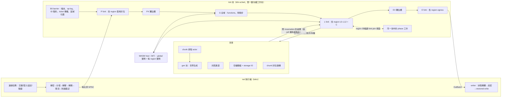

# Kiln：高效能 Minecraft Java Edition 伺服器核心設計文件 v2（26.3／protocol 777）

> v2 相對於 v1 的主要變更：使用者在 Q5 選擇**從第一天就區域化**（Folia 式 region），取代 v1「每維度一個擁有者執行緒」的並行模型。v1 的模型沒有被丟掉：它成為「每維度只有一個 region、維度依序執行」的退化情況，也就是 `vanilla` profile 的排程；v1 的決定性工具（`Spec`、`PhaseExec`、strict 模式、incarnation、chaos harness）原樣沿用。Q1、Q2、Q11 已拍板，其餘 v1 問題採建議預設（§15.1）。

## 0. 摘要

**核心架構一句話**：世界以 8×8 chunk 的 **cell** 為儲存單位；**region** 是 cell 的索引集合（已載入 chunk 依連結規則形成的連通分量），不同 region 之間永遠隔著至少 256 格的未載入地帶；每個 region 同一時間只有一個 worker 擁有，依原版階段順序決定性地模擬；所有 region 的 tick 與 region 內的唯讀 fork-join 視窗共用一個有優先權的工作池；與順序無關的工作（網路、壓縮加密、世界生成、光照、序列化、IO、chunk 封包）全部移出 tick。

**為什麼**
- 使用者選擇從第一天就區域化（Q5）。Folia 是唯一在真實流量下證明能擴展的模型，但它的 1000 人測試刻意把玩家分散；分散的玩家靠 region 平行，人群仍落在單一 region，所以 v1 的 region「內」平行化（唯讀視窗、推測驗證）必須保留。
- 儲存以 cell 為單位、region 只是索引集合，split/merge 不搬大量資料（Proposal C 的想法）；需要合併或分割的只剩少數有序結構，而且都是線性合併或穩定分割。這把 Canvas 為 Folia 修了 80 多個 bug 的那類問題壓縮到可以用 property test 窮舉的範圍。
- Pumpkin 的 async→sync 重構（約 900 個檔案）證明遊戲邏輯必須同步；決定性（lockstep 與 strict 模式）讓我們能逐 tick 與原版差分測試與重播，這是小團隊唯一負擔得起的正確性手段。

**最重要的設計決策**
1. **Cell 儲存、region 是索引集合**：chunk、實體（每 cell 一份 SoA）、方塊實體、scheduled tick、POI、NearbyPlayers 都存在 cell 裡；region 之間移動的只有 `Box<Cell>` 指標與幾個有序索引（實體 tick 順序、方塊實體順序、scheduled tick 索引、inbox、玩家清單）（§4.5）。
2. **間隔證明加跨 region 目錄**：連結距離 2 個 cell，保證不同 region 的已載入 chunk 相距 ≥ 256 格，大於所有已知有界互動半徑（≤ 128 格）加 64 格餘裕；所有能越過間隔的原版機制逐項列出，指定機制（玩家快照、延後訊息、轉移帳本、融合、獨佔槽）與各 profile 的類別（§4.8）。
3. **三種排程**：`Sequential`（vanilla profile：每維度一個 region、維度依原版順序、跨維度直接存取，等於 v1 的精確模型）、`Lockstep`（balanced：全部 region 同 tick、每 tick barrier、跨 region 訊息依決定性鍵套用）、`Independent`（performance：每 region 自己的期限、延遲隔離、時間偏移為 V）。**融合**（forced merge）是把任何可預知的跨 region 互動變回精確的通用工具（§4.3、§4.5）。
4. **單一優先權工作池**：phase 工作優先於 region tick；等待 join 的 worker 只幫同一個 `PhaseScope` 的工作，絕不接手其他 region 的整個 tick（避免 rayon join 的優先權反轉，這是評審在 Proposal C 找到的缺陷）（§4.6）。
5. **區域語意**（非 vanilla profile）：每 cell 的 RNG 串流、每 cell 的 ID 租約、全域 mob cap 依 cell 分配餘額。結果不因切割方式改變，所以能用「分割不變性」測試直接驗證區域化器（§4.7、§13.3）。
6. **沿用 v1**：型別強制的唯讀視窗、`Spec` 相依驗證（新增實體 section 戳記）、`PhaseExec` 契約；incarnation、UUID 唯一檢查、chaos harness 與重播；encode-once egress；f32 批次直譯器；E/I/V/F 近似目錄；Tier F/A 資料政策與 clean room。
7. **WASM 插件（M7 實作，契約現在定）**：每個 region 一個實例（綁 region，不綁執行緒）；持久狀態只能放在 host 管理、有擁有權範圍的命名空間（玩家、cell、實體、global）；型別化原子操作、fail-closed（§11）。
8. 所有 ID 從官方 jar codegen、clean room、季度改版兩層政策（§2）。

**時程（老實說）**：由下而上估算，含 25% 緩衝與逐次增加的改版預算。區域化（排程器、區域化器、cell 儲存、跨 region 訊息、指令可達範圍、測試）約增加 25 個計畫週，其中 12 週是新的 MR 里程碑（在任何玩法依賴它之前先以合成負載驗證區域化器）；精簡插件 host（v1 的 M3b）依 Q11 移除，它的工作併入 M7。計畫工作合計 174 週（v1 為 151 週）。M7（完整目錄、插件 1.0、independent 模式）計畫值約 **2031-09**，比 v1 晚約 9 個月，合理範圍 2029-07 到 2034 初（§14.4）。M1 與 MR 結束時以實測產能重估。

**決策狀態**：Q1、Q2、Q5、Q11 已拍板；Q3、Q4、Q6、Q7、Q10、Q12–Q18 採建議預設（使用者未異議）；Q8 已結案；Q9 由區域排程取代。區域化帶來的新問題是 [§15.1](#151-決策狀態與待決策事項) 的 Q19–Q28。

---

## 1. 目標、非目標、效能目標與量測方法

### 1.1 目標與非目標
- 目標：只支援最新正式版 26.3（protocol 777、world version 5023）並跟進季度改版；`vanilla` profile 在可測範圍內與原版逐位元一致，偏差一律明列、可設定、可量測；同硬體、同版本下以里程碑比較閘門證明勝過 Paper；**分散玩家的伺服器在單機上隨核心數擴展**（balanced／performance 的 region 平行），人群伺服器不因區域化變慢；WASM 插件；Windows 開發、Linux 部署。
- 非目標：多版本（交給 ViaVersion/ViaProxy）、Bedrock、DataFixerUpper（舊世界先用原版 `--forceUpgrade`）、Bukkit API、mod、跨機器分片（交給 Velocity 多後端）、v1 的 anti-xray（Q14）與 signed chat（Q4）。

### 1.2 效能目標
全部是**未量測估計**，由 M1、MR 校準（§1.4）與 M6 取代。

| # | 情境 | 目標 | 機制 |
|---|---|---|---|
| T1 | 閒置、載入出生點 | RSS ≤ 300 MB | 位元組對齊 palette、無 GC、mimalloc |
| T1b | 記憶體預算 | M2 以真實世界量測每個已載入 chunk、每個實體、每位玩家的位元組數並設為閘門（起始估計每 chunk 約 40–120 KB，未量測） | palette 選擇、光照 null section、CoW 快照有界 |
| T2 | S1 300 bots，vanilla | p99 ≤ 15 ms；CPU 秒/tick ≤ 0.5× Paper vanilla-like | encode-once、增量 tracker、平行組裝、壓縮加密移出 tick |
| T3 | S2，vanilla profile | 玩家數 ≥ 1.5× Paper vanilla-like（p99 ≤ 50 ms） | EX-01…07、ENT-01（皆 E）、無 GC 停頓、光照與 IO 移出 |
| T3b | S2，balanced／performance | balanced ≥ 3× kiln-vanilla；performance ≥ 3× Paper 預設 | REG-01（region 平行）加 §10 的 I/V/F 項目 |
| T4 | 世界生成，同種子同執行緒 | ≥ 3× Paper（硬閘門 ≥ 1×） | f32 批次直譯器（SIMD 通道加倍）、DAG 平行 |
| T5 | S4a，vanilla-exact | MSPT ≤ 0.5× Paper vanilla-like；≤ 1/3 Paper 預設 | 保序休眠、狀態表 |
| T6 | 加入時 chunk 已快取 | sim 成本 ≤ 5 ms | 快取封包 N 次 `Bytes` clone |
| T7 | S1 每玩家 egress | vanilla ≤ Paper；balanced ≤ 0.6× Paper | TR-01、快取 chunk 高壓縮等級 |
| T8 | 10 秒 200 人加入 | 無 tick 超過 50 ms | 每 tick 加入限量、登入在 net 執行緒、ticket 傳播有預算 |
| T9 | S7（Folia 式分組），balanced | 1,000 bots 時 p99 ≤ 50 ms（8C/16T） | region 平行、LPT 排程、每 region 固定成本低 |
| T10 | 區域化的額外成本 | S1 在 balanced 下開啟區域化對 `max_regions = 1` 的 CPU 秒/tick ≤ +3%；1,000 人時 barrier（B0）p99 ≤ 0.5 ms；≤ 1,000 chunk 的 region 合併/分割 p99 ≤ 1 ms | 索引集合、線性合併、reach report 在 region 內平行算好 |

**同版本規則**：比較數字兩邊同一 MC 版本、同一批 bot、同一世界，報告印出兩邊版本。主線換版而 Paper 未跟上時，改用與 Paper 最新版相符的 Kiln pinned tag；kiln-bot 保留前一版 codegen（ID 全由 codegen 產生，成本低）。Paper 為 alpha 時照量並標示。Folia 目前只到 26.2 beta，而 Kiln 從 26.3 起步沒有 26.2 tag，所以 T9 先以絕對數字為目標；兩者版本對齊時再加 Folia 同版本對照。

### 1.3 量測方法
- **拓撲**（Q17 採建議預設）：伺服器在雙開 Linux 的 5700X3D；bots 與 Velocity 在另一台機器、有線網路；proxy 模式。同機時以 `taskset` 隔離 CPU 並標註；WSL2 不作正式數字。
- **基準**：原版 26.3 jar；Paper 預設、tuned、vanilla-like（關閉 activation range 與 hopper cooldown）。kiln-vanilla 對 Paper vanilla-like 與預設；balanced/performance 對 tuned。區域化的收益另外以同一個 Kiln 建置的 `max_regions = 1` 對照，這是唯一不受 JVM 差異影響的比較。
- **指標**：MSPT（平均、p50、p99、最大）、CPU 秒/tick、RSS、每玩家 egress、chunks/s 與每 CPU 秒 chunks、加入到 441 chunk 延遲；區域化另報 region 數、每 region MSPT 分佈、B0 耗時、融合次數與原因、跨 region 訊息數；5 次中位數 ± IQR。
- **情境**：S1 64×64 格內 N 人；S2 夜晚分散生存（相距 1,500 格、上限滿）；S3 探索未生成地形；S4a 無生物農場（1,000 漏斗、分類器、紅石計算機）；S4b 含鐵、金農場；S5 TNT；S6 多小時 S2+S3 浸泡；**S7** Folia 測試的設定：預生成 100k×100k 世界、49 組約 20 人、VD 8／SD 5、新玩家分配到人最少的區域；**S8** region 翻轉：bots 反覆走近與走遠、每數秒跨 region 傳送，強迫合併、分割與帳本轉移。
- **統計容忍度**：以 95% CI 表示 Kiln/原版速率比；兩個 Poisson 速率比的半寬約 1.96·√(1/N₁+1/N₂)，±2% 需每邊約 19,200 個事件，所以固定 tick 數，原版用 `/tick sprint`。

### 1.4 校準與容量模型
M1 校準：在原版與 Paper 26.3 上以 JFR/spark 剖析 S2 類負載，得到每玩家、每 mob（GoalSelector 與 Brain 分開）、每 ticked chunk、每個醒著方塊實體的成本，作為容量模型與合成 mob 的來源。MR 另外量測每個 region tick 的固定成本 c_r、barrier 成本與平行效率 η。

**單一 region 的序列成本**（與 v1 相同）：S_r ≈ Σ玩家·c_p + Σmob·c_m + Σchunk·c_c + Σ方塊實體·c_b + 階段開銷。起始估計（未量測）：c_p 約 15 µs；c_m 在 vanilla 約 4 µs、balanced 約 3–3.5 µs（S2 多為 GoalSelector mob，只有 AI-02 覆蓋的路徑移出）、performance 約 0.8 µs（AI-04/05）；c_c 在 vanilla 約 0.3 µs、RT-01 後約 0.1 µs。

**多 region 的 lockstep tick**：
```
wall ≈ max( max_r S_r ,  Σ_r (S_r + W_r + c_r) / (T · η) ) + t_B0 + t_PX + t_G + 3·t_fork
```
W_r 是 region 內視窗的平行工作量，T 是 tick 池 worker 數（8C/16T 預設 7），η 是平行效率（記憶體頻寬與快取競爭，起始估計 0.6–0.8，未量測）；c_r 起始估計 20–50 µs；t_B0 + t_PX + t_G + 三次 fork 約 0.1–0.3 ms（未量測）。預算 40 ms。

| 情境 | 機制 | 估計（皆未量測） |
|---|---|---|
| S2，vanilla profile | 每維度一個 region，等於 v1 | 約 85 人（每位孤立玩家約 15 + 80×4 + 441×0.3 ≈ 470 µs） |
| S2，balanced | 每位孤立玩家一個 region，約 320 µs + c_r | 約 450–650 人（η 0.6–0.8），即 kiln-vanilla 的 5–7 倍；T3b 閘門取保守的 3 倍 |
| S2，performance | 每位約 123 µs + c_r | CPU 模型約 1,200 人；實際多半先受記憶體限制：VD 10 時每位分散玩家約 (2·11+1)² = 529 個已載入 chunk，1,000 人約 53 萬個 chunk，以每 chunk 40–120 KB 計為 21–64 GB |
| S7，balanced | 50 組 × 20 人，每組一個 region：20×15 µs + 約 70 mob × 3.25 µs + 約 225 chunk × 0.1 µs ≈ 0.55 ms | CPU 總量約 29 ms，牆鐘約 6 ms；上限落在網路、bot 機器與記憶體，不在 CPU（T9 取 1,000 人、p99 ≤ 50 ms） |
| S1，人群 | 全部在一個 region；region 不會分割 | 與 v1 相同（T2），區域化只多 c_r 與 barrier（T10 ≤ +3%） |

Q1、Q10 的預設以 M6 實測為條件；容量模型預測與實測的誤差在 M6 必須 ≤ ±20%（否則重擬模型）。

---

## 2. 版本與資料策略

### 2.1 版本
26.3、protocol 777、world version 5023、原版 jar 需要 Java 25。版本常數集中在 `kiln-version`。只接受 DataVersion 5023 的世界，其他版本提示先用原版 `--forceUpgrade`。

### 2.2 資料擷取與 codegen
`xtask data fetch <ver>`：
1. 依 Mojang manifest 下載 `server.jar` 並驗證 SHA-1。
2. 執行 `-DbundlerMainClass=net.minecraft.data.Main --reports --server`（約 15 秒）：packets.json、blocks.json（1,286 個方塊、35,723 個狀態）、registries、物品預設元件、datapack JSON、指令樹、JSON-RPC 管理 schema。
3. `kiln-extractor`（fork 自 CC0 的 SteelExtractor 或 MIT 的 Pumpkin Extractor）：碰撞形狀（標記依賴 `CollisionContext` 者）、實體 metadata、追蹤範圍、chunk pyramid 半徑、multi-noise RTree、density function 向量、`Mth.SIN`／`ASIN_TAB` 等初始化表、修補過的參考 chunk dump；另以 javap 記錄每個呼叫點用的是 `Math` 或 `StrictMath`，以及封包欄位指紋，兩者都進入 snapshot 差異報告。

codegen 是 xtask（`kiln-data-gen`），產物提交進版本庫，不用沉重的 build.rs。封包以名稱解析 ID，被移除或改名的封包會造成編譯錯誤。

### 2.3 資料分級與 clean room
- **Tier F（提交：互通所需事實）**：ID、名稱、狀態屬性、形狀、封包 ID 的精簡 JSON 與生成的 Rust。
- **Tier A（永不提交或散布：Mojang 資產與其衍生物）**：datapack JSON、結構模板、jar；以及 extractor 產物中源自 Mojang 資料者——multi-noise RTree、density function 測試向量、`Mth` 初始化表、修補過的參考 chunk dump。這些由開發者、CI 與使用者在本機以官方 jar 產生，放在雜湊驗證的快取。發行版在首次啟動、同意 EULA 後下載官方 jar。轉譯後的世界生成只含拓撲。
- **Clean room**：反組譯碼只用來寫 spec note（`docs/spec/…`，以自己的話描述行為、順序與事實常數）；程式碼依 spec note 與測試另行撰寫，讀與寫在不同的 AI session；不做逐行移植；版本庫、issue、保留的 prompt 不含反組譯碼與 GPL/AGPL 程式碼；每個 PR 列出參考來源。
- **授權與公開**（Q2 已拍板）：授權尚未決定；版本庫維持私有；任何公開或散布之前先做法律審查。

### 2.4 季度改版
改版節奏約 12–13 週（26.1 3 月、26.2 6 月、26.3 9 月；之後日期為推估）。26.4-snapshot-1 已經改了 `steep` material 條件、移除 noise settings 的 `default_block`、改 lush/dripstone 洞穴生成與 `cuboid` 語意、biome 改成 16³、chunk NBT 的 `Status` 改名 `status`、handshake host 可達 1,024 字元並帶 URI query 屬性。研究結論是每次改版應預留「一次完整的世界生成 schema 遷移」。

**兩層政策**（Q18 採建議預設 B）
- **(a) 協定與資料 parity、可加入**：正式版釋出後 10 個工作天內完成。codegen 重跑、goldens 與參考 dump 由新 jar 重新產生、新封包欄位與元件手寫。
- **(b) 新內容與變動的世界生成 parity**：依使用率排序，新內容可在偏差清單標示「未實作」最多兩次改版。

**預算隨已實作的範圍成長**：D1 2 週、D2 2 週、D3–D4 3 週、D5–D6 4 週、D7 起 5 週（§14 的日曆已計入）。每次改版另外重審跨 region 目錄（§4.8）與有界半徑表（§4.5.3）：新機制若能越過 256 格間隔，必須在該次改版內分類。

**持續進行**：`next` 分支從 M0 起每晚抓最新 snapshot，產出差異報告（封包、欄位指紋、registry、狀態數與 bpe、狀態 DAG 與 density op、Math/StrictMath 呼叫點、chunk 格式、交握）。每次演練包含**世界升級程序**（原版 `--forceUpgrade` → Kiln 驗證 DataVersion → round trip 通過），寫進維運文件。

### 2.5 數值參考（Q8 已結案）
對 26.3 jar 的檢查：7,744 個 `net/minecraft` 類別中，引用 `java/lang/StrictMath` 的有 0 個，引用 `java/lang/Math` 的有 492 個。`UnaryFunction$LogSampler` 呼叫 `Math.log(D)D`，`PowFunction` 的三個 sampler 呼叫 `Math.pow(DD)D`；feature（OreFeature、IcebergFeature、FancyTrunkPlacer、SpeleothemUtils）以 double 直接呼叫 `Math.sin/cos/pow/log`；`Mth.SIN` 與 `ASIN_TAB` 在類別初始化時由 `Math.sin/cos` 建表。

因此：
- 參考實作是 **JDK 25 HotSpot x86-64 的 `Math`**（intrinsic 源自 Intel LIBM，不是 fdlibm）。
- 類別初始化表由 extractor dump（Tier A），不自行重算。
- 每個逐次呼叫的超越函數選一種實作（correctly rounded 或 fdlibm），以約 10⁸ 個 extractor 向量量測與 jar 的翻轉率，選翻轉率最低者；已知翻轉列入偏差清單。
- 這個例外涵蓋 density op **與** feature 中的 double 呼叫。

---

## 3. 整體架構



**Workspace（相依只往下）**
```
kiln-server          協調者、設定與 profile、維運協定
├─ kiln-plugin-host  wasmtime host、capability、限制、擁有權命名空間（kiln-plugin-wit／sdk 另行發佈）
├─ kiln-net          連線任務、登入/設定狀態機、驗證、proxy、egress、限流
│  └─ kiln-proto     codec、分框、壓縮/加密 trait、封包（kiln-proto-derive）
├─ kiln-sim          階段、方塊行為、紅石、方塊實體、生怪、tracker、物品欄、指令執行、目錄
│  ├─ kiln-region    區域化器、RegionPart、CellTable、跨 region 訊息、轉移帳本、玩家快照、融合
│  ├─ kiln-entity    每 cell SoA、目錄、空間索引、物理、AI、尋路
│  ├─ kiln-light     光照引擎
│  └─ kiln-world     cell、chunk、container、ticket、狀態 DAG、tick 佇列、POI、WorldView trait
├─ kiln-sched        tick 池：優先權、PhaseScope、scoped helping、LPT/EDF、arena、watchdog（不相依遊戲）
├─ kiln-chunkgen     排程 actor、ProtoChunk      └─ kiln-worldgen 直譯器、noise、feature、structure
├─ kiln-storage      Anvil、level/player 資料、sidecar、StorageService
├─ kiln-command      Brigadier 相容樹、57 種 parser、selector、NBT path、可達範圍分類
├─ kiln-data／kiln-version／kiln-nbt／kiln-util
└─ kiln-javamath     Java RNG、Math 參考實作、HashSet 與 PriorityQueue 順序模擬
工具：kiln-harness、kiln-bot、kiln-capture、kiln-probe（Java agent）、kiln-extractor、xtask；fuzz/（nightly）
```
規則：
- sim、world、entity、worldgen 不相依 tokio 與 `kiln-net`（xtask 檢查）；主 workspace 用 stable Rust；mimalloc 為全域配置器。
- `kiln-world` 不知道 region：遊戲邏輯只經 `WorldView` trait 存取世界，由 `kiln-region` 的 `RegionView` 實作（Proposal B 的做法）。單一 region 模式與單元測試因此很單純。
- sim crate 以 clippy `disallowed_types`／`disallowed_methods` 禁止內部可變性型別、迭代 `std::collections::HashMap/HashSet`、以及在 tick 中讀牆鐘。

---

## 4. 執行緒、區域與 tick 模型

### 4.1 擁有權：cell、region 與維度
```rust
struct Server { dims: Vec<Dimension>, global: Global, ledger: TransferLedger,
                sched: RegionScheduler, sem: Semantics }
enum Semantics {
    Vanilla,   // 維度層級 level RNG、全域實體 ID 計數器、即時生怪計數（只用於 vanilla profile）
    Regional,  // 每 cell RNG、每 cell ID 租約、生怪餘額依 cell 分配（balanced／performance，region 數為 1 時亦同）
}
struct Dimension {
    id: DimId,
    table: CellTable,                        // 每個 cell 的擁有者；只在 barrier 改寫，tick 中以 & 共享
    regions: SlotMap<RegionId, Region>,      // 排程器以 get_disjoint_mut 交出互斥的 &mut Region
    tickets: TicketManager,                  // 等級傳播在 B0 執行（§5.3）
    uuids: UuidIndex, lodestones: LodestoneIndex, raids: RaidIds,
}
struct Global { players: PlayerList, scoreboard: Scoreboard, storage: CommandStorage, bossbars: Bossbars,
                gamerules: GameRules, schedule: FunctionSchedule, ids: GlobalIdAllocators,
                maps: MapDataStore, registries: Registries, snapshot: Arc<GlobalSnapshot> }
struct RegionView<'a> {                      // 遊戲邏輯看到的 WorldView 實作
    me: &'a mut Region, table: &'a CellTable, global: &'a GlobalSnapshot,
    players: &'a PlayerSnapshot, out: &'a mut RegionOutbox,
}
enum Access<T> { Owned(T), Unloaded, Foreign(RegionId) }
```
- **Cell 是儲存單位**：8×8 chunk（128×128 格、全高度），擁有 chunk、實體 SoA、方塊實體 ticker、scheduled tick 容器、POI、NearbyPlayers，以及區域語意下的 cell RNG 與 ID 租約（§5.2、§6.1）。
- **Region 是索引集合**：它擁有 `Vec<Box<Cell>>` 與幾個有序索引；split/merge 只搬 `Box<Cell>` 指標與索引（§4.5.4）。每個 cell、chunk、實體、方塊實體在任何時刻恰好屬於一個 region。
- **沒有共享鎖**：沒有 `Arc<Mutex<World>>`。排程器以互斥借用交出 `&mut Region`，所以碰觸其他 region 在編譯期就不可能；透過 `CellTable` 查到非自己的 cell 時回傳 `Access::Foreign`（§4.8 G2 規定其處理）。其他執行緒只持有 `ChunkPos`、`CellPos` 或帶世代檢查的 handle。
- 離開 sim 的只有不可變的 section 資料（`Arc<BlockContainer>`、`Arc<[u8; 2048]>` 光照，CoW）；快照不保留 chunk，不可能阻擋卸載（Pumpkin #2040 在結構上不會發生）。
- sim 不 await、不相依 tokio。
- **v1 是退化情況**：vanilla profile 每維度恰好一個 region，維度依原版順序在同一個 worker 上執行，跨維度以 `CrossDim::Direct`（`split_at_mut` 取得其他維度的 `&mut`）直接存取，這就是 v1 的模型。

### 4.2 執行緒清單與預設數量（8C/16T）

| 池 | 預設 | 優先權 | 工作 |
|---|---|---|---|
| tick 池（`kiln-sched`） | 7（實體核心 −1；worker 0 兼任協調者） | 正常 | region tick、region 內視窗工作、序列段（B0、PX、G、EX） |
| 必要背景 | 2 | 正常 | 存檔壓縮、卸載、ticking chunk 光照、排隊檢視者的 chunk 封包（優先權類別 BLOCKING > INTERACTIVE） |
| gen | 4（邏輯核心/4） | 低 | 推測性世界生成、非 ticking 區光照（類別 NORMAL > BACKGROUND，優先權沿相依傳遞） |
| chunk-scheduler | 1（多半閒置） | 正常 | 擁有所有 ProtoChunk 的 actor |
| net（tokio） | 2（直連時依加密位元組/秒增加，≤ 8） | 正常 | socket、加解密、登入、驗證 |
| storage IO | 2（多半阻塞） | 正常 | 定位式 region IO |
| plugin-async／watchdog | 1／1 | 正常 | WASI 0.3 工作（M7）／epoch 與停滯偵測 |

- **預算規則**：CPU 密集的池（tick + 必要背景 + gen + net）總和 ≤ 邏輯核心 −1：7 + 2 + 4 + 2 = 15。其餘 5 條多半閒置或阻塞。
- 釋放資源的工作與推測性生成分開，CPU 飽和時不會被餓死。
- 待存檔位元組上限（預設 256 MiB）：超過時停止接受新的生成 ticket，並在各 region 的 L11 內聯壓縮存檔，直到回到上限以下。
- 所有池大小可設定；M1 與 MR 在 Windows 與 Linux 量測 fork-join 喚醒成本與 SMT 的影響，預設值在量測後定案。

### 4.3 tick 階段順序與三種排程模式
原版在 tick 之間處理封包（全域到達順序），tick 內依序是 console 輸入、`#minecraft:tick` functions、各維度（每個維度開頭是 world border、天氣、睡眠、tickTime，overworld 的 tickTime 內含 `/schedule`）、connection（玩家 `doTick`、keepalive）、送 chunk。`kiln-sim/src/order.rs` 是從 26.3 bytecode 寫成的 spec note，有測試斷言，每次改版重新比對；下列位置若與 spec note 不同，以 spec note 為準。

**region 內的階段（三種模式共用）**
```
L0  inbox       chunk 升級、光照發佈、路徑結果、帳本抵達者、跨 region 訊息（依鍵排序，丟棄過期 incarnation）
L2  scheduled block/fluid tick（觸發時間、優先權、sub-tick）
L3  raid        L4 chunk tick：套用 ticket 等級轉換、生怪（原版洗牌列表或每 cell 洗牌）、隨機 tick、降水、custom spawner
L5 ∥ tracker    可見性差異與 delta 編碼（原版位置：chunk tick 內、block event 之前）
L6  block event
L7 ∥ AI 預處理  Brain sensor（profile 控制）、POI 候選、goal 起始條件的推測路徑求解
L8  實體 tick   終界龍戰（若擁有）、EntityTickList 插入順序（每 region 的 TickOrder）、乘客
L9  方塊實體 tick（依 BeSeq 的有序列表 + 醒著的 bitset）
L10 實體管理    加入、移除（空間成員資格在移動當下已更新）
L11 ∥ 尾端視窗  AI-02 路徑求解、autosave NBT 編碼（有預算）
L12 交接        光照批次、存檔、生成請求（皆帶 incarnation）；reach report（§4.5.2）
C   連線        該 region 玩家的 doTick、keepalive（player list 順序）
```

**`Sequential`（vanilla profile）**：等於 v1。
```
B0  barrier：玩家加入與離開、帳本提交、ticket 傳播、metrics（每維度只有一個 region；ID 用全域計數器）
P   全部玩家的封包依全域到達戳記在同一條序列套用（P0 ∥ 移動預檢、P1 套用）
G0  console/RCON/JSON-RPC、插件完成事件      G1 #minecraft:tick functions
L   overworld：G2 時間步（含 /schedule）→ L0–L12；nether：G2 → L0–L12；end：G2 → L0–L12（CrossDim::Direct）
C   全部玩家依 player list 順序        E   egress
```

**`Lockstep`（balanced 預設）**：每 tick 三次 fork、四個序列段。
```
B0  序列  玩家加入與離開、帳本提交、op-log 重播與衝突判定、UUID 索引合併、ID 租約補充、ticket 傳播、
          區域化器（合併／分割／融合，依上一 tick 的 reach report）、生怪計數快照、外掛實例生命週期
P   fork  每個 region：P0 ∥ 移動預檢；P1 依到達戳記套用自己玩家的封包；遇到 Exclusive 動作（§4.8 C1/C5/D3）
          就停住該 region 之後的所有封包
PX  序列  被停住的串流依全域到達戳記續跑，持有 &mut Server；結束時發佈玩家快照與維度聚合（睡眠、emptyTime）
G   序列  G0 console/RCON/JSON-RPC；G1 #minecraft:tick functions；G2 各維度時間步（overworld 含 /schedule）
L   fork  每個 region：L0–L12、C
EX  序列  （只有需要時）mid-tick 的無界觸發依 TickSeq 執行（§4.8 D3）；彙整全域廣播
E   fork  每個 region：egress 組裝（含本 tick 的全域廣播與聊天），交給 net
```
- **為什麼 P 在自己的 fork**：封包屬於「tick 之間」，必須在 functions 之前（原版順序）；分開 fork 讓 G 看到套用過封包的世界，與原版相同。
- **為什麼 E 在自己的 fork**：全域廣播（聊天、全域音效、EX 的輸出）必須在同一 tick 送達所有 region 的玩家；若把 E 併入 L fork，先完成的 region 會漏掉後來才產生的廣播。
- **G2 提前到 fork 之前**：原版的 nether／end 時間步在 overworld 整個 tick 之後，但它們的遊戲時間取自 overworld 的 level data（derived），天氣與睡眠只在 overworld 生效，`/schedule` 只在 overworld，因此提前不改變它們讀到的值（order.rs 的 spec note 需確認）。
- **為什麼 C 可以緊接在 L_R 之後**：原版的 C 在所有維度之後；但玩家 `doTick` 只與自己 region 內的狀態互動（有界，§4.5.3），跨 region 與跨維度的效果一律經 §4.8 的機制，所以提前不可觀察。
- 三次 fork 的喚醒與 join 成本約 3 × 10–20 µs（未量測；M1 量測 Windows 與 Linux）。

**`Independent`（performance 預設）**
- 每個 region（或融合群組）有自己的 `local_tick` 與期限，排程器以 EDF 挑選；一個 region 的 tick 是 [region 內 B0（inbox、帳本抵達、自己的租約）、P、L、C、E]。落後的 region 只拖累自己的玩家。
- G 作為「global 任務」以 20 TPS 執行：擁有全域狀態，發佈快照，依收到的順序套用各 region 的 op-log（非決定性）。
- 拓撲變更只需要相關 region 停在 tick 邊界（兩兩 rendezvous），合併時以 local tick 差值平移 scheduled tick（Folia 的 redstone time 平移）。
- 需要獨佔的動作（PX、EX、需要獨佔的 G1 function）以 rendezvous 執行：受影響維度的 region 在下一個 tick 邊界暫停，執行後恢復；落後的 region 會拖慢 rendezvous（記錄）。若靜態掃描發現**每 tick** 都需要獨佔的消費者（例如含無界 selector 的 `#minecraft:tick`），伺服器自動改用 lockstep 並記錄原因（Q27）。
- independent 模式不具決定性，strict 模式禁止使用。
- **目前實作（2026-09-28，`kiln-sim/src/independent.rs`，`SimConfig::schedule`／`KILN_SCHEDULE=independent`，預設 lockstep）**：還沒有 EDF 與每 region 的 B0/P；做法是「慢的 region 離開 lockstep」。tick 時間 EMA 超過 30 ms 的 region 在 L 階段被**借出**（`Region::lend` 讓 region 在原位變空、cell 表不變），它的 cell、part 與玩家在自己的執行緒跑 L，伺服器不等它；跑完的 region 在下一個 tick 開頭回來，在家度過那個 tick（B0、P fork、PX、G）後再借出，EMA 低於 15 ms 才回到 lockstep。回來時 scheduled block/fluid tick 平移錯過的 tick 數（`LevelTicks::shift`），其餘狀態讀伺服器時間（V）。rendezvous（等所有借出的 region 回來，之後同 lockstep）：加入與離開、console、任何玩家的聊天與指令、到期的 datapack function、autosave 與關機、有借出 region 的維度要改拓撲、傳送門旅行；借出期間的廣播替它的玩家保留，它的玩家的封包、它的 cell 的 chunk 與生成的實體都等它回來。載入插件或有 `#minecraft:tick` function 時自動留在 lockstep（記錄一次）。已知缺口：借出期間的天氣封包與睡眠計數看不到它的玩家；`state_hash` 等檢視 API 需先呼叫 `Sim::rendezvous`；慢 region 的 chunk 新佔 cell 會觸發 rendezvous。測試：`tests/independent.rs`（注入 100 ms 延遲的 region 不拖累另一個 region 的 20 TPS；水在慢 region 的第 5 個自身 tick 流動，伺服器同時跑了數百 tick；拿掉平移時測試失敗）。

### 4.4 平行化與決定性

**型別規則**
1. 視窗只拿 `&RegionView`（不可變）；RNG 要 `&mut` 才能抽，所以原版的每次抽取都在序列套用中。
2. 結果以輸入順序回傳（indexed `collect`），依原版順序套用；禁止平行浮點歸約（lint），只允許 indexed collect 後序列 fold。
3. 會被序列階段改變的結果帶相依、套用時驗證：

```rust
struct Spec<R> { deps: SmallVec<[Dep; 8]>, val: R }
enum Dep { Section(SectionKey, u32), EntityStamp(SectionKey, EntityCategory, u32),   // 硬碰撞實體（船、界伏蚌、礦車）
           BlockEntity(ChunkPos, u32), Light(SectionKey, u32),
           Mover(EntityKey, u64 /* 移動者情境雜湊 */), Border(u32), Evaluator(EntityKey, u64 /* malus、旗標、分數起點 */) }
impl<R> Spec<R> { fn take(self, w: &RegionView, recompute: impl FnOnce() -> R) -> R {
    if self.deps.iter().all(|d| w.dep_current(d)) { self.val } else { recompute() } } }
```
- **移動者情境**：鷹架、細雪、移動中的活塞等形狀依賴 `CollisionContext`。codegen 依 extractor 標記這些方塊；預檢只算與情境無關的部分，情境相依者在套用時計算。`Dep::Mover` 涵蓋輸入旗標、姿勢、腳部物品、落下距離區間、載具、遊戲模式與能力、移動前位置；同 tick 中該玩家任何改變情境的封包都使它失效。通過驗證的結果與內聯計算逐位元相同，所以 EX-02、EX-04 是 E 類——前提是 **verify-memo** 在語料上全綠：CI 模式重算每一個命中並斷言相等，production 抽樣 1%。
- **命中率**：每種查詢追蹤命中率，低於門檻（起始 30%）自動改內聯；strict 模式凍結門檻。

**`PhaseExec` 契約：策略不得改變結果**
```rust
trait PhaseWindow: Sync { type In: Sync; type Out: Send;
    fn run(&self, snap: &RegionView, item: &Self::In) -> Self::Out; }   // 純函式
enum Strategy { Inline, Parallel }    // 依大小與命中率選；strict 模式凍結門檻
```
內聯與平行呼叫同一個 `run`、讀同一個快照、在同一個階段點；延後的結果一律在固定偏移送達。CI 對每個視窗跑強制內聯、強制平行、隨機混合，每 tick hash 必須相同。

**模式**：`ordered`（預設）tick 內完全決定，非同步結果在到達的 tick 依鍵排序套用；`strict`（測試與重播）非同步結果在固定偏移套用、sim 等待、插件用 fuel，同種子加同輸入在任何執行緒數下每 tick hash 相同。**strict 需要 `Sequential` 或 `Lockstep`**；區域化器只依 tick 計數與 cell 集合做決定（不讀牆鐘），新 cell 的 chunk 也在固定偏移的 barrier 安裝，因此區域拓撲本身可重播。所有影響模擬狀態的預算以數量計，不以時間計。

**region 平行的決定性**：每個 fork 的輸出（跨 region 訊息、op-log、reach report、租約用量）在序列段依與 region 劃分無關的鍵合併（`MsgKey = (src_tick, src_cell, seq)`，§4.7），所以結果不依 worker 數與偷取順序而變。

**incarnation**：每個 `ChunkPos` 有 `incarnation: u32`，每次載入加一；所有請求（chunk、實體、POI、光照、封包建構）帶 `(ChunkPos, incarnation)`，結果依當時的 cell 擁有者路由到該 region 的 L0，過期即丟。實體加入時檢查維度內 UUID 唯一（§4.7.4），重複即拒絕並記錄（與原版相同）。

**重播與 chaos**：重播紀錄記下每個非同步結果的套用 tick、每個封包的到達戳記、每次區域拓撲變更與融合原因，production 事故可在 strict 模式重現。ordered 模式 chaos harness 隨機延遲與重排 IO、生成、光照完成，搭配快速 ticket 翻轉與 region 翻轉（S8），斷言 UUID 唯一、卸載重載物品數守恆、沒有結果裝進非當前 incarnation、光照等於完整重算、帳本守恆。

### 4.5 區域化器

#### 4.5.1 Cell 大小與連結規則
```rust
pub const CELL_SHIFT: u32 = 3;          // cell = 8×8 chunk = 128×128 格
pub const LINK_CHEB: i32 = 2;           // 兩個佔用中的 cell，Chebyshev 距離 ≤ 2 即相連
pub const MIN_GAP_BLOCKS: i32 = 192;    // 斷言的不變量；8×8 cell 與連結距離 2 實際保證 256
```
- **連結規則**：佔用中的 cell 若 Chebyshev 距離 ≤ 2（中間最多隔一個空 cell）就相連；region 是相連關係的連通分量。不同 region 的佔用 cell 距離 ≥ 3，中間至少隔兩個完整的空 cell，所以**不同 region 的已載入 chunk 相距至少 2 × 128 = 256 格**。
- **佔用**：cell 內至少一個 chunk 處於「region 程式碼可存取」的狀態（FULL，含不 tick 的邊界 chunk，以及為 POI 讀取而載入者）。只在生成管線中的 ProtoChunk 屬於 chunk-scheduler actor，不算佔用；生成永不讀取 region 的資料（結構起點與參照在不可變側表）。
- **為什麼選 8×8、連結距離 2**：

| 方案 | 保證間隔 | VD 10 時兩位玩家分開所需距離 | 取捨 |
|---|---|---|---|
| Folia：16×16 section、create 半徑 1、merge 搜尋半徑 2 | ≥ 48 chunk（768 格） | 約 1,100–1,400 格 | 分開太晚 |
| Proposal B：4×4、間隔 3 cell | 12 chunk（192 格） | 約 35–38 chunk（560–610 格） | 格數 4 倍，跨 cell 遷移加倍，餘裕 64 格 |
| Proposal C：8×8、相鄰即連 | 8 chunk（128 格） | 約 31–38 chunk | 間隔等於最大有界半徑，沒有餘裕 |
| **Kiln：8×8、連結距離 2** | **16 chunk（256 格）** | **約 39–46 chunk（620–740 格）** | 餘裕 128 格；cell 數與遷移次數為 4×4 的 1/4 |

  推導：玩家已載入半徑約 VD+1 = 11 chunk；兩個已載入區之間需要的空 chunk 數依對齊落在 16–23 之間，加上 2 × 11 + 1，得到 39–46 chunk。代價是比 4×4 方案晚約 15–20% 才分開；換到兩倍的安全餘裕（可以吸收未稽核的有界半徑到 255 格）與較少的 per-cell 成本。`CELL_SHIFT` 是編譯期常數，MR 以 cargo feature 量測 4×4（`LINK_CHEB = 3`）作對照，決定記錄在 Q19。

#### 4.5.2 佔用、合併、分割與融合
所有拓撲變更只在 B0 發生，持有 `&mut Dimension`，所以沒有 region 正在 tick。
- **新 cell 延後安裝**：chunk 載入或生成完成時，若它的 cell 已有擁有者，結果直接路由到該 region 的 L0；若 cell 尚無擁有者，結果留在維度收件匣，由 B0 指派（新建 region、加入既有 region 或合併數個 region）後，下一 tick 的 L0 才安裝。因此「不同 region 間距 ≥ 256 格」在每個 tick 內都成立，不需要 Folia 的「tick 中的 region 不成長」與 transient region。
- **合併是強制且立即的**：新佔用的 cell 查 5×5 鄰域，與所有相連 region 合併。合併 = cell 指標與索引的聯集，加上各 `RegionPart` 的線性合併（§4.5.4）。
- **分割是可選的最佳化**：每個 region 每 20 tick 檢查一次；有空出的 cell 時以 5×5 鄰域 BFS 求連通分量；最小分量已經與其他部分斷開 ≥ 100 tick（5 秒）才分割。遲滯避免玩家在門檻附近來回走時反覆合併分割（每次循環要付 O(實體) 的索引分割與插件實例替換）。數字可設定，全部以 tick 計數，strict 模式可重播。
- **融合（forced merge）**：把不相鄰的 region 綁成同一個排程單位，讓它們之間的互動變成單執行緒、依 `TickSeq` 交錯的精確執行。同維度的融合就是索引集合的聯集（region 的 cell 可以不連通）；跨維度的融合是「融合群組」：一個 worker 依原版維度順序執行各成員，彼此以 `CrossDim::Direct` 存取（退化成 v1 的依序模式）。融合帶原因與到期 tick；到期後依連通性照常分割。
- **融合原因**（B0 依上一 tick 各 region 在 L12 產生的 reach report 決定，reach report 在各 region 內平行算好）：
  - 可預測的無界來源：下一 tick 到期、指令經分類為 Unbounded 的指令方塊；重複／連鎖指令方塊與指令方塊礦車（存在即持續融合）（§4.8 D2）；
  - 具爆炸威力的實體：以「位置 ± 下一 tick 位移 + 2 × 威力 + 16 格」的球體觸及其他 region 的 cell（§4.8 C7）；
  - 高速移動體：下一 tick 的掃掠盒（加 16 格）觸及其他 region 的 cell（§4.8 C6）；
  - 全域狀態衝突：同一 tick 內一個 region 寫、另一個 region 讀同一個鍵（§4.7.2），融合 200 tick；
  - 未列入目錄的跨 region 存取（§4.8 G2），融合 200 tick；
  - 操作者強制（`/kiln regions fuse`）。
- **小 region 批次化**：預估成本 < 0.2 ms 的 region 由排程器打包成約 1 ms 的工作依序執行，減少每 region 固定成本；語意上它們仍是獨立 region。

#### 4.5.3 間隔證明與有界半徑表
**命題**：若 (1) region 程式碼只能經 `RegionView` 讀寫自己擁有的 cell，(2) 任何 tick 中都不會同步載入 chunk（非 vanilla profile 的同步載入點一律走 SYNC-01），(3) 不同 region 的已載入 chunk 相距 ≥ G = 256 格，那麼任何半徑 r < G、以自己 region 內位置為起點的查詢或變更，都只會落在自己擁有的 chunk 或未載入的 chunk 上。

在已載入區內傳遞的連鎖（紅石、方塊更新、流體、活塞）只能沿已載入 chunk 前進，無法跨越 256 格的未載入帶。玩家的視距範圍全部在自己的 region 內，所以追蹤與廣播（≤ 視距）不會跨 region。

**有界半徑表**（預期值；實作前以 26.3 bytecode 寫成 spec note 確認。任何超過 128 格的有界值必須進入 §4.8 目錄，或提高 `MIN_GAP_BLOCKS`）

| 機制 | 半徑（格） | 狀態 |
|---|---|---|
| 天然生怪：玩家 128 格內、24 格外；生怪範圍 8 chunk（17×17）；立即消失 > 128 | 128 | 研究摘要確認（128 消失、17×17 範圍） |
| 隨機消失（noActionTime > 600、1/800） | 32 | 待確認 |
| 避雷針搜尋 | 128 | 待確認 |
| 傳送門 POI 搜尋（往 overworld／往 nether） | 128／16 | 待確認；在目的地執行，讀取集合先載入（§4.8 C4） |
| 地圖更新（持有者周圍） | 約 128 | 待確認 |
| 實體追蹤 | ≤ 視距（每型別 range 由 extractor 擷取） | 待確認夾限規則 |
| 爆炸：實體受影響半徑 2 × 威力；原版自然來源最大威力 7（凋零生成） | 14 | 待確認；NBT 設定可達威力 127（254 格），列入目錄 C7 |
| 寵物跟隨起始／傳送門檻 | 10／12，**傳送目標無上限** | 待確認；傳送列入目錄 C3 |
| 拴繩斷裂 | 約 10–12 | 待確認（26.x 可能修改） |
| 烽火台／潮湧核心 | 50／96 | 待確認 |
| sculk 感測器／監守者 | 8／16 | 待確認 |
| 一般音效與 level event／粒子／`force` 粒子 | 64／32／512 | 待確認；512 與大音量 `/playsound` 列入目錄 D5 |
| raid 搜尋 | 待確認（預期 < 128） | 待確認 |

餘裕：最大有界半徑 128 + 64 格 = `MIN_GAP_BLOCKS` 192；實際 256。

#### 4.5.4 需要合併與分割的狀態
cell 內的東西（chunk、實體 SoA、section 空間桶、方塊實體 ticker、scheduled tick 容器、POI、NearbyPlayers、cell RNG、cell ID 租約、raid、插件 cell 命名空間）**永不搬動**。需要處理的只有：

| 狀態 | 位置 | 合併 | 分割 |
|---|---|---|---|
| 實體 tick 順序 `TickOrder` | region | 依 `TickSeq` 線性合併 | 依實體所在 cell 的新擁有者穩定分割 |
| 方塊實體順序 `BeOrder` | region | 依 `BeSeq` 線性合併 | 穩定分割 |
| scheduled tick 索引（下個到期時間 → 容器） | region | 聯集 | 依 chunk 分割 |
| inbox（位置定址的訊息） | region | 依 `MsgKey` 合併 | 依目標 cell 路由 |
| 玩家清單（player list 順序）與連線端點 | region | 依全域加入序合併 | 依玩家所在 cell |
| sub-tick 計數器、實體 local 計數器 | region | 取最大值 | 複製 |
| 融合原因 | region | 聯集 | 依原因的來源位置 |
| egress arena | 每 tick | 無（tick 之間為空） | 無 |
| 插件 region 實例（M7） | region | 丟棄被併入者（先排空工作） | 從池中建立新實例 |
| metrics | region | 以沿襲 ID 彙整 | 同左 |
| block event 佇列 | region | 無（每 tick 排空） | 無 |

tracker 的檢視者集合使用維度層級的 `PlayerSlot`，不需重寫；世界層級的 RNG（天氣）在 G；區域語意的 RNG 與 ID 租約在 cell。所以「每 region RNG 串流」不存在，也就不需要合併（§4.7.3）。

```rust
pub trait RegionPart: Sized {
    fn merge(into: &mut Self, from: Self);                                    // 線性合併，保持決定性順序
    fn split(self, owner_of: &dyn Fn(CellPos) -> usize, n: usize) -> SmallVec<[Self; 4]>;  // 穩定分割
}
pub struct Region {
    id: RegionId,                                // 每個 region 生命週期一個新 ID，session 內不重用
    dim: DimId,
    cells: Vec<Box<Cell>>, index: FxHashMap<CellPos, u32>,   // 索引集合；排序以 CellPos（Morton）為準
    anchor: CellPos,                             // 最小的 cell：排程與報告用的穩定鍵
    tick_order: TickOrder, be_order: BeOrder, due_ticks: TickIndex, inbox: Inbox,
    players: PlayerList,                         // player list 順序限制在本 region
    counters: RegionCounters,                    // sub-tick、實體 local、訊息 seq
    pins: SmallVec<[FusePin; 2]>,                // 融合原因與到期 tick
    local_tick: u64,                             // lockstep 時等於全域 tick
    cost_ema: Duration,                          // LPT 排程用
    plugin: Option<PluginContextId>,             // M7
}
pub struct Regionizer { policy: RegionPolicy, pending: Vec<TopologyEvent> }
pub enum TopologyEvent { Occupied(CellPos), Vacated(CellPos), Fuse(FusePin), Expire(FuseReason) }
pub struct FusePin { a: RegionId, b: RegionId, reason: FuseReason, until_tick: u64 }
impl Regionizer {
    /// 只在 B0 呼叫：&mut Dimension 證明沒有 region 正在 tick。
    pub fn apply(&mut self, dim: &mut Dimension, tick: u64) -> SmallVec<[TopologyDelta; 8]>;
}
pub enum TopologyDelta { Created(RegionId), Merged { into: RegionId, from: SmallVec<[RegionId; 4]> },
                         Split { from: RegionId, into: SmallVec<[RegionId; 4]> }, Dead(RegionId) }
```

#### 4.5.5 不變量（debug 建置斷言、property test 檢查）
1. 每個 cell 恰好屬於一個 region；`CellTable` 與各 region 的 `index` 一致。
2. 未融合的不同 region，其已載入 chunk 的距離 ≥ `MIN_GAP_BLOCKS`。
3. 實體、方塊實體、scheduled tick、帳本條目守恆（沒有遺失、沒有重複）。
4. 每個 region 的 `TickOrder` 依 `TickSeq` 排序；每個實體每 tick 最多被 tick 一次；本 tick 新加入者不在本 tick 被 tick。
5. 每則訊息恰好送達一次，送到目標 cell 當時的擁有者。
6. 網路 ID 與 UUID 在維度內唯一。
7. debug 與 CI 建置中，每次跨 cell 存取都檢查擁有權（Folia 的 thread-context 檢查教訓）。

### 4.6 排程器：單一優先權工作池
不用 rayon 的全域池：rayon 的 `join` 會讓等待中的執行緒偷走一個不相關、長達數毫秒的 region tick，造成優先權反轉（Proposal B 指出、評審在 Proposal C 找到的缺陷）。gen 池仍可用 rayon，因為那裡的反轉無害。

```rust
pub enum ScheduleMode { Sequential, Lockstep, Independent }
pub struct RegionScheduler { mode: ScheduleMode, pool: TickPool, tick: u64 }
pub struct TickPool { workers: Vec<Worker>, injectors: [Injector<Task>; 3] }  // Phase > RegionTick > Housekeeping
pub enum Task {
    Phase { scope: ScopeId, job: JobRef },                        // region 內視窗的一段工作（50–200 µs）
    RegionTick { units: SmallVec<[RegionId; 4]>, est: Duration, deadline: Option<Instant> },  // 小 region 可打包
}
pub struct PhaseScope<'r> { id: ScopeId, latch: CountLatch, view: &'r RegionView<'r> }
impl TickPool {
    /// 由執行該 region 的 worker 呼叫；等待期間只執行同一 scope 的工作，絕不開始其他 region 的 tick。
    pub fn join_scoped<W: PhaseWindow>(&self, scope: &PhaseScope, w: &W, items: &[W::In]) -> Vec<W::Out>;
}
```
- **worker 的優先順序**：(1) 自己 deque 中的 phase 工作，再偷其他 scope 的 phase 工作（有 region 正在等它們）；(2) 可執行的 region tick：lockstep 依 `cost_ema` 由大到小（LPT，縮短最後完成時間），independent 依期限（EDF）；(3) 休眠到下一個期限或工作。
- **scoped helping**：進入平行視窗的 worker 把工作切成 50–200 µs 的片段推入自己的 deque，執行自己那份；等待時只幫同一 `PhaseScope` 的工作；若同 scope 的工作都已被其他 worker 拿走，短暫自旋後在 latch 上休眠。
- **人群的效果**：lockstep 下最大的 region（人群）最先開始；小 region 做完的 worker 轉去偷人群 region 的視窗工作，所以兩種平行在同一個池中互補。
- **小工作留在內聯**：估計 < 0.5 ms 的視窗內聯執行（`PhaseExec` 契約保證結果相同）。
- 實作約 2–3k 行（未量測估計），以 crossbeam-deque 為基礎；loom 覆蓋 latch 與 scope 協定；strict 模式下偷取順序由 chaos 排程器隨機化，hash 必須不變。

### 4.7 全域狀態、ID 與轉移帳本

#### 4.7.1 全域階段
G 在 fork 之外執行（lockstep 時持有 `&mut Server`）：console/RCON/JSON-RPC、`#minecraft:tick`／`#load` functions、`/schedule`（overworld 時間步內）、各維度的時間、天氣、世界邊界、睡眠判定、gamerule、玩家清單與聊天、custom spawner 的計時器、維度聚合（emptyTime、生怪計數快照）。G 結束時發佈 `Arc<GlobalSnapshot>`（持久化 map），L fork 中的 region 讀它。

#### 4.7.2 記分板、command storage、bossbar、隊伍、gamerule
- **讀**：`GlobalSnapshot` 加本 region 本 tick 的覆寫（讀得到自己的寫入）。
- **寫**：記為 op（set／add／remove／append／merge），B0 依 `(src_tick, src_cell, seq)` 重播。只寫不讀的 set 與 add 依決定性順序重播，得到某個序列順序的最終狀態；自動的準則累加（擊殺、統計）是可交換的 add，與原版相同。
- **衝突**：同一 tick 內 region A 寫入的鍵被 region B 讀取（任一方向）→ 該 tick 不精確（I），記錄鍵與位置，並把 A、B 融合 200 tick，之後的互動在同一個排程單位中精確執行（v1「切回依序」的推廣）。
- G 與獨佔槽（PX、EX）直接修改全域狀態，region 在下一個 fork 看到。

#### 4.7.3 區域語意：RNG、ID、生怪上限
非 vanilla profile 一律使用區域語意（`Semantics::Regional`），**即使該維度只有一個 region**，這樣切割方式不會改變結果：
- **RNG（REG-03）**：每個 cell 有自己的 Xoroshiro128++ 與隨機 tick LCG，種子 = hash(世界種子, 維度, cell, cell incarnation)；隨機 tick、`level.random` 的抽取（發射器、掉落速度）、生怪 chunk 洗牌（每 cell 洗牌、cell 依位置順序）、named random sequences（loot table 的 `random_sequence`）都用抽取位置所在 cell 的串流。天氣等世界層級的抽取在 G 用維度串流。實體自己的 RandomSource 由 (世界種子, 維度, 建立它的 cell, cell 內建立序號) 播種，UUID 從它抽出。
- **ID（REG-05）**：實體網路 ID、map ID、raid ID 從全域計數器以**每 cell 租約**發放（實體 256 個、map 4 個一批），B0 依 cell 位置順序補充低於低水位的租約；ID 單調不重用（評審要求）。租約在 tick 中用完時先用 region 層級的備用租約（結果與切割有關，記錄）；原版的 `(tickCount + id) % 4` 物品移動相位因此與原版不同（I）。未用完的租約在 cell 卸載時作廢；以每次 cell 載入最多浪費 512 個 ID 計，2³¹ 可承受約 400 萬次 cell 載入（原版計數器本來就會回繞）。
- **生怪全域上限（REG-04）**：B0 把各 cell 的分類計數加總成維度快照；G 算出每個分類的餘額 H = 上限 × 可生怪 chunk 數 / 289 − 計數，依各 cell 的可生怪 chunk 數以最大餘數法分配（平手依每 tick 雜湊的 cell 順序輪替，避免偏袒）；cell 內的即時計數照常更新。每位玩家的 local mob cap 是精確的（玩家與其 8 chunk 範圍必在同一 region）。總生怪數永不超過原版上限；差異只在餘額很小的 tick 中「誰拿到名額」，屬 I，以 DT3 農場套件（AFK 刷怪塔，其他 region 有 10 位分散玩家）量測容忍度。

#### 4.7.4 UUID 與實體查找
每維度一個 `UuidIndex`，tick 中唯讀；region 的新增與移除先記在自己的待處理集合，查詢時合併兩者；B0 合併進索引。同一 tick 兩個 region 加入相同 UUID（只會發生在損壞或複製的資料）時，B0 依 `TickSeq` 移除較晚者並記錄——原版是在加入當下拒絕（I）。依 UUID 或名稱的指令查找在獨佔槽執行，直接存取。

#### 4.7.5 跨 region 訊息
```rust
pub struct Msg { target: Target, key: MsgKey, body: MsgBody }
pub enum Target { Cell(DimId, CellPos), Chunk(DimId, ChunkPos), Player(PlayerKey),
                  Entity(DimId, Uuid), Global }
#[derive(Copy, Clone, Eq, PartialEq, Ord, PartialOrd)]
pub struct MsgKey { src_tick: u64, src_cell: CellPos, seq: u32 }   // 與 region 劃分無關的套用順序
pub enum MsgBody {
    Place(TransferId), OwnerTeleport { pearl: TransferId }, PetFollow(TransferId),
    ContinueMove(TransferId), ExplosionSpill(ExplosionSpillData), Broadcast(FrameRef),
    TicketRequest(TicketOp), GlobalOp(GlobalOp), PluginTask(PluginTaskRef),
}
```
- 訊息以**位置定址**（`world.schedule_at(ChunkPos, task)`），不以 region ID 定址；region 合併或分割時訊息隨目標 cell 移動；目標未載入時加 ticket，chunk 可存取後才送達。
- lockstep 下訊息在 B0 收集，下一 tick 的 L0 依 `MsgKey` 套用；independent 下在目標 region 下一次 tick 時套用。

#### 4.7.6 轉移帳本
```rust
struct TransferLedger { entries: BTreeMap<TransferId, Transfer> }     // 隨 level data 持久化（kiln/transfers.dat）
struct Transfer { id: TransferId, entity: Box<EntityTransfer>, from: Loc, to: Loc,
                  src_seq: TickSeq, reason: TransferReason, state: TransferState }
struct Loc { dim: DimId, pos: DVec3 }                                  // 依位置路由，送達時才解析擁有者
enum TransferReason { Portal, EndGateway, Teleport, PearlOwner, PetFollow, FarMove, Parked, Respawn, Command }
enum TransferState { InTransit, Parked { chunk: ChunkPos }, Arrived }
```
- 只有擁有實體的 region 能標記轉移中並移除它。非擁有者的請求（地獄的珍珠要傳送 overworld 的主人、別的 region 的寵物跟隨）變成訊息，在擁有者下一個 L0 處理；對轉移中或已移除實體的請求被拒絕（同原版 `isRemoved`）。
- 玩家資料指向帳本條目；存檔、關機、崩潰都不會遺失或複製轉移中的實體。玩家的連線端點（入站 SPSC 與 writer handle）與插件玩家命名空間隨轉移一起原子地搬移。
- 同 tick 抵達者依 (來源維度順序, `src_seq`, 來源 cell) 排序，讓原版會選的那位建立傳送門（跨 region 時沒有原版順序可言，這個鍵至少是決定性的）。
- 維度內的傳送保留實體的 `TickSeq`（原版維度內傳送不改變 tick 列表位置），在目的 region 的 `TickOrder` 以二分搜尋插入；跨維度照原版建立新實體，排在最後。
- `Parked`：實體移動到未載入的 chunk（間隔地帶）時，從 region 分離並經 StorageService 的合併操作寫入該 chunk 的實體儲存；該 chunk 之後載入時照常出現（原版行為待確認，Q25）。

### 4.8 跨區域互動目錄
**vanilla profile**：每維度一個 region、維度依序、跨維度直接存取，下表所有機制都是 E（v1 已記錄的無法避免差異除外），因此下表只列 balanced 與 performance。表中 balanced／performance 的「E」表示該機制本身不引入額外差異；區域語意本身的 I 類差異（REG-03–05）另計。

**A. 有界互動（由 256 格間隔保證只落在同一 region）**

| # | 機制 | 可達 | Kiln 機制 | bal／perf |
|---|---|---|---|---|
| A1 | 半徑 ≤ 128 的查詢與變更（生怪與消失距離、避雷針、POI、村民、蜜蜂、鐵魔像、sculk、拴繩、烽火台、潮湧核心、地圖更新） | ≤ 128 | §4.5.3 間隔證明 | E／E |
| A2 | 已載入區內的連鎖（紅石、方塊更新、流體、活塞、漏斗跨 cell 邊界） | 沿已載入 chunk | 相鄰 cell 永遠同 region | E／E |
| A3 | 實體追蹤、方塊變更與實體封包、一般音效與粒子 | ≤ 視距／64 | 玩家的視距範圍在自己的 region | E／E |
| A4 | 一般移動、乘客、載具 | 每 tick ≪ 64 | 同上 | E／E |

**B. 無界讀取**

| # | 機制 | Kiln 機制 | bal／perf |
|---|---|---|---|
| B1 | 最近玩家與「維度內有沒有玩家」（消失判定、`getNearestPlayer(-1)`、以 `@p` 選玩家） | 本 region 即時；其他 region 讀 PX 之後發佈的玩家快照。其他 region 的玩家距離必 > 256，消失判定（> 128）與原版相同；只有玩家集合在該 tick 變動、或其他 region 的玩家在 L 中被移動時不同 | I／I |
| B2 | 維度聚合：睡眠百分比、emptyTime（300 tick 停止實體 tick）、生怪計數 | PX 與 B0 在 fork 前計算，位置與原版相同；生怪計數見 REG-04 | E／E（生怪 I） |
| B3 | 投射物主人讀取（隊伍、友傷、擊殺歸屬、進度觸發） | 玩家主人讀快照；需要改變主人的效果（統計、進度）以訊息送到主人的 region，下一 tick 套用；非玩家主人在其他 region 時視為未載入 | I／I |
| B4 | 磁石羅盤檢查磁石是否仍在 | 每維度磁石 POI 索引，B0 更新 | I／I |
| B5 | 結構查詢（`/locate`、探險家地圖、終界之眼、海豚） | 讀不可變的結構起點側表，不屬於任何 region | E／E |

**C. 無界寫入與移動**

| # | 機制 | Kiln 機制 | bal／perf |
|---|---|---|---|
| C1 | 玩家、console、function 發出的 `/tp`、`/teleport`、`execute … run` 跨 region | 在 PX／G／EX 獨佔槽或融合的 region 中直接執行；PX 與其他 region 玩家的封包之間只有到達順序的差別 | I（G 中為 E）／I |
| C2 | 珍珠落地傳送主人（含主人在別的 region、別的維度、停滯室） | 訊息到主人所在 region → 帳本 `PearlOwner`，下一 tick L0 抵達 | I／I |
| C3 | 寵物傳送到主人（主人在別的 region） | 快照判斷；帳本 `PetFollow`；目的 region 在 L0 做落點搜尋，失敗則送回原位 | I／I |
| C4 | 傳送門與 end gateway | 帳本加 SYNC-01 的完整讀取集合；搜尋區（例如 17×17 chunk 的 POI）載入後依連結規則成為同一 region，連結結果精確，只有抵達晚一 tick | I／I |
| C5 | 重生（床、重生錨、世界重生點，可能在別的 region 或維度）、旁觀者傳送到玩家 | 屬 Exclusive 封包動作，在 PX 直接執行 | E／I |
| C6 | 高速移動體（珍珠砲、TNT 砲、指令給的超高速度） | B0 以下一 tick 的掃掠盒預測，觸及其他 region 就融合（E）；tick 中才被加速而越界者，在自己擁有的 cell 內照常移動與碰撞，剩餘位移經帳本 `FarMove` 在目的 region 下一 tick L0 延續——軌跡保持（除非路徑上的方塊在該 tick 改變），落點效果晚 ≤ 1 tick；以 `kiln_region_continuations_total` 計數 | E 或 V／V |
| C7 | 大威力爆炸（NBT 設定威力 ≤ 127，實體半徑 ≤ 254） | B0 預掃描具爆炸威力的實體並融合；漏網者超出自己 cell 的部分以 `ExplosionSpill` 訊息在目的 region 下一 tick 套用並計數 | E 或 V／V |
| C8 | 實體進入未載入 chunk（間隔地帶） | 帳本 `Parked`，寫入該 chunk 的實體儲存 | 待確認（Q25）／同左 |

**D. 指令與資料包**

| # | 機制 | Kiln 機制 | bal／perf |
|---|---|---|---|
| D1 | `#minecraft:tick`、`#load`、`/schedule`、console／RCON／JSON-RPC | G（獨佔） | E／E（independent 需 rendezvous：I） |
| D2 | 可預測的無界來源：重複與連鎖指令方塊、下一 tick 到期的脈衝指令方塊、指令方塊礦車 | 靜態掃描（載入時與每次編輯；function 呼叫圖含被呼叫者）把指令分成 Local／GlobalState／Unbounded；Unbounded 者在 B0 融合整個維度（`execute in` 等跨維度者融合全部維度）。存在持續來源的維度因此永遠是一個 region（記錄原因，如同 v1 TICK-02 的 `auto`） | E／E |
| D3 | 不可預測的無界觸發：玩家指令、進度獎勵 function、附魔 `run_function`、外掛發出的指令 | 玩家指令在 PX；mid-tick 觸發暫停到 EX，依 `TickSeq` 以獨佔方式執行；`unbounded_triggers = "fuse-after-first"` 時，首次觸發後融合該維度 200 tick | I／I |
| D4 | 絕對座標指令（`fill`、`clone`、`setblock`、`summon` 到遠處） | 執行時檢查目標 cell 的擁有權：在本 region 內就直接執行；否則同 D2（可預測）或 D3（不可預測） | E 或 I／I |
| D5 | `/forceload`、大音量 `/playsound`（範圍 16 × 音量）、`/particle … force`（512） | ticket 請求走訊息；聲音與粒子走全域廣播，於同一 tick 的 E fork 送出 | E／E |

**E. 全域狀態**

| # | 機制 | Kiln 機制 | bal／perf |
|---|---|---|---|
| E1 | 記分板、command storage、bossbar、隊伍、gamerule 的讀改寫 | §4.7.2 op-log；衝突時融合 | I／I |
| E2 | 記分板準則自動累加 | 可交換的 add op | E／E |
| E3 | 地圖像素與地圖 ID | 像素寫入 op（不相交者可交換）；ID 租約（可能跳號） | I／I |
| E4 | 實體網路 ID、raid ID、UUID | REG-05、§4.7.4 | I／I |
| E5 | level RNG、隨機 tick LCG、named random sequences | REG-03 | I／I |
| E6 | 時間、天氣、世界邊界 | G2 | E／V（REG-02 時間偏移） |
| E7 | 玩家清單、tab、聊天 | G；各 region 在 P 收集的聊天依到達戳記合併，同一 tick 的 E fork 送出，順序等於原版的全域到達順序 | E／E |
| E8 | 全域音效（凋零生成、終界龍死亡、終界傳送門開啟）與雷聲（音量 10000） | 全域廣播，同一 tick 的 E fork 送出；與接收者 region 內封包的相對順序排在該 tick 之後 | I／I |

**F. 生怪與特殊實體**

| # | 機制 | Kiln 機制 | bal／perf |
|---|---|---|---|
| F1 | 天然生怪全域上限 | REG-04 | I／I |
| F2 | 每玩家 local mob cap | 玩家與其 8 chunk 範圍必在同一 region | E／E |
| F3 | 流浪商人、巡邏隊、幻翼、貓、圍城 | 計時器在 G；逐玩家的條件判斷與生成在玩家所在 region 的 L4 custom spawner 位置 | I／I |
| F4 | raid | raid 中心所在 region 擁有；ID 租約 | E／E（ID I） |
| F5 | 終界龍戰 | 擁有 End (0,0) chunk 的 region 擁有（柱子與 gateway 都在 128 格內）；該 chunk 未載入時狀態由 global 保管 | E／E |
| F6 | chunk ticket（玩家、傳送門、珍珠、forceload、插件） | 請求走訊息，B0 傳播，等級轉換在擁有 region 的 L4 套用（原版在 chunk tick 開頭的 `runAllUpdates`） | I／I |

**G. 其他**

| # | 機制 | Kiln 機制 | bal／perf |
|---|---|---|---|
| G1 | 插件（M7） | §11 的擁有權命名空間與位置定址排程 | 依 API |
| G2 | 未列入目錄的跨 region 存取 | debug 與 CI 建置 panic（測試時就抓到）；release 當作未載入處理、計數 `kiln_region_violation_total`、記錄位置、下一 tick 融合 200 tick（Q26） | 計數並列入偏差清單 |

**SYNC-01**（非 vanilla profile）：每個原版同步載入點寫成 spec note，列出它讀取的**完整** chunk 集合與狀態；例如傳送門搜尋前往 overworld 讀半徑 128 格（17×17 = 289 chunk）的 POI、前往地獄讀 16 格。實體在轉移狀態等整個集合就緒，優先權沿相依傳遞；POI 單獨載入。每點各自分類；傳送門搜尋連結結果精確、只有抵達延遲（I）。方塊更新連鎖碰到未載入 chunk 時原版是否同步載入需以 bytecode 確認；非 vanilla profile 一律當作未載入（不載入），這是間隔證明的前提。

**vanilla profile 的阻塞載入（Q7 採建議預設）**：有上限的模擬。阻塞請求把整個相依閉包（含半徑 8 的 STRUCTURE_STARTS）提升到最高優先權；生成絕不等待 sim（結構起點與參照在不可變側表）；等待迴圈只抽取排程器與 IO 完成事件；超過期限（預設 500 ms）記錄並退回 SYNC-01。vanilla profile 只有一個 region，同步載入的 chunk 直接加入它，不涉及區域化器。測試：S3 負載下走傳送門進入未生成地形。

### 4.9 熱點與人群
人群不會分割：300 位擠在一起的玩家永遠在一個 region。每個 O(n²) 工作都在視窗內執行或化為 memcpy：可見性依原版觸發條件增量計算（§6.3）、delta 每實體編碼一次、每位檢視者的組裝是區段 memcpy、壓縮加密在 tick 外或 proxy。序列成本維持 O(玩家 + 實體 + 封包)。LPT 讓人群 region 最先開始，其他 region 做完的 worker 轉去執行它的視窗工作。M1 以校準的 mob 成本量測人群序列比例，超過 60% 時把數據與選項（CROWD-01、切分 connection tick、之後的著色子 cell 平行實體 tick 實驗）交給使用者（R1）。

**目前實作（2026-09-28）**：region 內只動到單一玩家的子階段以 `Ctx::map_mut_with`（互斥借用的 indexed map）在 tick 池上分窗執行，輸出依連線 id 合併：P 中只影響自己的封包串（移動、keep-alive、傳送確認、客戶端設定、疾跑、tick end，依玩家分組、各自保序，掉落與死亡依到達順序合併）、玩家 tick（connection upkeep、base tick、飲食、觸發器）、未開方塊選單的玩家的選單廣播、chunk 視野維護（缺少的 chunk 才進序列段建封包）、可見性差異、移動編碼與遞送（每 32 位連續檢視者一段，各自依連線順序收集看得到的玩家的封包，outbox 的內容與順序按構造與序列執行相同）、egress。方塊與實體（生怪、mob tick）維持序列。另外生怪的玩家距離檢查改用 chunk 索引（結果相同）。sim_load（1,000 人、20 組合成單一 region、有 mob）平均約 19.4 → 14.2 ms，其中 mob tick 約 7 ms 仍是序列；無 mob 的單一人群以 `--inline` 同時段對照 20.6 → 7.9 ms；state hash 與改動前相同。300 人人群的 CPU 秒/tick 原本約多 16%（見下）。

**人群視窗的 CPU 閘門（2026-09-29）**：`kiln-sched` 做了三件事降低視窗的 CPU 成本，結果不變（決定性測試照舊）：(1) 分窗時只喚醒能分到 `PoolConfig::helper_share`（250 µs）估計工作量的 helper 數，一個都不夠就內聯；(2) 探測用最快的大區塊速率外推，被搶走核心的區塊不會把短視窗誤判成長視窗；(3) 閒置 worker 的自旋預算自適應：自旋以休眠收場就減半（最低 1/16），自旋中等到工作就回升；另外以移動平均記錄被喚醒的 helper 實際拿走的份額，helper 拿不到核心時視窗改為內聯，之後逐步回到分窗。量測方式：`sim_load` 改用與伺服器相同的 mimalloc，印出量測期間的行程 CPU（`GetProcessTimes`、`QueryProcessCycleTime`）；機器被其他工作佔滿（16/16 邏輯核心忙碌），所以以高優先權執行、各變體交錯 12 輪、取成對中位數（cycles/tick）。300 人單一 region、無 mob、1,200 tick，以 `--unified --inline`（無區域化、無視窗）為基準：只開區域化 +0.0%，只開視窗 +2.4%，兩者都開（預設）+2.6%，mspt p50 2.75 → 2.45 ms；改動前視窗 +16%（mspt 2.23 ms）。**T10 的 +3% 閘門達成**（餘裕小）。1,000 人單一人群：改動前 mspt p50 19.9 → 5.25 ms、CPU +8.8%；改動後 19.9 → 6.2 ms、CPU +6.5%。量測用的是行程內負載（無網路），網路執行緒的 CPU 兩邊相同，所以真實 300 bots 的相對額外成本只會更低。

**人群的全域階段與實體島（wp38，2026-10-03）**：1,000 人單一 region 的 tick 有 ~500 ms 在全域階段，幾乎全是定位條（`waypoints.rs`，每個移動者對每位玩家兩次）。改法：每個接收者分到「移動者的回合」中屬於自己的那份（接收者之間無關，所以在 tick 池平行、各自寫自己的 outbox），連線存成每接收者一列 16 bytes 的 dense 陣列；方塊或 chunk 連線永遠存著發送者上次 step 時的方塊／chunk，發送者沒換方塊時結果只由連線種類與兩份快照決定，所以每位接收者用位元集合運算（種類集合、settled 發送者、看得見的 chunk）挑出可能送封包的 step，其餘不碰；發送者的常見封包編碼一次共用。`crowd_golden` 的 verify 模式把每份快速結果和逐對 step 比對。實體階段：實體與附近玩家（加上騎乘、拴繩、寵物主人、釣竿）相距 24 格以上分成島，各島依清單順序平行 tick，產出依實體清單順序合併（島互不相遇時結果與序列相同，frog/goat 人群的 state hash 與封包串流相同）；島連成一片（mob 四處走）時改用 16 格 tile 的 3×3 著色九趟：每趟同色 tile 平行，各自能讀寫自己與周圍八格 tile 的實體與玩家（一趟中互不重疊），實體依趟的順序而非清單順序 tick。島裡實體改的方塊延到島之後依實體順序套用（自己的島立即讀到）；有村莊 POI、sculk 監聽、creaking 心臟、閃電、漏斗礦車、終界龍、凋零的 region 照舊序列。決定性：島與 tile 只由狀態決定（不看 worker 數），`tests/entity_islands.rs` 比較 1/4/7 worker、chaos、region 拆分。另外：實體追蹤（L7）每實體平行編碼、每段玩家平行遞送；`PoolConfig` 預設改為 0.1 ms 以下才內聯、每 50 µs 工作量喚醒一個 helper（1,000 人無 mob：mspt 5.3 → 4.1 ms，CPU 反而略降）；玩家、統計、已送 chunk、cell 索引改用乘法雜湊；`Math.sin/cos` 的級數改 Horner（位元相同）。開關：`SimConfig::entity_ticking`（`KILN_ENTITY_TICKING=serial|islands|tiles`，預設 tiles；大島在同一批裡切 tile，小島整個跑）、`locator_interval`（`KILN_LOCATOR_INTERVAL`，預設 1 = 原版；4 時 1,000 人 mspt 再少 ~0.45 ms，需使用者同意）。量測（8C/16T，300 tick）：1,000 人無 mob 440 → 4.1–4.3 ms；1,000 人 + 400 frog/goat 460–480 → 12.8 ms（serial 實體 19 ms；瓶頸：frog 的 LongJump `pickCandidate` 每個候選都尋路，單次 tick 可達 2 ms，約佔實體 CPU 一半，加上 1,000 人本身的 ~4 ms）；200 人 + 800 mob 22.6 → 5.9 ms（serial 實體 12 ms）。

**有原版 datapack 的人群（wp39，2026-10-04）**：wp38 量測時沒有 datapack（沒有自然生成），有 datapack 時 1,000 人無 summon 的 tick 是 14.6 ms，實體階段 9 ms 中約 6 ms 是自然生成（`spawner.rs`：每個 chunk 每個類別對全部玩家算距離、SipHash 的 HashSet 數 chunk、蝙蝠規則往上掃 384 格），約 1.5 ms 是每 tick 為 1,000 名玩家重建替身、視圖、格子和 touch 搜尋，mob 本身（188 隻自然生成的史萊姆與動物）只佔其餘；所以 tiles 開關對它沒有幫助（只平行化最後那部分）。改法（全部與原版逐 tick 相同，state hash 不變）：生成時玩家依所站 chunk 分組並排序（以 x 範圍二分搜尋、每組玩家位置的外框先判全在範圍內或全在範圍外）、spawnable chunk 數用 bitmap、local cap 只在某站立 chunk 的上界達到 cap 時才逐人計數並保留「還有空間」的玩家；每個 chunk 先在 tick 池上對本輪起始狀態平行試算，再依序確認：沒有生成任何東西且 cap 判斷不變的 chunk 直接採用，其餘重算。玩家替身在實體第一次碰到時才建立（區域搜尋用種子回答，與建好的結果相同），touch 只在自訂 `playerTouch` 的 mob 附近找，despawn 的最近玩家以 32 格立方的外框剪枝，ticking chunk 每 region tick 只算一次，封包階段只在有非移動封包時才建 entity box，壓力板只查 palette 有壓力板的 section，location 條件不再每次配置 Identifier，stat scores 與 advancement upkeep 在無事可做時不逐人處理。tiles 拿掉九趟之間的 barrier：每個 tile 群組在「之前各趟中與它共用實體或玩家的群組」都完成後就在任一 worker 上執行（自共享 slot 取出／放回實體、玩家、替身），輸出仍依趟、依清單順序合併；mob 改的方塊改在所有趟之後才進 region（tiles 原本就是近似，同屬需同意的開關）。`PoolConfig` 預設改為 40 µs chunk、每 25 µs 工作量一個 helper。量測（8C/16T，7 worker，有 datapack，300 tick，三輪交錯取中位數）：1,000 人 14.58 → 5.35 ms（p50 4.63、p99 9.2；CPU 21.6 → 13.3 ms/tick；無 datapack 3.93 → 3.17）；200 人 + 800 mob 18.86 → 11.88（tiles 12.67 → 5.23）；1,000 人 + 400 frog/goat 26.49 → 16.88（tiles 21.34 → 10.12，瓶頸是 frog/goat 長跳逐候選尋路，原版行為）。`KILN_LOCATOR_INTERVAL=4` 時 1,000 人 4.98 ms；15 worker 時 5.06 ms（CPU 多 27%），所以 7 的上限保留。

**MSPT 尾巴與分散情境（wp40，2026-10-04）**：先質疑情境本身。(1) 預設的 1,000 人是 20 群、相距 48 格，全在同一個 region；分散成 20 個 region（`--spacing 800`）原本反而更慢（8.2 ms），因為全域階段的定位條要 5 ms：相距 332 格以上的方位角連線每一步都算一次 `atan2`。(2) 世界是超平坦：y=-60 全在 y40 以下，史萊姆區塊在地表一直生史萊姆（300 tick 後 139 隻、分散時 777 隻），這是原版行為但不代表一般世界。(3) sim_load 原本背靠背跑 tick；真正的伺服器每 50 ms 一 tick，中間讓出的 45 ms 會讓快取被別的程式洗掉（`--tick-ms 50` 量到序列段與第一個 region 視窗變慢）。(4) 這台桌機上另有 Chrome、Wallpaper Engine 等吃掉約一半 CPU，還有每 16.7 ms（60 Hz）一次、讓碰到的 tick 慢約 1.2 ms 的週期干擾（以 tick 開始時間對 16.75 ms 取相位可看出）；純計算的抖動測試 p99/p50 就有 1.85。改法（全部 state hash 不變）：定位條的方位角連線存一個「里程表期限」（每位成員累計它在各次回合看到的位移；在發送者加接收者合計移動不到期限前，偏移量轉不到 0.5°、也進不了 332 格，連同表格 atan2 的誤差與 f32 捨入都算進去），期限內的步在建 open 集合時就跳過（`azimuth_deadline`，單元測試以隨機漫步與跨越 ±π 驗證只略過安靜的步）；接收者視野可見集合每種視野只算一次；成員快照在視窗裡平行做。實體階段的序列迴圈改成「推測」（`entities/spec.rs`）：每個回合先在 tick 池上對階段開始的狀態、拿實體的複本跑一次（`SpecLevel`：讀階段開始的狀態，改到別的實體就留成 overlay，記下看過的實體、搜尋過的範圍、有沒有讀玩家本身的狀態；改方塊、改玩家、動 region 機制或要新 id 就作廢），再依清單順序走：讀過的東西在之前的回合都沒變的就直接採用，否則當場照序列方式重跑，並記下它碰到的東西（`SimLevel::touched`、`player_writes`、`BlockOut::edits`）。結果與序列相同（entity_islands 逐 tick 比較 1 個與 4/7 個 worker），重跑比例超過 2/5 的 region 暫停 40 tick，被取代的實體在視窗裡釋放。tick 執行緒提高到 above normal 以上的優先權（`PoolConfig::priority`，預設 2，`KILN_TICK_PRIORITY`），worker 數改為邏輯核心數扣掉五分之一、最多 13（`default_workers`）；人群視窗都給量測出來的每項成本（省掉前段的計時探測）；啟動時先建好所有方塊狀態的路徑類型表（第一隻找路的 mob 會在 tick 中花 13 ms）；封包依連線成列路由、region 工作帶著連線 id 陣列；只為有 region 的維度建環境；實體階段的索引並行建。量測（8C/16T，原版 datapack，300 tick，交錯中位數）：1,000 人背靠背 5.59 → 3.81 ms（p99 9.94 → 5.07，max 19.9 → 5.9）、每 50 ms 一 tick 5.73 → 4.50（p99 7.61 → 5.86）；分散 20 region 背靠背 8.20 → 3.36（p99 12.4 → 4.43）、50 ms 節拍 10.44 → 4.04（p99 14.3 → 5.46）；200 人 + 800 mob 12.47 → 10.15（tiles 5.34 → 4.47）；1,000 人 + 400 frog/goat 17.48 → 11.62（tiles 10.18 → 8.89）。每 tick 的 CPU：1,000 人 13.5 → 17.3 ms、分散 40.2 → 26.3、frog/goat 27.7 → 50.9（多出的 worker 與推測的複本）。剩下的：密集 mob 群互推，推測的重跑本來就是序列相依；frog 長跳逐候選尋路；50 ms 節拍下的快取冷卻；60 Hz 干擾。`KILN_PHASE_DETAIL=1` 列出各階段的細項（`diag.rs`）。

**使用者決定（2026-10-04）**：基準改為分散情境（`--spacing 800`，以 `--tick-ms 50` 判斷，平均與 p99 都要低於 5 ms）。`KILN_ENTITY_TICKING`（tiles/islands）、`KILN_LOCATOR_INTERVAL`、`KILN_TICK_PRIORITY` 都預設關閉（一般優先權）；tick 池大小依機器而定，保留四分之一（至少兩個）邏輯核心給機器上的其他程式（16 核用 12、8 核用 6、4 核用 2），不全部佔用，`KILN_TICK_THREADS` 可覆寫。

**真實生存基準與同步生成卡頓（wp47，2026-10-08）**：`survival_bench`（kiln-bot 範例）可以 `--ssh` 在另一台機器（使用者的 VM）啟動 release 伺服器、經 ssh 通道讓 bot 從本機連入（遠端玩家、bot 不吃伺服器 CPU），原版 noise 地形、固定種子、生存模式，各組 10 人相距 `--spacing 1536`、探險者最遠離營地 `--roam 320` 格（太近時各組的 region 會因探險者的視野連成一片：700 格時 50 人只有 1 個 region、22 ms），量測窗內可 `--save-all-at` 觸發存檔。找到並修正的卡頓：(1) 加入或傳送到未生成地形時，玩家所站的 chunk 在 tick 執行緒上同步生成（新地區的第一個 chunk 要先算結構起點與鄰近地形，1.4–5.6 s）；改為玩家在 `LIMBO`（不屬於任何 region、region tick 不碰它、封包暫存、每 tick 照樣 flush）等待，該 chunk 進生成池的緊急佇列（任何空閒執行緒優先取），加入則延後到 chunk 好了才進遊戲；世界啟動時先做出生點附近的 chunk（`prepareLevels`）。`KILN_SYNC_PLACEMENT=1` 恢復舊的同步行為。(2) chunk 的磁碟讀取、卸載時的編碼壓縮、region 檔寫入都在 tick 執行緒上（探險者回頭時一 tick 20–60 ms、`save-all`/自動存檔 5 s）：有背景生成時 Anvil 改由兩條讀取執行緒、三條編碼執行緒與一條寫入執行緒處理（未寫入的存檔可被讀取執行緒讀到；`region::BackgroundWriter` 也用於實體與 POI），native 格式的讀取與編碼也移到背景；存檔的 chunk 在之後的 tick 以每 tick 2 ms 預算複製（`Chunk::snapshot`）給編碼執行緒，實體與玩家檔並行編碼／寫入。`KILN_BACKGROUND_STORAGE=0` 保留同步儲存（可重現的比較）。(3) 生成好的 chunk 安裝與光照：安裝每 tick 預算 1.5 ms、每 tick 最多 8 個生成的 chunk（玩家自己的不受限），光照改在 chunk 所屬 region 下一次執行開頭平行計算（光最多擴散一個 chunk，不出 region），生成殘留（post-processing 與生成時排程的 tick）每 region 每 tick 1 ms；看不見的生成請求在執行緒拿到前取消。其他精確優化：隨機刻的取樣改查每個 section 512 bytes 的「會隨機刻」位元表（bench 中 tb.random −28%，state hash 不變）、新 chunk 光照不再逐方塊查 level、ticking chunk 集合改用快速雜湊、生怪每個位置只查一次可生成清單。另外：生成管線閒置的 proto-chunk 以 LZ4 壓縮停放（200 人時管線持有 2.7 萬個未完成 chunk，未壓縮約 4 GB，VM 記憶體不足被 OOM 殺掉），區塊封包快取只留一份、每分鐘丟棄；傳送重設移動檢查的起點（`ServerPlayer.teleport` → `resetPosition`，limbo 中暫存的移動不再被判為移動過快）。量測（VM 12 vCPU、9 tick worker、50 ms 節拍、量測窗含一次 `save-all`）：50 人生成中 10.5 ms（p99 21、max 182，存檔開始）、讀檔 10.9 ms；native 11.0／11.2 ms；200 人 42.9 ms（p99 63，CPU 飽和：region 工作合計 265 ms/tick、伺服器 9.6 核）；500 人時 100 Mbit LAN（12.5 MB/s）飽和、半數 bot keep-alive 逾時，伺服器 249 人約 44 ms。5 ms 目標未達成：每個 region 每 tick 7–9 ms 是原版遊戲邏輯（mob AI、隨機刻、生怪、流體），tiles 開關無效（50 人 11.2 vs 11.5，200 人 42.6 vs 42.9），simulation-distance 6 只降 10–15%。

**等待 chunk 的玩家照原版 tick（wp48，2026-10-08）**：wp47 的 `LIMBO` 讓等待 chunk 的玩家完全不 tick（效果、飢餓、計時器都停住），使用者否決這個偏離。以 javap 查 26.3 jar：`ServerGamePacketListenerImpl.tick` 每 tick 無條件呼叫 `tickPlayer`→`ServerPlayer.doTick`（`Player.tick`＝base tick、效果、使用物品，加上 `FoodData.tick`、統計、health／experience 同步），不看 chunk 是否載入；`ServerPlayer.tick`（`gameMode.tick`、`wardenSpawnTracker`、`containerMenu.broadcastChanges`、`PlayerTrigger`、advancement flush）則由關卡的實體 tick 呼叫，玩家所在 section 在未載入的 chunk 時是 HIDDEN、不在 `entityTickList`，所以不跑。玩家在 `placeNewPlayer`／傳送時就在關卡裡（客戶端顯示「Loading terrain」），chunk 由 ticket 非同步載入；`hasClientLoaded`（`clientLoadedTimeoutTimer`，客戶端送 `PlayerLoaded` 或 60 tick 逾時）為 false 時移動封包被忽略、`ServerPlayer.isInvulnerableTo` 為真；`Entity.doCheckFallDamage` 在 `touchingUnloadedChunk` 時不算摔落。Kiln 現在照這個做：加入也立刻進關卡（登入封包、teleport、`START_WAITING_FOR_CHUNKS` 馬上送出，不再有 `waiting_joins`）；所站 chunk 未載入的玩家 region 為 `WAITING`（仍不屬於任何 region），每 tick 由 `Sim::tick_waiting` 依連線序以空的方塊集合（讀到的都是空氣）呼叫與 region 相同的 `player_tick`（只少 `ServerPlayer.tick` 那一段）；不需要方塊的封包（keep-alive、teleport 確認、`PlayerLoaded`、chunk batch、設定）立即處理，移動封包丟棄，聊天與指令照常，需要方塊的封包（點擊方塊／實體、容器）暫存到被放進 region。chunk 照 wp47 走緊急生成佇列，tick 執行緒不生成。`KILN_SYNC_PLACEMENT` 刪除（同步生成就是會卡住整個伺服器的偏離）。統計 `limbo_*`／`join_wait_*` 併為 `chunk_wait_*`。測試 `crates/kiln-sim/tests/chunk_wait.rs`：傳送進未生成地形的玩家與站在已載入地形的玩家，飢餓 255 與速度效果的持續時間、食物與飽和度逐 tick 完全相同（等待約 2,200 tick）；加入未生成地形的玩家（存檔位置在未生成處）加入當 tick 就在關卡內並收到登入封包，效果每 tick 減 1、飢餓照跑；等待期間最長的 tick 分別是 9.2 ms 與 5.2 ms（wp47 前同步生成要 1.4–5.6 s；測試上限 500 ms）。

### 4.10 超時策略
- 預設不做追趕 tick（TICK-01）；vanilla profile 保留原版追趕。lockstep 的 MSPT 是整個 tick（最慢的 region 加序列段）；independent 的 MSPT 以 region 計。
- 以 MSPT EMA 加遲滯驅動的卸載階梯，只用 profile 允許的階並記錄（寫入重播紀錄）：R1（>40 ms）chunk 傳送與生成速率、autosave 預算減半；R2（>45 ms）tracker 降頻、路徑預算收緊；R3（>50 ms 持續 5 秒）縮小 AI-04 起始距離、新 ticket SD −2；R4（>100 ms 持續）拒絕加入。independent 模式下階梯以 region 為單位，只對過載的 region 生效。
- Watchdog：單一 region tick 或序列段停滯 5 秒 dump 該 worker 的 stack，60 秒中止；`/kiln tick` 顯示每階段 p50/p95/p99，`/kiln regions` 顯示每 region 的大小、MSPT、融合原因；另有 tracing span 與 Prometheus。

---

## 5. 世界與區塊

### 5.1 Section 佈局
```rust
enum BlockContainer {                                  // 放在 Arc 中以便 CoW 快照
    Single(StateId),                                   // wire bpe 0
    Nibble { pal: Palette<16>,  idx: [u8; 2048] },     // wire bpe 4，byteswap 即可送出
    Byte   { pal: Palette<256>, idx: [u8; 4096] },     // wire bpe 8（用戶端接受 5–8）
    Direct(Box<[u16; 4096]>),                          // wire bpe 16 = ceil(log2 35,723)
}
struct SectionMeta { non_air: u16, fluid: u16, version: u32, entity_stamp: [u32; N_CATEGORY],
                     random_ticking: SmallVec<[u16; 8]>, light_dirty: bool }
```
- O(1) 讀寫，送出只做 SIMD byteswap 加 palette 標頭；記憶體在 ≤ 16 種狀態時約等於原版、17–256 種最多 1.6 倍（M2 以真實世界量測，T1b）。
- biome 為 `Single | Byte([u8; 64])`，大小依版本參數化（26.4 改為 16³）。送出時重新打包成 wire 格式：biome 的間接 palette 只接受 1–3 bits，超過就改用 direct 全域 biome ID（64 個項目，成本可忽略），不能像方塊那樣直接 byteswap。
- 每 chunk：4 個 heightmap、光照 `[Option<Arc<[u8; 2048]>>; n+2]` ×2（只有一份，不永久雙緩衝）、方塊實體、`be_version`、`light_version`、狀態、髒旗標、`CachedChunkPacket`。
- 以 `StateId: u16` 索引的生成表：不透明度、發光、形狀、是否情境相依、隨機 tick、PathType。
- `entity_stamp` 每個 section、每個實體類別一個計數器，實體進出或移動時遞增；供 `Dep::EntityStamp`、漏斗喚醒與 sensor 略過掃描使用。

### 5.2 Cell 儲存
```rust
pub struct Cell {
    pos: CellPos, incarnation: u32,
    chunks: [Option<Box<Chunk>>; 64], accessible: u64,     // 可存取 chunk 的 bitmask，決定是否「佔用」
    ents: EntityHot, cold: Vec<EntityCold>,                // 本 cell 實體的 SoA 列（§6.1）
    be_tickers: OrderedList<BeSeq, BeTicker>,              // 依 BeSeq 排序，墓碑 + 醒著的 bitset（§6.5）
    ticks: CellTicks,                                      // 每 chunk 的 scheduled tick 容器（§5.6）
    poi: PoiIndex, nearby: NearbyPlayers,
    rng: Option<CellRng>, ids: Option<IdLease>,            // 只在區域語意下存在（§4.7.3）
    raids: SmallVec<[RaidId; 1]>,                          // 中心在本 cell 的 raid
    plugin: Option<Box<PluginCellData>>,                   // M7，host 管理的 cell 命名空間
}
```
- cell = 8×8 chunk（128×128 格、全高度）是所有 per-chunk 模擬狀態的容器；region 以 `Vec<Box<Cell>>` 擁有 cell，每維度的 `CellTable` 記錄擁有者，只在 B0 改寫。
- 跨 chunk 存取一律經 `WorldView`（沒有裸指標）：先查本 region 的 `index`，找不到再查 `CellTable` 判斷 `Unloaded` 或 `Foreign`；保留最後使用 cell 快取。
- 一個 Anvil region 檔（32×32 chunk）恰好是 4×4 個 cell，存檔 IO 以 region 檔為單位合併寫入。
- M2 以實體跨 cell 的 S2 類微基準量測 cell 佈局的成本，對照版本庫內只供基準用的 flat-map 實作。

### 5.3 Ticket 與生命週期
- 原版等級（FULL 33、block-ticking 32、entity-ticking 31），ticket 類型由資料生成。
- **等級傳播在 B0**：每維度一個增量 BFS（序列、決定性）。ticket 的新增與移除在 tick 中以訊息收集（§4.8 F6），B0 傳播，產生的狀態轉換（變成 block-ticking、entity-ticking 或卸載候選）在擁有該 chunk 的 region 的 L4 套用，對應原版 `runAllUpdates` 在 chunk tick 開頭的位置。
- **成本**：邊界跨越 O(r)，加入與傳送是每個等級 O(r²)（r ≈ 視距加生成 pyramid 半徑），所以 T8 與 S8 量測加入風暴，並為每個 B0 的傳播設預算（超出的部分延到下一個 B0，記錄）。Moonrise 式離線、分區加鎖的傳播保留為量測後的選項。
- **佔用變化**：chunk 變成可存取時，若它的 cell 尚無擁有者，交給區域化器（§4.5.2）；cell 內最後一個可存取 chunk 卸載時產生 `Vacated` 事件，讓 region 之後可以分割。
- 兩階段卸載：等級越過門檻、無鄰居生成參照、無進行中光照工作觸及它與光照鄰居後，擁有 region 把 `Box<Chunk>` 與實體移進 `SaveJob::Unload`；storage 放入待寫入表，重載直接由此提供。
- chunk、實體、POI 分開載入（26.x 佈局），皆帶 incarnation。

### 5.4 26.3 生成狀態 DAG
`EMPTY → STRUCTURE_STARTS → STRUCTURE_REFERENCES → BIOMES → TERRAIN → FEATURES → INITIALIZE_LIGHT → LIGHT → SPAWN → FULL`
- 鄰居半徑擷取自 26.3 chunk pyramid（FEATURES 寫入 1、LIGHT 2）。EMPTY 到 TERRAIN 與 INITIALIZE_LIGHT 完全平行；FEATURES、LIGHT、SPAWN 需要區域獨佔。
- `chunk-scheduler` actor 擁有所有 ProtoChunk；區域工作把鄰域以 `Vec<Box<ProtoChunk>>` 移出、完成移回，擁有權就是鎖。pyramid 保證生成步驟永不寫入已 FULL 的 chunk（debug 建置斷言），所以生成與 region 完全分離。
- 優先權為到玩家 ticket 的最小距離；阻塞請求提升整個相依閉包。結構起點與參照存於不可變側表，生成永不需要向 sim 要資料；同一份側表也供 `/locate` 等結構查詢讀取（§4.8 B5）。
- M5 量測排程 actor 在 1,000 chunks/s 時的使用率（閘門 < 50%），並分別剖析 TERRAIN、FEATURES、STRUCTURE、LIGHT 的成本。

### 5.5 非同步結果套用
SPAWN 後送出 `ChunkReady { pos, incarnation, chunk }`。cell 已有擁有者時直接進該 region 的 L0；否則留在維度收件匣，等 B0 指派擁有者。L0 驗證 incarnation、安裝方塊實體與實體（檢查 UUID，§4.7.4）、推導狀態、排入傳送。磁碟載入：IO → 必要背景池解壓與 NBT 解析 → `ChunkLoaded`；部分生成的 chunk 送回排程器。每 tick 安裝的 chunk 數以數量為預算（strict 模式可重播），不以時間為預算。

### 5.6 Scheduled tick 與 POI
- 每 chunk 的 scheduled tick 容器以 `kiln-javamath` 模擬 `java.util.PriorityQueue` 的 siftUp/siftDown 陣列佈局，存檔依堆陣列順序寫出、載入依該順序分配 sub-tick 序號，重載後同 (tick, priority) 平手順序與原版一致。
- 原版的 sub-tick 計數器是維度層級的；Kiln 在每個 region 各有一個計數器（vanilla profile 只有一個 region，所以相同）。region 內的順序因此精確；不同 region 之間本來就不互動，合併後依 (時間, 優先權, sub-tick, 來源 cell) 決定性交錯。
- 原版每 tick 執行的 scheduled tick 有上限（數值與位置待 spec note 確認）。區域語意下，B0 依各 region 下一 tick 的到期數以最大餘數法分配上限（REG-09）：總執行數與原版相同，只有超過上限時「哪些被延後」不同（I，只出現在延遲機器）。
- POI 以 section 為單位帶版本，供 L7 驗證；POI 資料存在 cell 中，不隨 region 變動搬移。

---

## 6. 實體與方塊實體

### 6.1 儲存
不押注第三方 ECS（Hyperion 換了三次，bevy 每 3–4 個月破壞一次）。**每個 cell 一份自有 SoA**，region 只持有有序索引，所以 split/merge 不搬實體資料：
```rust
struct EntityHot {                                       // 每 cell 一份，#[derive(Soa)]（自有巨集，約 400 行）
    key: Vec<EntityKey>, seq: Vec<TickSeq>, kind: Vec<EntityTypeId>,
    pos: Vec<DVec3>, old_pos: Vec<DVec3>, vel: Vec<DVec3>, aabb: Vec<Aabb>, rot: Vec<[f32; 2]>,
    flags: Vec<EFlags>, section: Vec<SectionKey>, net_id: Vec<i32>, uuid: Vec<Uuid>,
}
struct EntityCold { living: Option<Box<LivingData>>, mob: Option<Box<MobData>>, data: KindData }
struct EntityDirectory { slots: Vec<AtomicU64 /* cell | row | generation */> }  // 每維度一份；頁面（256 格）屬於 cell
struct TickOrder { v: Vec<(TickSeq, EntityKey)>, dead: u32 }                     // 每 region 一份，墓碑 + 保序壓縮
#[derive(Copy, Clone, Eq, PartialEq, Ord, PartialOrd)]
struct TickSeq { tick: u32, local: u32, origin: CellPos }   // vanilla profile 中 local 就是維度計數器
```
- **tick 順序**：原版的 `EntityTickList` 是插入順序。新實體取得 `TickSeq = (本 tick, region 的 local 計數器遞增值, 所在 cell)`，附加在 region 的 `TickOrder` 尾端；region 內的順序因此等於原版的插入順序限制在該 region。region 合併時線性合併、分割時穩定分割（§4.5.4）。本 tick 加入者不在本 tick 被 tick。
- **SoA 列的位置任意**：tick 順序在 `TickOrder`、空間順序在 section 桶，所以 cell 內的列可以 swap_remove；壓實時依 `TickSeq` 重新排序，讓 region 依序迭代時大致是循序存取（評審指出每 cell SoA 對序列 E2 沒有直接加速，這是緩解）。
- **handle**：`EntityKey` 指向維度層級目錄的一格（generation 檢查）。只有擁有該實體的 region 會寫它的目錄格，所以用 relaxed `AtomicU64` 即可維持安全 Rust；其他 region 永不解參照外部的 `EntityKey`，跨 region 的參照一律是 `EntityRef { uuid, net_id, cached: EntityKey }`，只在擁有者 region 內解析。
- **跨 cell 移動**：列從一個 cell 的 SoA 搬到另一個（約 200 B），目錄更新；同 region 內 `TickOrder` 不變。跨 region 的移動一律經帳本（§4.7.6）。
- **hot/cold 分離與 `EntityMut` 視圖**（Proposal C）：broad phase（預檢、tracker、休眠檢查、空間查詢）掃 hot 欄；行為程式碼透過 `EntityMut<'_>` 視圖讀寫，寫法接近原版的物件導向程式碼，降低約 80k 行實體邏輯的移植成本。
- 封閉 enum 加生成表 `match` 分派，熱路徑無 trait object。

### 6.2 空間索引
- 每個 16³ section（在所屬 cell 內）的桶 `{all, by_class[items, living, projectiles, containers, hard_colliders]}` **保持插入順序**（墓碑加保序壓縮，不用 swap_remove）；**成員資格在移動當下更新**（同原版 `setPos`），同 tick 稍後的漏斗看得到剛進入的物品；跨 cell 的移動在同一個操作中同時更新目錄與兩個 cell 的桶。
- 查詢依 section 鍵順序、再依插入順序回傳（影響漏斗取物與合併）；查詢跨越 cell 邊界時照樣依 section 鍵順序。有界查詢不可能碰到其他 region 的 cell（§4.5.3）。
- 每 chunk 的 `NearbyPlayers`（視距、模擬距離、8、3、10 chunk）。
- 每 section 的睡眠漏斗監聽表（吸取區與目標區 AABB），物品或容器實體移動、數量變化時測試並喚醒。

### 6.3 Tracker
觸發條件照搬原版：實體 SectionPos 改變（含 Y）時重新評估；玩家換 section 時以空間索引找出範圍內實體、用精確距離重查。結果與原版相同（E），只是檢查集合較小。L5 以視窗產生 `(added, removed)` 差異依序套用；delta 封包一次編碼進 arena。追蹤與廣播以「已送出」為準（§7.4）。檢視者集合使用維度層級的 `PlayerSlot`（u16，加入時分配），不是 region 內的編號，所以 region 合併或分割時不必重寫。追蹤範圍不超過視距，玩家的視距範圍全在自己的 region 內。

### 6.4 AI 與尋路
- GoalSelector（`canUse` 隔 tick）與 Brain（TTL 記憶、原版週期 sensor、活動）都是資料加封閉 enum，在 L8 依序執行。A* 用每執行緒 arena、PathType 表、section 全開/全實心摘要。
- **EX-04**：鍵為（起點、目標、評估器、大小），以 section 版本、實體戳記與評估器狀態驗證。
- **起始條件需要路徑者**（AvoidEntityGoal 的 `canUse`、MoveToTargetSink）：在 L7 推測求解並驗證，精確；失敗則 L8 同步求解。
- **AI-02** 只用於 `start()` 之後的 moveTo（例如追擊中的重算），L11 求解、下個 L0 依請求順序送達；涵蓋的呼叫點列在目錄。
- 村民 POI 候選在 L7 計算、以 POI 版本驗證，認領依序套用。

### 6.5 方塊實體與休眠
- **順序**：原版的方塊實體 ticker 是維度層級的插入順序列表（chunk 載入與放置時加入；方塊狀態改變時重新綁定但保留位置，spec note 確認）。v1 的「每 chunk 一個有序列表」會把順序依 chunk 分組，與原版不同；v2 改為每個 ticker 取得維度（region）層級單調的 `BeSeq`，存在 cell 的有序列表中，region 的 `BeOrder` 以線性合併維持全域順序。醒著的 bitset 以 ctz 掃描，醒來的漏斗剛好在原版位置 tick。
- **喚醒來源**由 spec note 列舉漏斗與各方塊實體 tick 路徑的每個讀取而來：
  - 物品欄修改計數器（自身與快取鄰居）——**遞增是唯一物品欄修改 API 的一部分**，`/item`、`/data modify block`、戰利品寫入、WASM `inventory` 都無法繞過；
  - 物品與容器實體（含漏斗/儲物箱礦車）的移動與數量變化，經監聽表測試後喚醒，section 內移動也算；
  - 冷卻到期（含 7gt/8gt）、附著面方塊更新、堆肥桶等級、目標旁雙箱子形成。
- 已知失敗的轉移略過並重播比較器副作用（Lithium 技術，重新實作）；熔爐、釀造台、營火以分析式計時器休眠到下一個事件（EX-07）；日光感測器另需天氣與天空光變化的喚醒；生怪籠依 NBT 的 `RequiredPlayerRange` 以 NearbyPlayers 喚醒。不用 Paper 的 cooldown-when-full。
- **verify-memo**：測試時重算每個略過的 tick；production 抽樣 1%，不符即記錄並喚醒。

### 6.6 靜止休眠（ENT-01）
只略過可證明靜止實體（在地面、速度零、不在流體、無推擠來源、支撐 section 版本與實體戳記未變）的移動積分與碰撞；`checkDespawn`、年齡、`noActionTime`、合併節奏、`(tickCount + id) % 4` 相位與所有 RNG 抽取仍每 tick 執行；流體、鄰居更新、section 變化會喚醒。如此為 E，由 verify-memo 覆蓋。整 tick 略過的版本會改變 AFK 刷怪塔與物品消失，不提供。

---

## 7. 網路管線

### 7.1 IO runtime 與入站
- tokio 多執行緒（IOCP／epoll），每連線一個 reader 與 writer；連線任務處理交握、status、登入、設定、非同步 `hasJoined`（逾時；端點由 discovery 解析並依 TTL 快取）、proxy forwarding。sim 只看到進入 Play 的玩家，在 B0 加入其出生位置所屬的 region。io_uring 延後，放在 transport trait 後。
- 入站：64 KiB 緩衝 → 批次 CFB8 解密（約 6 倍）→ VarInt 分框（≤ 2,097,151）→ libdeflate 解壓到宣告大小（拒絕 > 8 MiB、< 門檻、> 壓縮長度 1032 倍；每連線另有解碼額度）→ 解碼成擁有資料的型別化封包 → 限流 → 蓋上全域單調的**到達戳記** → 每玩家有界 SPSC，由玩家所在 region 在 P 取出。到達戳記寫入重播紀錄。

### 7.2 Encode-once 與 egress
```rust
trait Packet: Encode + Decode { const ID: PacketId; const STATE: ProtoState; const DIR: Dir; }
#[derive(Encode, Decode)] #[packet(Play, Clientbound, "minecraft:level_chunk_with_light")]
struct LevelChunkWithLight { /* 欄位依 spec note 手寫，以 golden bytes 鎖定 */ }
struct TickArena { buf: BytesMut, spans: Vec<Range<u32>> }                      // 每 region 每 tick 一份，只編碼一次
struct GlobalArena { buf: BytesMut, spans: Vec<(OrderKey, Range<u32>)> }        // 聊天、全域音效、EX 輸出
struct PlayerOut { own: SmallVec<[Frame; 16]>, refs: Vec<(OrderKey, SpanRef)> } // OrderKey = (phase, seq)
```
- 廣播封包只分框、壓縮一次；E fork 中每個 region 平行地依 `(phase, seq)` 把每位玩家的訊框、本 region arena 的引用與全域 arena 的引用合併成連續緩衝，保留原版 tick 內順序；每連線只剩加密。每個送出的封包都有序號，所以方塊更新在 `block_changed_ack` 之前、bundle 分隔符號與 tracker 輸出的位置都與原版一致。
- **Lane**：高優先 lane 只放順序無關的 keepalive 與 disconnect，由 writer 依連線**目前狀態**編碼（Configuration 與 Play 的 ID 不同）；teleport 走一般 lane，保持與 Respawn 的順序。
- **狀態柵欄**：StartConfiguration 等狀態切換先 flush 並封住一般 lane，再丟棄或重新編碼佇列中的 Play 訊框。
- **Bundle** 內永不分割、丟棄或插入高優先訊框；≤ 4,096 個封包。
- **背壓**：待送位元組計數加 `Notify`；軟上限 2 MiB 暫停 chunk、移動合併為定期完整同步；硬上限 32 MiB 或 30 秒未確認即斷線；≤ 64 KiB 切片加密、vectored write。strict 模式對每位玩家加密前的串流做 hash。
- **玩家換 region**：連線端點（入站 SPSC 的消費端、writer handle）是玩家狀態的一部分，隨帳本轉移搬到新 region，不需要重新註冊；搬移發生在 tick 之間，同一 tick 的輸出只由一個 region 組裝。

### 7.3 壓縮與加密位置
libdeflater（MSVC 以 `cc` 建置）、zlib-rs 備援、不用 miniz；輸出到精確大小 slice，避開 flate2 清零。直連時加密在 writer（CFB8 每核心約 50 MB/s），多緩衝 VAES 延後（Q6 採建議預設：proxy 優先）。直連的 net 執行緒數依加密位元組/秒估算：VD 10 加入約 4–5 MB，約 90 ms 的 CFB8。

### 7.4 Chunk 封包快取與傳送
- `CachedChunkPacket { deps: ChunkDeps, frame: Bytes }`，deps 含所有 section 版本、`be_version`、`light_version`；在必要背景池以 Arc 快照建構，壓縮等級 6（位元組是頻寬槓桿），每 tick 流量用 1–4。
- **送出當下驗證**：訊框從檢視者佇列取出時比對 deps，過期就重建或附上變更紀錄。
- **廣播以已送出為準**：chunk 對某玩家仍待送時不列入廣播與追蹤（原版 `isChunkTracked` 檢查 `!isPending`），所以送出的封包必定反映送出當下的狀態。
- 原版 batch/ack（最多 10 個未確認批次）、螺旋順序；balanced 加 CH-01。chunk sender 是每位玩家的狀態，隨玩家換 region。

### 7.5 Proxy 模式
`[proxy] mode = "velocity"`：強制 offline 與壓縮門檻 −1；modern forwarding v1–v4、常數時間 HMAC；可選 IP 白名單；arena 訊框不壓縮，egress 為純 memcpy。也支援 BungeeGuard/legacy（host ≤ 32,767），parser 已接受 26.4 的 `host?k=v`。proxy 模式是建議部署與基準預設。門檻 −1 使後端到 proxy 的連結傳送未壓縮的 chunk 資料，量測並記錄該連結的頻寬；遠端 proxy 保留低等級壓縮選項。

### 7.6 Codegen 與協定完整性
- 封包 ID 由 packets.json 生成並以名稱解析；欄位手寫，以 `kiln-capture`（真實用戶端與原版間的 MITM）錄的 golden bytes 鎖定。registry 同步的 known packs 與完整 NBT 兩條路徑都預先編碼；自訂 datapack registry 走完整 NBT。
- **協定完整性清單**由 packets.json 生成：每個封包必須是已實作、明確忽略（附測試）或延後（列入偏差清單）；改版新增未分類封包時 CI 失敗。涵蓋 resource pack（設定與遊戲狀態）、dialog 與 custom_click_action、code_of_conduct、server_links、transfer、cookie、custom_report_details、post_effects、waypoint、disguised_chat、plugin channel、從 Play 重新進入設定。
- **聊天 v1**（Q4 採建議預設）：玩家訊息用 `disguised_chat`（保留 chat_type 格式），伺服器訊息用 `system_chat`；接受並忽略 `chat_session_update`、`chat_command_signed`、`chat_ack`。聊天是全域的：各 region 在 P 收集，依到達戳記合併，同一 tick 送出（§4.8 E7）。

---

## 8. 世界生成與光照

### 8.1 26.3 f32 語意
（2026-09-27 以 javap 與 f32 spike 驗證後更正；原始 javap 輸出在 work/wp2-worldgen/javap，屬 Tier A。）
- **f32 與 f64 的分界**：取樣介面為 `sampleValue(ctx, int x, int y, int z) → float` 與 volume 版 `sampleVolume(ctx, DensityBuffer(float[]), DensityVolume)`，座標一律是整數方塊座標。座標在進入 lattice 之前是 f64（`xz_scale`/`y_scale` 與 `NoiseStack` 頻率都是 double；2²⁵ 週期的 wrap、double lattice offset、`Mth.floor(double)`；float 的 shift 以 `(double)` 加入）；進入 lattice 之後全部是 f32（小數部分 `(float)(x - floor)`、gradient dot、smoothstep、lerp3、振幅相乘與逐層累加、所有 density op、spline、gradient、內插）。SmearedPerlin 例外：y 小數與 fudge 保持 double，最後才轉 float。octave 設定以 double 計算後 `(float)` 轉成每層振幅，振幅加總是 `DoubleStream.sum()`（Kahan 補償）。
- datapack 常數以 `Codec.FLOAT` 直接從十進位字串轉 float（不可經 f64 二次捨入），`xz_scale` 等用 `Codec.DOUBLE`。超越函數只有 `Math.sqrt`、`Math.log`（log op）與 `Math.pow`（octave 設定，2 的冪），沒有 `StrictMath`。
- **point 與 volume 本來就算出不同的 bit**：dot 項順序、振幅套用位置、座標合成（point `(b*s)*f`、volume `b*(s*f)`）、`Mul`/`Div` 在 point 模式遇左值 0 提早回傳、min/max 在 point 模式以宣告的 range 短路、fillCell 的內插順序都不同；vanilla 自己的兩種模式在 `final_density` 上每個 seed 有 7–70 個位置（共 1,019,200 個）不一致。Kiln 兩種模式各自移植、各自逐位元相同。
- **編譯器會影響數值**：`DensityFunctionCompiler` 會 inline reference、把 `cache` 換成共用的 prepared cache、以 `slice` 固定子節點缺少的軸，並依常數與宣告的 `Interval` range 特化（例如 `x/c` 變成 `x*(1/c)`、以 range 剪掉 min/max 分支），所以 `Interval` 的 float 運算也要照搬。
- **noise settings**：有 `material_rule` 與 `aquifers` 物件（barrier、fluid_level_floodedness、fluid_level_spread、lava、exclusion、surface_level 六個 density function），**沒有 `ore_veins` 物件**。`NoiseRouter` 有 8 個欄位：temperature、vegetation、continents、erosion、depth、ridges、`chunk_surface_level`（新）、final_density。beardifier 是 `final_density` 裡明寫的 `minecraft:beardifier`，沒有結構時為 0。新 op：distance_to_point、gradient、pow、lerp、interval_select、find_top_surface、slice、sqrt、reciprocal、negate、log、sign、div、sub 與 floor/ceil/round/truncate/multiple；1.21 的 cache_2d、flat_cache、cache_once、cache_all_in_cell、y_clamped_gradient、weird_scaled_sampler、shifted_noise 已不存在。`ImprovedNoise` 改為 `GradientNoise`、`PerlinNoise`、`SmearedPerlinNoise`、`NoiseStack`；noise 參數改為 `base_octave`、`octave_count`、`amplitude_modifiers`、`base_amplitude`。
- TERRAIN 狀態（`NoiseBasedChunkGenerator.buildTerrain`）依序做 fill、surface、carvers。
- 實作規則不變：嚴格 IEEE f32、禁止 FMA 收縮、`(float)` 轉型只出現在 Java 有的地方、`kiln-javamath` 播種（LCG、Xoroshiro128++、MD5 位置種子）。SIMD 只沿取樣位置向量化，永不沿運算式樹。SteelMC 的 26.2 parity 是 f64，不適用。
- **spike 結果（M2 提前完成）**：5 個 seed（含隨機一個）、8 個 router 欄位加 6 個 aquifer 輸出，point／volume／caching 三種模式各 5,096,000 個角點，**0 mismatch**；29 個 overworld density function 與全部 noise instance 也是 0 mismatch。單執行緒 volume 吞吐 926k 點/秒，vanilla caching 路徑 399k（約 2.3×，T4 目標 3× 需 SIMD）。

### 8.2 直譯器與轉譯器
- **批次直譯器（oracle 與預設路徑）**：把 density function 圖攤平成拓撲排序的 `Vec<Node>` 加暫存槽；每個節點一次處理一批位置（一個 cell 柱）的 f32 陣列，自動向量化或以 `std::arch` AVX2（執行期偵測）；f32 的 SIMD 通道數是 f64 的兩倍。同一個直譯器也執行 datapack 的自訂世界生成；遇到未知的 density 或 feature 類型時以名稱明確失敗。
- **轉譯器（條件式）**：只特化拓撲（CSE、依界限消除分支、f32×8 SIMD），常數在執行期載入，生成的程式碼不含 Mojang 資料；只在載入的圖雜湊相符時使用，否則退回直譯器，CI 以差分 fuzz 與直譯器逐位元比對。**不在關鍵路徑上**：M5 只要求直譯器 parity 與量測吞吐；若直譯器低於 T4 目標，轉譯器才排進 M8。Q3（是否嵌入常數）隨之延後（採建議預設）。

### 8.3 平行化與參考比對
平行性來自 gen 池上的狀態 DAG；gen 池以優先權類別排序（BLOCKING：有 region 在等 > INTERACTIVE：玩家附近與 chunk 封包 > NORMAL > BACKGROUND：預生成），優先權沿相依傳遞，runtime 光照與 chunk 封包永不排在地形生成之後。區域化不影響生成：生成不讀 region 的資料，完成的 chunk 依 cell 擁有者路由（§5.5）。原版跨邊界的 feature 順序本來就依排程而定（MC-55596），所以比對用的測試區域以正規的單執行緒順序生成，對照依 SteelMC 方法修補過的參考（固定 feature 順序、每 chunk 重設 biome 快取、有序集合）。

### 8.4 f32 spike（M2，2 週）
- **目標版本**：D1 之後的主線（26.4）。它驗證的是 f32 數值語意，在版本間可轉移；M5 開始時以當時主線重新產生向量。
- **範圍**：density function 的值 parity——overworld router 的每個輸出在 cell 角點上 f32 逐位元相同，≥ 10⁶ 個位置，使用 extractor dump 的向量；排除 beardifier。
- **go/no-go**：2 週後仍有無法解釋的不符，就把 R2 升級給使用者（在此之前只支援預生成世界的政策）。

### 8.5 光照
Starlight 式引擎，依公開演算法 clean-room 實作：FIFO BFS、增加與減少分開的佇列、方向性傳播、生成表中的每狀態不透明度與條件式面遮蔽、以 heightmap 初始化天空光、每 section 透明度 bitset。生成期間負責 INITIALIZE_LIGHT/LIGHT。

**執行期光照管線**
1. 每個 region 在 tick 中累積與光照有關的變更，L12 依光照 cluster（彼此相距 > 2 chunk）分組。cluster 不可能跨 region（間隔 256 格 ≫ 光照可達範圍）。
2. **每個 cluster 最多一個進行中的工作**；之後的變更排隊，並以前一個工作**發佈後的結果**為輸入串接，不會兩個工作從同一份舊快照出發互相覆蓋。
3. ticking chunk 的光照走必要背景池（高於世界生成）；結果帶 incarnation 與版本，依 cell 擁有者路由，在 L0 發佈（strict 模式等待）。
4. **陳舊上限一 tick**：ticking chunk 的工作若在下一個 L0 仍未完成，region 等待它或內聯執行該批次。
5. 存檔與卸載會等待（或納入）觸及該 chunk 及其光照鄰居的進行中工作，不會寫出 `isLightOn=true` 的陳舊光照。
6. 光照 chaos 模式隨機延遲工作，並與完整重算比較。

原版光照本來就與遊戲非同步，發佈晚至多一 tick 為 I 類；光照抑制（light suppression）是已記錄的差異（GAP-01）。

### 8.6 M5 地形 parity（BIOMES 與 TERRAIN，2026-09-27）
（以 javap 驗證；不含結構、feature、SPAWN。）
- **BIOMES**：`MultiNoiseBiomeSource.createResolverForChunk` 在 chunk 的 quart 格（4×高/4×4，step 4）以 volume 模式取樣六個 climate 欄位（caching context），再逐 quart 查 R-tree（section 由下而上、x、y、z）。overworld 參數表在程式碼裡建，資料只從 `reports/biome_parameters` 取得（7,594 項，量化後與 vanilla 完全相同）。R-tree 搜尋以 thread-local 的 `lastResult` 為起點，等距時先找到的葉子勝，所以 vanilla 自己的 biome 取決於 worker 執行緒先前生成過哪些 chunk；Kiln 與 harness 一律每個 chunk 從空的 lastResult 開始（標準順序）。carver 的 biome 與 `topMaterial` 用 point 模式的 uncached resolver；overworld 所有 biome 的 carver 列表相同，因此不查。
- **caching context 可觀察**：每個 prepared cache 保留最後取樣的 volume 與最後一個 point；point 查詢落在最後 volume 的格點上時回傳 volume 值（可能與 point 值差最後一位）。一個 NoiseChunk 的 context 依序經過 aquifer 建構（surface level volume）、doFill、material rule compile（礦脈 volume）、lazy 的 preliminary surface、carver 步驟的 aquifer 查詢；`Scratch::caching` 逐步模擬 cache cell 的狀態。
- **TERRAIN = doFill → buildSurface → generateCarvers**：doFill 對整個 chunk 做 final density volume，再逐格呼叫新版 `NoiseBasedAquifer`（surface level cache、`skipSamplingAboveY`、13 個 surface 取樣偏移）。buildSurface 由 **material rules** 取代 surface rules，礦脈是 `ore_vein` rule（density、richness 在 compile 時對 chunk volume 取樣，gap 為 point），`noise_settings` 沒有 `ore_veins`；BiomeCondition 以 chunk 與鄰居出現過的 biome 在 compile 時直接判定（精確的最佳化）。carver 只標記 `CarvingMask`（y 從 minY+1 到 maxY−8），`applyCarvingMask` 以 `aquifer.computeSubstance(…, 0)` 填入，跳過 `#uncarvable`，挖開草地下的泥土時呼叫 `topMaterial`。
- **Harness**：`tools/ChunkVectors.java` 在 process 內以反射執行 vanilla 的 doFill/buildSurface/generateCarvers（`Beardifier.EMPTY`、`Blender.empty()`），必須套用 static registry 的 pending tags（否則 `#uncarvable` 為空，vanilla 會把基岩挖掉）。
- **結果**：5 個 seed（含隨機一個）× 2,560 chunk（含 ±1,874,938 chunk 的世界邊界與 2²⁰ wrap 附近），biome、fill、surface、carvers 四層 **0 mismatch**（每層每 seed 2.5 億方塊、393 萬 quart）。單執行緒吞吐（同一批 chunk，機器負載下有波動）：Kiln 約 10 ms/chunk（~95 chunk/s），vanilla 27–34 ms/chunk（30–36 chunk/s），約 2.5–3×；surface 與 fill 各約 4.5 ms。
- **缺口**：只支援 multi-noise biome source（無 End 的 biome source，nether 的 legacy biome noise 未實作）；blending 與舊世界升級（`BelowZeroRetrogen`）不支援。（aquifer 的 `shouldScheduleFluidUpdate` 已於 §8.7 補上。）

### 8.7 M5 生成管線、feature 與結構（2026-09-27）
- **API**：`Worldgen::overworld(pack, seed, generate_structures)` → `Arc<Worldgen>`；`Pipeline::new(world)`（`Sync`，各執行緒自備 `GenScratch`）；`Pipeline::full(gs, x, z) -> ProtoChunk`（FULL：3×3 鄰域都已 decorate）；`Pipeline::structure_data(gs, x, z)` 產生 chunk NBT 的 `structures`（starts + References）；`world::FullChunks` 是 `kiln_world::ChunkGenerator`，產出的 `Chunk` 帶 `pending_updates()`（post-processing 位置、block/fluid ticks）與 `structures`。管線從不讀 sim 狀態；生成是位置的純函數，同一 chunk 重要求時在私有管線重算。
- **標準順序（MC-55596）**：vanilla 的 feature 結果取決於鄰居 decorate 的先後。Kiln 定義 rank(x,z)=RANK[(x mod 3)·3+(z mod 3)]，RANK=[0,1,2,7,6,3,8,5,4]；Chebyshev 距離 ≤2 的 chunk 依 rank 先後 decorate（等同 vanilla 以 (rank,x,z) 順序 decorate）。與執行緒數、請求順序無關（`tests/pipeline.rs`）。
- **Harness**：`tools/FeatureVectors.java` 在 process 內啟動 vanilla dedicated server，以 `WorldGenRegion` 子類逐次呼叫 `applyBiomeDecoration` 的內層（每個 placed feature／structure 一次，記錄變更與遠讀），`--check` 驗證迴圈與 vanilla 本身完全相同；v2 格式另存 TERRAIN 後與 FEATURES 後的 post-processing 列表及 scheduled ticks；`--structures` 另存 structure starts NBT、References、beardified terrain；`--near SET` 把區域放在某結構集的放置 chunk 上。
- **INITIALIZE_LIGHT/LIGHT**：沿用 kiln-world 的引擎，新增 `light::light_new_chunk(world, pos)`（發光方塊、半透明頂部往下與往旁的天空光、與已載入鄰居的邊界互相傳播；以逐塊增量更新為參照測試）。管線本身不存光照（proto-chunk 在 FEATURES 期間光照為 0，與 vanilla 相同）；整合時 chunk 安裝後呼叫 `light_new_chunk`。
- **SPAWN**：`Generator::spawn_origin`（`NoiseSpawnFinder`：`spawn_target` 參數點、半徑 2048/512 與 512/32 兩輪螺旋）+ `spawn::initial_spawn`（`setInitialSpawn` 的 11×11 螺旋）+ `spawn::spawn_pos_in_chunk`（`PlayerSpawnFinder.getLevelRespawnPos`）。初始生物生成（SPAWN 狀態的 mob）未做。
- **Fluid post-processing**：doFill 與 carver 在 `aquifer.shouldScheduleFluidUpdate()` 且為流體時 `markPosForPostprocessing`；`getPostProcessPos` 只有 4 種方塊（蘑菇標自己，靈魂沙／岩漿塊標上方）；ProtoChunkTicks 每 (pos,type) 一個、delay 存 0。結果放進 `kiln_world::chunk::PendingUpdates`，由 sim 在 chunk 變 FULL 時執行（lead 整合）。
- **Parity（2026-09-28）**：feature 向量 17 個檔（seed 0、1、12345、−4172144997902289642、7777777、101–104、201–204、301–304；338 個區域，每區 16 個目標 chunk）：29 種 feature 類型共 2,920,065 次放置全部相同、0 略過，最終目標方塊 0 差異；v2 向量（5 個 seed、640 個目標）post-processing 列表（TERRAIN 後與 FEATURES 後）與 scheduled ticks 全部相同。結構向量 34 個檔（seed 12345、501–520、601–608、611–616）：39 種結構 1,234 個 start 的 NBT 全部相同、References 19,145 項全部相同、放置 5,106 次全部相同、beardified terrain 0 差異；v2 向量的 post-processing 與 ticks 只有 seed 511 的 5 個 chunk 在 TERRAIN 後的 post-processing 列表不同（aquifer 的 schedule 旗標，方塊相同，原因未明）。spawn：6 個 seed 的 spawn chunk 全部相同，5 個精確位置相同（seed 12345 差 1 格：vanilla 以自己的順序 decorate spawn chunk，見 MC-55596）。
- **吞吐（單機、背景負載高時量測）**：Kiln TERRAIN 9.8 ms/chunk（vanilla 27–38）；FEATURES 本身約 1.6–3.6 ms/chunk（vanilla `applyBiomeDecoration` 5.6）；結構 start 與 references 冷快取時約 5 ms/decorated chunk（vanilla 計入其 38 ms 的 STRUCTURE_STARTS..TERRAIN）。完整管線 `examples/fullbench`（16×16 FULL，含邊界成本）：1 執行緒 12.9 chunk/s、4 執行緒 21.4 chunk/s；16 執行緒在機器已滿載時沒有加速。
- **缺口**：nether／end 的 feature 已寫但未比對（harness 只跑 overworld），nether fortress、end city 未做；結構與 template 裡的實體（村民、守衛者、溺屍、礦車、mansion 的 evoker/vindicator/allay；後者只消耗 finalizeSpawn 的 random，假設 difficulty 低於 hard）不生成；SPAWN 狀態的初始生物不生成；shipwreck 高度由標準順序中第一個放置它的 chunk 決定（與 vanilla 實際順序可能不同）。

---

## 9. 持久化

### 9.1 Anvil 相容
自行依格式規格實作（唯一完整的 Rust 實作是 GPL）：4 KiB sector、位置與時間戳標頭、壓縮類型 1/2/3/4 加 +128 外部 `.mcc`；26.1+ 佈局 `dimensions/minecraft/<dim>/{region,entities,poi}`、`players/{data,advancements,stats}`、`data/minecraft/*.dat`、`level.dat`。Kiln 專屬資料都放在 sidecar，不寫進 chunk NBT，不影響原版：
- `kiln/transfers.dat`：轉移帳本（跨維度、跨 region、`Parked`），隨 level data 原子寫入；
- `kiln/pending_spawn.bin`：尚未跑 SPAWN 的 chunk；
- `kiln/plugins/<dim>/r.<x>.<z>.bin`：插件 cell 命名空間（M7，Q28），與 Anvil region 檔對齊。
region 拓撲不持久化：載入時由已載入 chunk 重新計算。

### 9.2 IO 管線
`StorageService` actor 加 2 條阻塞執行緒：定位式 IO（`read_at`／`seek_read`）、256 個 region handle 的 LRU、每 region 檔的 sector bitmap、寫入合併、由待寫入表提供讀取；另提供「把實體併入某 chunk 的已存實體」的合併操作，供 `Parked` 使用（尊重 incarnation）。deflate 與 LZ4 在必要背景池執行。autosave 是增量的：每 tick 全伺服器最多約 24 個 chunk（依各 region 的髒 chunk 數分配），實體與方塊實體 NBT 在各 region 的 L11 從 `&RegionView` 編碼，section 以 Arc 快照傳遞。fsync：`per-write`（原版 `sync-chunk-writes`）、`periodic`（≤ 5 秒，balanced 預設）、`none`。

### 9.3 Round-trip 驗證
兩邊伺服器都以 `/tick freeze`，或以 gamerule 關閉隨機 tick、火焰蔓延、生怪（名稱依 26.3 codegen）且無玩家的情況下執行 N tick。比較**正規化 NBT**：方塊狀態、biome、方塊實體、實體、heightmap、光照、tick 列表（有序）、level.dat、playerdata；排除 `LastUpdate`、`InhabitedTime`、時間戳與 sector 佈局。round trip 在 vanilla 與 balanced 兩種 profile 下都要通過（balanced 另外驗證 sidecar 不污染原版檔案）。

### 9.4 可選原生格式（M8）
放在 `trait ChunkStorage` 後面：log-structured region store（附加寫入加索引、背景壓實）、直接存我們的 container 格式（載入不需重新索引）、zstd 等級 3 加每維度字典，消除 Anvil 實測 27% 的 sector 填充；每個檔案帶以 DataVersion 為鍵的 state-id 表，季度 ID 重排只需重新對應；`kiln world convert` 雙向轉換。Anvil 維持預設（Q12 採建議預設），round-trip 閘門只涵蓋 Anvil。

**實作（2026-09-28，`kiln-storage::native`）**
- 佈局：每維度 `dimensions/<ns>/<dim>/native/`，一個 cell（8×8 chunk）一個 `c.<x>.<z>.kcell`；紀錄種類 chunk、實體 chunk、POI chunk、插件 cell 資料（取代 `kiln/plugins/cells` sidecar，每個 Anvil region 一筆，放在該 region 第一個 cell）。`kiln/world_format` 內容為 `native` 即為原生世界；`KILN_WORLD_FORMAT=native` 只影響新世界，既有世界維持原格式。
- 檔案：log-structured，附加紀錄後寫完整索引與帶 CRC 的 trailer（一次寫入、可選 fsync）；讀取只透過最後一個完整索引，中斷寫入回到前一個一致狀態（掃描復原、下次寫入先截斷殘留）。每筆紀錄 CRC-32；stale 資料超過一半時以暫存檔加 rename 壓實（同步於 flush，不是背景執行緒）。無法解析的檔案改名移開，暫時打不開的檔案絕不覆寫。
- chunk 紀錄：section 以記憶體中的 container（Single/Nibble/Byte/Direct、biome、光照 zero/full/nibbles）直接存放，其他欄位存 NBT（`sections` 位置保留）。轉換時逐 chunk 驗證可逐位元組還原，否則該 section（或整個 chunk）存原 NBT；原版世界 2,500/2,500 chunk 皆走原生佈局。
- 壓縮：每筆 zstd 3；每維度字典（轉換時或新世界前 256 筆 chunk 訓練，`dict.<id>.zdict`、`dict.current`）。id 表：紀錄帶 state/biome 表指紋（含 DataVersion），表存於 `registries/<指紋>.bin`，不同版本以名稱重新對應。
- 無損：Anvil → native → Anvil 每個 chunk 解壓後的 NBT 逐位元組相同（包含 compound 欄位順序，因為重建時保留原順序）、header 時間戳相同，其他檔案原樣複製；`kiln world compare` 檢查。`tools/native_roundtrip_check.py` 以原版參考世界與實體 fixture 世界驗證，原版伺服器載入轉回的世界無錯誤、方塊探測一致。Kiln 自行存檔的 chunk 欄位順序依 Kiln 的 encode 順序（原版 CompoundTag 為 hash map，順序本就不固定）。
- 量測（20,480 chunk 噪聲世界，單執行緒載入／存檔，機器同時有其他負載）：磁碟 162.5 → 99.2 MiB（−39%）；載入 1,114 → 2,585 chunk/s（平均 775 → 373 µs，p50 640 → 258 µs）；全量存檔 655 → 3,597 chunk/s；增量 10% 重存 597 → 2,317 chunk/s（Anvil 需重寫整個 region 檔）。轉換 8 執行緒：→native 554 chunk/s、→Anvil 1,745 chunk/s。模擬中（`sim_storage`，4 名玩家以 8 格/tick 穿越世界、視距 10，600 tick）：Anvil 10,000 次載入平均 2.3 ms、p50 0.80 ms、p99 21 ms（region 開檔 21 次、平均 0.23 ms），同樣 tick 數原生 28,000 次載入平均 0.59 ms、p50 0.27 ms、p99 5.4 ms（cell 開檔 745 次、平均 0.41 ms；LRU 256 個檔案，繞回時重開），牆鐘 51 s → 33 s。

---

## 10. 近似與最佳化目錄

### 10.1 類別（可操作的定義）
- **E**：逐位元與原版相同。證明方式：DT1 追蹤一致（§13）。
- **I**：內部時序或 RNG 串流不同，但一般遊戲觀察不到。操作定義：DT2 GameTest 結果全部一致，且農場套件的速率比 95% CI 落在該項目的容忍度內（DT1 追蹤可以不同）。
- **V**：看得出差異，但農場仍可運作；有宣告的容忍度。
- **F**：可能讓某些農場或裝置失效。

### 10.2 Profile 與覆寫
- `vanilla`：`Sequential` 排程加原版語意（每維度一個 region），只有 E，加上無法避免且已記錄的差異。`balanced`（預設，Q1 已拍板，以 M6 實測為條件）：`Lockstep` 加區域語意，E、I，加少量 V。`performance`：`Independent` 加區域語意，全部。
- 覆寫：`[gameplay.overrides]`，例如 `AI-04 = { enabled = true, start_distance = 24 }`，也可以每世界設定；區域相關設定在 `[regions]`（`max_regions`、`split_hysteresis_ticks`、`unbounded_triggers`、`fusion = "auto" | "off"`）。
- **KnobDef 與解析範圍**：
```rust
struct KnobDef { id: &'static str, class: Parity, scope: Scope, zonable: bool, governed: bool,
                 tolerance: Option<Tolerance> }
enum Scope { Global, PerDimension, PerCell,
             PerNetwork /* 紅石網路：碰到 vanilla zone 就取最精確 */,
             PerEntityAtTickStart /* 每 tick 開始依實體位置決定一次 */, PerChunk }
```
- **Zone**：以 cell 對齊的區域覆寫 profile；清單標明哪些項目可分區（REG-* 不可分區）。跨 zone 的紅石網路適用「最精確者勝」，實體項目在 tick 開始時依位置決定一次，生怪項目以維度為單位。
- knob 值是不可變快照，只在 tick 邊界替換；每次變更（含卸載階梯的升降）寫入重播紀錄。`/kiln explain <entity|pos>` 列出對該實體或位置生效的項目與原因。
- 啟動時印出偏差清單（含區域化造成的結構性偏差與目前的融合原因），也可經 `/kiln deviations` 與 metrics 查詢；metrics 與崩潰報告帶 policy 雜湊。

### 10.3 目錄

效益欄皆為未量測估計。

| ID | 機制 | 預期效益 | 原版差異 | van/bal/perf |
|---|---|---|---|---|
| EX-01 | 漏斗休眠，保留列表位置（§6.5） | 漏斗多的基地 5–20× | E | on/on/on |
| EX-02 | 推測預算（移動、碰撞候選、POI），情境相依形狀套用時算 | 物理 20–40% 移出序列 | E | on/on/on |
| EX-03 | 增量平行 tracker（原版觸發）、encode-once、chunk 快取 | tracker 約 O(變化量) | E | on/on/on |
| EX-04 | 精確路徑快取，含起始條件的推測求解 | A* 少 20–50% | E | on/on/on |
| EX-05 | 隨機 tick 用原版 LCG 加狀態表，保持抽取次數 | 隨機 tick 較便宜 | E | on/on/on |
| EX-06 | 物品/XP 合併候選用空間索引，保持順序 | 物品農場 | E | on/on/on |
| EX-07 | 其他方塊實體休眠（分析式計時器） | 基地 | E | on/on/on |
| ENT-01 | 靜止休眠，只略過移動與碰撞（§6.6） | 大量靜止實體 | E | on/on/on |
| REG-01 | 區域化：region 並行，lockstep 每 tick barrier，跨 region 效果依 §4.8 | 分散伺服器隨核心數擴展（S2 約 kiln-vanilla 的 5–7 倍） | I（逐項見 §4.8） | off/on/on |
| REG-02 | independent 排程：每 region 期限、延遲隔離、合併時平移 scheduled tick | 過載的 region 不拖累其他玩家 | V（落後時晝夜與紅石時間偏移；跨 region 時序依負載、非決定性） | off/off/on |
| REG-03 | 每 cell RNG 串流（隨機 tick、`level.random`、生怪洗牌、named random sequences、實體 RNG 種子） | 分割不變、region 間無共享 RNG | I（RNG 操控裝置不同） | off/on/on |
| REG-04 | 全域 mob cap：維度快照加依 cell 分配的餘額（§4.7.3） | 生怪可並行 | I（容忍度以 DT3 量測） | off/on/on |
| REG-05 | 每 cell ID 租約（實體、map、raid），UUID 在 barrier 合併 | 無全域原子計數器 | I（物品移動相位、map 可能跳號） | off/on/on |
| REG-06 | 跨 region 延後效果（§4.8 B1、B3、B4、C2–C4、E8、F3、F6） | 不必融合 | I | off/on/on |
| REG-07 | 獨佔槽 PX／EX 執行不可預測的無界指令與觸發 | 不必融合 | I（到達順序與 tick 內位置） | off/on/on |
| REG-08 | tick 中越界的高速移動體延續、爆炸溢出（§4.8 C6、C7） | 不必停下所有 region | V（計數；落點效果晚 ≤ 1 tick） | off/on/on |
| REG-09 | scheduled tick 上限依 region 分配（§5.6） | — | I（只在延遲機器） | off/on/on |
| REG-10 | auto 融合：可預測的無界來源、大爆炸、高速移動體、全域狀態衝突、未列入的存取 | 保持精確，以平行度交換 | E | —/on/on（強制 `off` 時，原本靠融合的項目改為延後，視為 F） |
| TICK-02 | 已併入 REG-01：維度只是不同維度的 region，跨維度存取走 §4.8 目錄 | — | — | — |
| RT-01 | 從每 section 列表抽樣隨機 tick、較快 RNG | 隨機 tick 2–5× | I（RNG 操控裝置不同） | off/on/on |
| SYNC-01 | 依呼叫點完整讀取集合在轉移狀態等待 | 無同步載入尖峰 | 逐點分類（傳送門搜尋 I） | off/on/on |
| AI-01 | Brain sensor 從快照平行計算 | 只對 Brain mob | I | off/on/on |
| AI-02 | 延後尋路，只限 `start()` 之後的 moveTo | 無路徑尖峰 | V（慢 50 ms） | off/on/on |
| AI-03 | 每 tick A* 節點預算 | 限制追擊尖峰 | V | off/安全網/on |
| AI-04 | 12 格外 AI 降頻，物理每 tick，村民等豁免 | mob AI 2–4× | V（部分刷怪塔） | off/off/on |
| AI-05 | activation range 加豁免 | 遠方 mob 5–10× | F（鐵/刷怪塔） | off/off/on |
| TR-01 | 遠距移動更新半頻/四分之一，保留完整同步 | 實體封包少 30–60% | V | off/輕度/on |
| TR-02 | 每位檢視者只追蹤最近 N 個 | 極端人群 | V | off/off/on |
| CROWD-01 | 高密度時玩家推擠與附近掃描隔 tick | 人群序列成本 | F（推擠裝置） | off/off/off（R1 觸發時交使用者） |
| CH-01 | chunk 傳送節流 | 平滑加入尖峰 | I/V | off/on/on |
| SP-01 | 上限近滿時抽樣 chunk、怪物週期隔 tick | 生怪 30–60% | V | off/off/on |
| RS-01 | 依流向的紅石線引擎 | 紅石線最多 20× | F | off/off/on |
| COL-01 | 每實體每 tick 最多 8 次碰撞 | 擠壓成本 | V/F | off/off/on |
| ITEM-01 | 較大合併半徑、每 4 tick | 物品農場 2–5× | V | off/off/on |
| TICK-01 | 不做追趕 tick | 避免死亡螺旋 | V | off/on/on |
| SAVE-01 | 週期性 fsync | IO 大減 | I（≤ 5 秒崩潰窗口） | off/on/on |
| LOAD-01 | 卸載階梯 R2–R4 | 過載維持 20 TPS | V | 只有 R1/on/on |
| GAP-01 | 光照晚至多一 tick；無光照抑制 | 光照完全移出 tick | I／F（抑制技術） | on/on/on（無法避免） |

漏洞修正（dupe、headless piston）不是效能項目，所有 profile 預設關閉，以 `fixes.*` 選擇性開啟（Q13 採建議預設）。

### 10.4 量測效果與偏差
- 每個項目有開與關的測試：E 類以 DT1 追蹤證明；I 類依 §10.1 的操作定義；V/F 類量測偏差大小；REG-* 另以 DT-R 情境（§13.3）證明其類別，並以 `max_regions = 1` 對照量測效益。
- 統計項目的容忍度寫在 KnobDef 中，以 Kiln/原版速率比的 95% CI 表示，固定 tick 數，原版以 `/tick sprint` 執行（§1.3）。
- 效益以開關兩種設定在 S1–S8 的 CPU 秒/tick 差量測，M7 前全部完成。I 與 V 類項目另有抽樣分歧探針：約 0.1% 的略過或近似決策在背景以唯讀方式重算，匯出每個項目的分歧率。

---

## 11. WASM 插件架構

插件依 Q11（選項 A）在 **M7** 與 WIT 1.0 一起提供，M7 之前沒有插件 host。但執行緒契約現在就定下來，因為 Folia 的教訓是：插件生態建立之後才改契約，所有插件都會壞。

### 11.1 Runtime 與 WIT 版本化
- wasmtime 49.x component model、WIT 套件 `kiln:api`、guest 為 wasm32-wasip2/p3。熱路徑同步、關閉 `concurrency_support`（約 187 ns／次，開啟約 684 ns）；WASI 0.3 async 只在獨立的 `async-tasks` world（HTTP、計時器、DB），只以訊息接觸遊戲；pooling allocator、快取 `.cwasm`。
- **版本**：M7 之前 WIT 只是內部草稿，不對外發佈；**1.0 於 M7 凍結**（wp51 已凍結，形狀雜湊測試與政策見 `docs/plugin-api.md` §5），前提是 §11.3 與 §11.4 的測試通過；之後 semver，major 需兩次改版的淘汰期。WIT 與 SDK 的授權隨 Q2 一起決定（v1 的建議是寬鬆授權，與核心授權無關）。原生層只有第一方 Rust crate（cargo feature），不支援 Rust-ABI dylib。

### 11.2 執行緒契約
```rust
enum PluginContext { Global, Region { dim: DimId, region: RegionId, generation: u32 } }
struct PluginInstance { store: wasmtime::Store<HostState>, ctx: PluginContext, generation: u32 }
struct PluginRuntime { pre: HashMap<PluginId, InstancePre<HostState>>,
                       instances: HashMap<(PluginId, PluginContext), PluginInstance> }
impl PluginRuntime {
    /// B0：依拓撲變更建立（從 pooling allocator）或丟棄 region 實例；丟棄前先排空它的工作。
    fn on_topology(&mut self, delta: &TopologyDelta);
}
```
- **`global` world**：每個插件恰好一個實例，在 G 執行（被 PX／EX 呼叫時也在那裡），擁有 global 範圍的資料；指令註冊、設定、加入/離開、跨 region 協調。
- **`region` world**（可選 export）：每個插件在**每個 region** 一個實例，綁 region，**永不綁執行緒**（評審指出 Proposal B 每執行緒一個實例會讓 guest 狀態依排程而變）。region 分割時從池中建立新實例，合併時丟棄被併入者的實例；實例的線性記憶體無法分割，所以 guest 記憶體只能當快取，host 不保證實例的延續性——任何 barrier（分割、合併、熱重載）都可能換掉實例。
- **handle** 帶 (region, generation)，只在該情境的呼叫期間有效；使用過期 handle 會 trap。
- WIT 沒有同步的跨 region 呼叫；沒有「主執行緒」的概念（Folia 破壞所有插件的原因）。

### 11.3 持久狀態：host 管理的擁有權命名空間
```rust
enum OwnedNs { Player(PlayerKey), Cell(DimId, CellPos), Entity(DimId, Uuid), Global }
```
- **玩家範圍**：屬於玩家所在的 region，隨帳本轉移原子地搬移（跨 region 與跨維度都一樣）；持久化在 `kiln/plugins/players/<uuid>.bin`。
- **cell 範圍**：留在 cell，擁有該 cell 的 region 才能讀寫；region 變動時不搬資料；持久化在與 Anvil region 檔對齊的 sidecar（Q28）。
- **實體範圍**：跟著實體走；持久化位置見 Q28（建議實體 NBT 中的 `kiln:plugin` 鍵，原版開啟世界時會丟棄它）。
- **global**：單寫者是 global 實例；其他情境只能用**型別化原子操作**（add、compare-and-set、append；B0 依 `MsgKey` 套用，結果下一 tick 送回）或**對 global 的非同步呼叫**。v1 已移除共享 KV 的 get/put：它在平行情境下沒有讀改寫語意，A 付給 B、C 付給 A 同 tick 發生時會遺失或複製金額。
- **同步決策的讀取規則**：可取消事件中的處理器只能讀寫目前情境擁有的命名空間，加上唯讀的 global 快照（最多舊一 tick）；讀其他 region 的 cell 資料會 trap。保護類插件把領地存成 cell 範圍資料（SDK 提供跨 cell 領地的複寫輔助），破壞事件的目標方塊與動作玩家必在同一 region，所以決策是同步且精確的。

```wit
interface state {
  variant scope { player(player-handle), cell(cell-handle), entity(entity-handle) }
  get: func(s: scope, key: string) -> option<list<u8>>;       // 只允許目前情境擁有的範圍
  put: func(s: scope, key: string, val: list<u8>);
  submit: func(op: atomic-op) -> ticket;                       // global 鍵：add / compare-and-set / append
  call-global: func(method: string, args: list<u8>) -> ticket;
}
interface scheduler {
  at-position: func(dim: dim-handle, x: s32, z: s32, delay-ticks: u32, task: task-id);  // 路由到擁有該位置的 region
  for-player: func(p: player-handle, delay-ticks: u32, task: task-id);                 // 跟著玩家走
  global: func(delay-ticks: u32, task: task-id);
}
```
**Property test**：三個情境隨機並行轉帳，同時隨機分割、合併 region 並轉移玩家，總額必須恆定、玩家資料不得遺失。

### 11.4 事件、預算與失敗政策
- 不提供每次方塊更新與每次實體 tick 的 hook。
- **可取消事件**（破壞、放置、互動、聊天、指令、玩家傷害、加入/離開）在原版的時點、於該 region 的實例中同步呼叫；manifest 可宣告 host 端過濾（方塊 tag、範圍、權限、實體類型），多數事件不跨邊界。
- **觀察事件**（死亡、生成、依 tag 的方塊變化、物品欄變化）每個插件每個 region 每個階段邊界批次送出 `list<event>`，攤提約 50–100 ns/事件。
- **每次呼叫的新鮮額度**：每次可取消事件呼叫有自己的 epoch 期限（預設 500 µs），不受其他玩家事件消耗的影響。
- **每位玩家／來源的預算與速率限制**：host 在呼叫插件之前先套用每位玩家的事件速率限制與每 tick 額度；超出只影響該玩家後續事件，並依該訂閱的失敗政策處理。每個 region 實例另有每 tick 預算。
- **失敗政策**由 manifest 的每個訂閱宣告：`fail-closed`（保護類：trap 或超額即拒絕）或 `fail-open`。
- **Strike** 只在單次呼叫超過自己的新鮮額度時計算，耗盡總預算不算。3 次 strike／60 秒降為只觀察；有 fail-closed 訂閱的插件降級後**繼續拒絕**，絕不靜默放行。
- **寫入緩衝**：可取消處理器中的 host 寫入先緩衝，正常返回才提交；trap 不留下部分修改（epoch 時序不具決定性）。
- **插件引發的可取消事件**（插件 A 傷害玩家）同步派送給其他插件的 Store；只拒絕重新進入已在呼叫堆疊上的 Store（避免 Pumpkin #2056/#3593 的重入問題），不延後，否則會變成不可取消而繞過保護。
- 插件發出的指令依 §4.8 D3/D4 分類：無界者暫停到 EX。

```rust
struct HostState { ctx: PluginContext, limits: StoreLimits, caps: CapSet, write_buf: Vec<HostWrite>,
                   on_stack: bool, per_player: HashMap<PlayerKey, TokenBucket> }
trait PluginHost {
    fn dispatch_cancellable(&mut self, ev: &Event, src: Source) -> Verdict;   // 新鮮額度、失敗政策
    fn dispatch_batch(&mut self, phase: PhaseId, evs: &[Event]);
}
```

### 11.5 Capability 與資源限制
- manifest 宣告：`world.read`/`write`、`entity.control`、`player.message`、`inventory`（經唯一物品欄 API，會遞增修改計數器）、`command.register`、`scheduler`、`http:<host>`、`fs.data`；`packet.observe` 需要操作者明確授權。只連結已授權的介面。WASI 只預開插件資料目錄，無環境變數，除授權的 HTTP 外無 socket。
- `StoreLimits` 64 MiB、實例與表上限；1 ms epoch ticker；strict 模式改用 fuel，加上 host 提供的種子 RNG 與時鐘，重播精確。
- 不讓數字 ID 跨越邊界：registry 鍵解析成每次執行的 handle，狀態以屬性 map 表示，插件可跨季度改版不需修改。
- 批次 API：`get-blocks(box)`、`set-blocks(list, flags)`（依原版更新旗標依序套用；在可取消處理器中則先緩衝；目標必須在目前 region 擁有的 cell 內，否則改用 `scheduler.at-position`）。

### 11.6 熱重載與 region 生命週期
- 在 B0：離線編譯新元件 → global 實例 `on-disable() -> option<list<u8>>` 取得狀態 blob → 原子地替換訂閱與指令、為 global 與每個 region 實例化 → `on-enable(blob)`。擁有權命名空間中的資料原樣保留。
- 每個工作、非同步完成與 handle 都帶實例 `generation`；重載或 region 合併時排空或取消它們並送出取消通知；位置定址的工作重新路由到新的擁有者，只有狀態 blob 跨版本。
- region 實例的建立成本由 pooling allocator 攤平（微秒級，未量測）；分割有遲滯（§4.5.2），實例翻轉的頻率低。
- 測試：帶有跨情境工作與進行中 HTTP 完成的重載；S8 region 翻轉下插件狀態守恆。

### 11.7 實作現況（M7 slice 1 與 follow-ups，`crates/kiln-plugin-host`）
- **ordered 與 strict 兩種模式**：ordered（預設）以 epoch 牆鐘期限（每次可取消呼叫 500 µs、每個 region 實例每 tick 10 ms）；只要沒有呼叫超時就具決定性，但被 OS 搶佔的呼叫可能這次超時、下次不超時，所以 lockstep 決定性測試要嘛用不會超時的預算，要嘛用 strict。strict（`KILN_PLUGIN_MODE=strict`、`KILN_PLUGIN_FUEL`）以 fuel（wasm 指令數）為每次呼叫與每 tick 預算，`env.now-millis` 與 WASI 時鐘跟隨 tick，WASI 亂數流固定；`env.random`、ticket 與 task handle 在兩種模式都由（seed、插件、tick、來源玩家、該玩家本 tick 第幾次呼叫）導出，不依到達順序。決定性測試以全部範例插件、每次呼叫 2,000,000／5,000／2,000 fuel 跑單一 region 與 4 worker 加 chaos：hash、封包、超時次數都相同（5,000 fuel 時 3 次、2,000 fuel 時 30 次超時）。批次呼叫（observe）以批次第一位玩家為來源，所以其中的原子操作只有可交換者（`add`）與佈局無關；每 region 實例每 tick 預算本質上依佈局而定，strict 下不應觸及。
- **熱重載**：`/kiln plugins reload <id>` 在背景執行緒重新讀取並編譯（`.cwasm` 快取），下一個 B0 換入：舊 global 實例 `on-disable` 的 blob 交給新實例 `on-enable`，訂閱與指令一次替換，global 與每個 region 實例重建；舊世代的工作取消並以 `on-cancelled`（附剩餘延遲）通知新世代，舊世代的原子操作結果丟棄。handle 與 task handle 帶世代，舊 task handle 會 trap。
- **工作**（`scheduler`）在 B0 依（到期 tick、排程 tick、來源、呼叫順序）執行：global 在 global 實例、跟隨玩家者在玩家所在 region、定位者在擁有該位置的 region（未載入就等待）；玩家離線則取消並通知。原子操作結果下一 tick 送回來源玩家所在 region（否則 global）。
- **實體範圍**存在實體 NBT 的 `kiln:plugin`（插件 id → 鍵 → 位元組），隨實體跨 region 與存檔；原版開啟世界時保留在未知欄位中。
- **host 端過濾**（方塊鍵與 `#tag`、實體類型、方形區域、`bypass-permission`）、每位玩家 token bucket（預設 64 容量、每秒 80）、每實例每 tick 預算：超出時套用失敗政策，不計 strike；strike 視窗以 tick 計（1,200）。
- **呼叫成本**（release，同機前後量測，20 批取最佳）：立即返回的處理器 123 ns（strict 131 ns）；spawn-protection 允許（讀一次 cell）539 ns（slice 1 為 1,600 ns）；拒絕（cell 讀寫加訊息）2.6 µs（4.2 µs）；host 端過濾掉的事件 13 ns。手段：事件紀錄扁平（玩家名改為 `event.player-name`）、決策為扁平 enum（拒絕訊息走 `event.deny-message`，免 post-return）、`get-int`/`put-int`、每 region 計數、分片 bucket、frame 重用。
- **wp51（2026-10-09）：插件 API 1.0**。先做用途分析（`docs/plugin-api.md` §2–§3：十二種用途、刪掉的東西與理由），再蓋最小的 API；WIT `kiln:api@1.0.0` 凍結（去掉註解與空白後的形狀雜湊在 `tests/wit_freeze.rs`，改形狀必須同時改雜湊與版本，政策見該文件 §5）。
  - **動作（effect）**：所有「寫入遊戲」的呼叫（訊息、HUD、傳送、物品、選單、實體、方塊）都在處理器正常返回時才提交到 host 的 outbox，以（tick、來源玩家、呼叫順序）排序後，在序列點（P 之後、指令之後、B0 的工作之後）由 sim 以原版指令使用的同一批 `Host` 方法套用（`teleport`、`give`、`place_block`…），每個回傳 `ticket`，結果以 `op-result`（`applied`）在下一個 B0 送回來源玩家所在的 region（`on-results` 現在帶著來源玩家）。排序與 region／執行緒數量無關，所以不破壞決定性。
  - **新事件**：`entity-attack`（`Attack` 封包，非玩家實體）、`player-damage`（`Player::hurt` 在確定會打中之後、動任何狀態之前；玩家身上帶著所在 region 的 `RegionPlugins` 控制代碼，所以傷害碼路徑上的同步詢問不需要把插件 host 傳進 40 幾個傷害呼叫點）、`item-use`（只送給物品標籤屬於該插件的、或訂閱 `items` 過濾符合的）、`container-click`（插件選單走 `OpenBlock::Plugin`，格子放在玩家身上的虛擬容器，一律鎖定並重送畫面；一般容器需 `vanilla = true`）、`custom`（插件發的）；觀察批次多了 `player-died`、`player-spawned`（依 manifest `kinds`）。
  - **新呼叫**：`hud`（私有側欄用客戶端自己的 `kiln_sb` objective 與 boss event 封包，不動伺服器計分板）、`players`（teleport／game mode／heal／kill／kick）、`inventory`（give／take／clear／選單）、`entities`（spawn 回傳由種子、插件與呼叫導出的 uuid，實體 NBT 帶 `kiln:owner` 標記，remove 只認自己的）、`blocks.set-blocks`（必須帶呼叫的 cell-handle，座標必須在那個 cell 內，違反回 `edit-error` 不 trap）、`event.info`／`event.online`、`chat.tell`、原子操作 `try-add`（不得低於下限）。
  - **插件引發的可取消事件**：`events.raise` 在同一情境內同步呼叫其他插件；實作上發出者呼叫期間，host 把訂閱 `custom` 的同情境實例從槽位借進它的 store（`Peers`），所以重入呼叫堆疊上的實例不可能、從 `on-custom` 再發出的事件找不到對象（深度 1），沒有 Pumpkin #2056／#3593 那類重入問題，也不延後。
  - **`async-tasks` world**（`wit/async-tasks.wit`、`crates/kiln-plugin-host/src/async_tasks.rs`）：插件的第二個元件 `tasks.wasm`，另一個引擎（component-model async、concurrency 開）、另一條 tokio current-thread 工作執行緒；提供 `http.fetch`（只到 manifest 的 `http:<host>`，十秒逾時、1 MiB 上限）、`timers.sleep`（數伺服器 tick）、`storage`（每個插件自己的 KV 檔）。遊戲只以 `jobs.submit` 送工作、以 `op-result` 收結果。熱重載丟棄實例與在飛的工作，被打斷的工作以 `on-cancelled`（`reload`）通知新世代重送；strict 模式不可用（工作立刻失敗）。cargo feature `async-tasks`（預設開）：component-model async 使每次進入插件的呼叫貴約 13 ns，要精簡熱路徑的建置可關掉（有 `tasks` 的插件就不載入）。邊界：Rust 沒有 `wasm32-wasip3` target，guest 以 wasip2 建置、用 wit-bindgen 的 async ABI；world 不匯入 `wasi:*@0.3` 介面。
  - **SDK 與範例**：`kiln-plugin-sdk`（`Plugin` trait、文字／物品／選單建構器、`codec`、各介面薄封裝）、`kiln-tasks-sdk`；範例 `claims`（fail-closed 領地，跨 cell 以 `at-position` 工作複寫）、`scoreboard-hud`、`homes`、`shop`（鎖定選單＋`try-add`）、`npc`、`arena`＋`gatekeeper`、`webhook`＋`webhook-tasks`、`noop`。
  - **測試**：`kiln-plugin-host/tests/api.rs`（10＋1，含呼叫成本）、`api_property.rs`（領地決策與玩家購買在隨機 region 切分／合併下與簡單模型一致、錢守恆且不為負；各 24 組）、`async_tasks.rs`（HTTP／POST／拒絕／計時器／儲存與重啟、重載後重送、strict）、`wit_freeze.rs`；`kiln-sim/tests/plugin_api.rs`（七個玩家端到端：HUD 封包、鎖定選單與購買、領地與 PvP 與動物、家、NPC、死亡重生、競技場）、`plugin_api_determinism.rs`（strict 模式六名玩家三組，一個 region／一個 worker 對每組一個 region／四個 worker＋chaos，fuel 2,000,000 與 2,000 兩種預算：每 tick 的 state hash、插件造成的封包流、插件狀態與 calls／traps／timeouts 都相同，2,000 fuel 時 8 次逾時也相同）。
  - **量測**：⟦見下⟧
  - **缺口**：沒有 `get-block`（要借 region 的 cell 指標或每次預取，兩者都不值得，見 `docs/plugin-api.md` §3）；沒有權限節點與每次移動的 hook；`player-damage` 的 `amount` 是進 `hurt` 時的原始值；選單只有 `generic_9xN`；動作在序列點套用而不在 region 內並行；`take` 不分標籤；`async-tasks` 沒有逐工作 CPU 上限、不支援 `wasi:*@0.3` 介面、strict 不可用；UseItem 只有水桶類走放置檢查（Kiln 尚未模擬玩家倒水）。

---

## 12. 安全與維運

- **封包驗證**：訊框 ≤ 2,097,151 B；串流解壓 ≤ 8 MiB，不依宣告大小預先配置；拒絕宣告低於門檻的壓縮訊框；每欄位上限；NBT 深度 512、2 MiB。
- **限流**：token bucket（500 封包／7 秒）加每類型限制（tab-complete、配方書、書本編輯）；登入與交握逾時；每 tick 加入人數上限；非同步 `hasJoined` 帶逾時；Velocity forwarding 以常數時間 HMAC 驗證。插件事件另有每玩家速率限制（§11.4）。
- **維運協定**：status ping、favicon、legacy 0xFE ping；RCON 預設關閉或只綁 localhost；Query；原版 JSON-RPC 管理協定 3.1.0（TLS 預設開啟）；transfer 與 cookie。
- **設定檔**：TOML，含對應 server.properties 的鍵、`[proxy]`、`[threads]`、`[regions]`、`[gameplay] profile` 與覆寫、zone、`fixes.*`；ops.json 等級 0–4 加節點權限。
- **區域維運**：`/kiln regions`（每維度的 region 清單、cell 數、玩家數、MSPT、融合原因與到期）、`/kiln regions explain <pos>`（該位置屬於哪個 region、為什麼與誰融合）、`/kiln regions fuse <a> <b>`（強制融合）、`/kiln regions trust <pos>`（把某個指令來源標記為只作用於本 region；標錯時相關行為為 F，列入偏差清單）。
- **可觀測性**：每階段、每 region 的 tracing span（Tracy）、samply 用的 `profiling` profile、Prometheus（TPS、MSPT、每 region MSPT 直方圖、B0 耗時、region 數、合併/分割/融合次數與原因、跨 region 訊息數、延續與違規計數、送出位元組、佇列深度、待存檔位元組、壓縮加密時間）。
- **隱私**：伺服器與工具對外部服務（包括 HTTP User-Agent）不送出使用者的電子郵件或其他個人識別資料；遙測預設關閉。
- **改版維運**：世界升級程序（§2.4）寫進維運文件。

---

## 13. 驗證策略

### 13.1 原版差異測試（DT1–DT3）
- **DT1 逐 tick 追蹤**：`kiln-probe` 是掛在原版 26.3 上的 Java agent，以 `/tick freeze` 與 `/tick step` 驅動，記錄每 tick 的區域方塊 hash、實體狀態、level RNG 狀態 hash 與隨機 tick LCG 值。它把原版以時間或執行緒播種的 RNG（`Level.random`、每個實體的 RandomSource 與由它抽出的 UUID、Sensor 的靜態 RANDOM）替換成決定性推導的種子（種子紀錄加每維度的建立序號）；Kiln 在 vanilla profile 的測試模式用同一套推導。抽取次數不同會在第一個分歧的 tick 顯現。DT1 在 vanilla profile（`Sequential`、每維度一個 region）執行。
- **DT2 GameTest**：26.3 的 GameTest 是 BlockBasedTestInstance（test_block、test_instance_block、結構模板）。Kiln 在 M2 實作 GameTest runtime 與結構模板載入器（含方塊實體與實體）、測試方塊語意與 `/test`；通過／失敗必須一致。DT2 在 vanilla 與 balanced 兩種 profile 下都跑。
- **DT3 統計與行為**：農場套件（含 AFK 刷怪塔、物品消失、村民床與工作站取得、苦力怕躲貓、鐵與金農場），依 §1.3 的 CI 方法；balanced 另跑「多 region」版本：農場所在 region 之外還有 10 位分散玩家，驗證 REG-03、REG-04 的容忍度。
- **語料必須涵蓋**：物品流越過 cell 邊界進入分類器、漏斗吸取區的 section 內物品滑動、漏斗礦車、指令寫入物品欄、堆肥桶與雙箱子、存檔重載跨越的同 tick 中繼器平手、跨維度 function、鷹架與細雪的同 tick 輸入變化、128 格內未載入 chunk 中的既有傳送門、方塊實體 ticker 順序（多個 chunk 依不同順序載入後的漏斗鏈）。
- **世界生成**：每維度 2,500 chunk、多個種子，逐方塊（加 biome 與 heightmap）對照修補過的參考；閘門是 0 不符，依狀態逐步加入。
- **協定 goldens** 來自 `kiln-capture`；**Anvil round trip** 依 §9.3。

### 13.2 決定性測試
- strict 模式（`Lockstep`，多 region、三維度）在 tick 池 1、7、16 個 worker 與 gen 1、8 下每 tick hash 相同，並以 chaos 排程器隨機化偷取順序、工作順序與延遲（每個 PR 短跑、每晚長跑）。
- `PhaseExec` 強制內聯、強制平行、隨機混合三種 hash 相同（§4.4）；verify-memo 在語料上全綠。
- 三維度、多 region 同 tick 生成實體、分配 map ID、跨 region 傳送，hash 相同。
- ordered 模式 chaos harness 與重播（§4.4）；光照 chaos（§8.5）。
- strict 模式下每位玩家 egress 串流 hash 相同。
- loom 涵蓋 tick 池的 scope latch、egress 佇列、SPSC 與排程器協定；Miri 涵蓋 byteswap 的 unsafe 程式碼。

### 13.3 區域化測試
- **DT-R1 分割不變性**：區域語意下，只含有界機制的語料（農場、紅石、漏斗分類器、圍欄、作物，分散放在相距很遠的多個地點），以三種拓撲執行：`max_regions = 1`、自然區域化、chaos 區域化器（隨機融合與解除融合、在政策允許範圍內隨機延遲分割、隨機 worker 數與偷取順序）。每 tick 的**每 cell 狀態 hash**（以相對順序代替 `TickSeq` 與 sub-tick 的原始數值）必須相同。偵測器（全域狀態衝突、備用 ID 租約、scheduled tick 上限分配、獨佔槽、跨 region 訊息、延續、違規）必須為零；非零時測試指出是哪一個。這個測試直接抓到區域化器的遺失、重複、順序與路由錯誤。
- **DT-R2 跨 region 情境**：§4.8 每一項至少一個情境，在 balanced（多 region）與 vanilla profile 各跑一次並比較：E 類最終狀態相同（靠融合或獨佔槽）；I 類只有宣告的差異（例如抵達晚一 tick）；V 類計數且在宣告範圍內。清單包含：寵物跨 region 傳送、珍珠停滯室（主人在別處）、跨 region 投射物歸屬、威力 127 的爆炸靠近他 region、珍珠砲跨越間隔、end gateway、傳送門搜尋區跨越兩個原本分開的 region、磁石、重複指令方塊 `@a`、脈衝指令方塊 `kill @e`、進度獎勵 function 使用 `@a`、記分板跨 region 讀寫衝突、全域音效、`/particle … force`、靠近邊界的 raid、玩家在 region 間走動與傳送時的聊天順序、未列入的存取（應被計數並觸發融合）。
- **DT-R3 區域化器 property test**：10k 個隨機腳本（ticket 增刪、玩家走動與傳送與穿越傳送門、迭代中的實體生成移動移除、非同步完成的重排、加入與離開、融合原因、插件工作），對照同語意的單執行緒參考模型，檢查 §4.5.5 的不變量。
- **擁有權斷言**：debug 與 CI 建置中每次跨 cell 存取都檢查擁有權。
- **S8 翻轉浸泡**：bots 反覆合併分割 region 並跨 region 傳送，期間以 kill -9 中斷伺服器，重啟後帳本守恆（沒有實體或玩家遺失或複製）。

### 13.4 Fuzz
每個解碼器、壓縮訊框、NBT、region 與 chunk NBT、sidecar 的 cargo-fuzz 目標；登入與設定的有狀態序列 fuzz；CI 短跑、每晚長跑。

### 13.5 沒有 26.3 bot 時的壓測
- `kiln-bot` 以 `kiln-proto` 撰寫，26.3 支援不需另外做，並保留前一版 codegen；**先驗證能加入原版 26.3 才採信它的數字**；實作 chunk batch ack 與真實的封包組成；每個 process 數千個 bot，腳本行為：跟隨人群、分散行走、Folia 式分組（S7）、反覆走近走遠與跨 region 傳送（S8）、20 格/秒飛行探索、建造破壞、聊天、挖礦。
- **影子世界 oracle**：bot 把收到的所有封包解碼成用戶端側世界，在靜止時與伺服器比對（同時進行編輯、加入、傳送與 region 翻轉），用來抓 chunk 快取陳舊與廣播遺漏。
- 對稱 codec 錯誤以 goldens、ViaProxy + azalea 交叉檢查、真實用戶端冒煙測試抓出。

### 13.6 CI
- 每個 PR：Windows 與 Linux 建置、單元測試、goldens、strict 決定性（含 chaos 排程器短跑）、DT-R1 與 DT-R3 短跑、短 fuzz、DT2 子集、協定完整性清單。
- 每晚：完整 DT1/DT2、DT-R1/R2/R3、世界生成閘門、chaos harness、長 fuzz、`next` 分支的 snapshot 差異報告。
- 每週：S1–S8 基準（固定拓撲）；每個里程碑前：S6 多小時浸泡與 S8 翻轉浸泡（RSS、待存檔深度與帳本守恆有閘門）。

---

## 14. 里程碑

### 14.1 估算依據
由下而上依子系統行數估算，先驗取自研究：世界生成 SteelMC 約 66k 行、Pumpkin 約 59k；Pumpkin entity 約 82k；ItemStack 元件（26.3 有 122 種）加實體 metadata 約 15–20k。其餘為我們的估計。**產能假設**（M0–M1 實測後取代）：機械式程式碼（codec、以 golden 驗證）6k 行/週；行為移植（以差分測試驗證）3k 行/週；新型基礎設施（排程、並行、儲存、區域化）2k 行/週。每個里程碑加 25% 緩衝；改版預算依 §2.4 另計。

**區域化增加的工作**（未量測估計）：`kiln-sched` 約 2.5k 行；區域化器與 `RegionPart` 約 5.5k；跨 region 訊息、帳本、玩家快照、全域 op-log 推廣約 4.5k；區域語意（cell RNG、ID 租約、UUID 索引、生怪餘額）約 1k；所有權斷言、reach report、LPT 約 2k；參考模型、chaos 區域化器、分割不變性測試、合成負載約 6k；指令可達範圍分類、PX/EX、靜態掃描推廣約 5k；各玩法里程碑中的跨 region 處理約 7k；插件的 region 情境與 independent 模式約 8k。合計約 25 個計畫週。v1 的 M3b（精簡插件 host，2k／10k）依 Q11 移除，工作併入 M7。

| 里程碑 | 估計行數（機械／行為／基礎設施） | 基礎週數 | 計畫週數（含 25%） |
|---|---|---|---|
| M0 | 5k／—／3k | 2.3 | 4（含環境建置） |
| M1 | 14k／6k／14.5k | 11.6 | 15 |
| **MR** | —／1.5k／17.5k | 9.3 | 12 |
| M2 | 15k／8k／22k，加 spike 2 週 | 18.2 | 23 |
| M3 | 4k／29k／2k | 11.3 | 14 |
| M4 | —／69k／8.5k | 27.3 | 34 |
| M5 | —／55k／5k | 20.8 | 26 |
| M6 | —／63k／— | 21.0 | 26 |
| M7 | —／8k／27k | 16.2 | 20 |

計畫週合計 174（v1 為 151）。

### 14.2 里程碑（垂直切片，先打掉最大未知數）

W1 = 2026-10-05。改版日期為推估（約每 13 週一次），已插入日曆。比較閘門一律遵守同版本規則（§1.2）；**未達比較閘門時重新規劃，並把 profile 或架構的選擇交給使用者**。

| 里程碑 | 時程 | 範圍（依優先序；cut line 由使用者事先核准） | 完成標準（客觀） | 打掉的未知數 |
|---|---|---|---|---|
| **M0 管線與 codec 骨架** | 4 週（W1–W4，→ 2026-10-30） | `xtask data fetch`、Tier F codegen、`kiln-capture`、`next` 分支每晚 snapshot 報告、產能量測開始 | fetch 在 Windows 與 Linux CI 可重現；交握、status、登入、設定的 goldens 逐位元組一致；真實用戶端可 ping；26.4 snapshot 報告每晚產出 | 資料管線、產能 |
| **M1 人群大廳**（含 **D1：26.4**，約 2026-12-15，2 週） | 15 + 2 週（W5–W21，→ 2027-02-26） | offline 與 Velocity 登入；完整設定狀態與 registry 同步；實體 metadata（codegen 加玩家）；無情境移動預檢；原版觸發條件的 tracker；system chat 與 disguised_chat；指令樹與基本指令；`kiln-sched` tick 池與 scoped helping；每 cell 實體儲存與 `TickOrder`；`Sequential` 與單一 region 的 `Lockstep` 骨架（P/PX/G/L/EX/E）、`PhaseExec`、`TickArena`、egress lane 與狀態柵欄；ordered/strict、重播紀錄、到達戳記、incarnation；kiln-bot（先驗證能加入原版 26.3，保留 N−1 codegen）；**校準工作**（§1.4）；Windows 與 Linux 的 fork-join 開銷；協定完整性清單產生 | 固定拓撲上 S1 300 bots p99 ≤ 15 ms、1,000 bots 分 20 群（`max_regions = 1`）p99 ≤ 20 ms；**比較閘門**：S1 300 bots 的 CPU 秒/tick ≤ 0.5× 同版本 Paper vanilla-like；strict 模式 1、7、16 個 worker 加 chaos 偷取順序、強制內聯/平行/混合 6,000 tick hash 相同；序列比例以校準的 mob 成本量測，> 60% 時提交使用者；**重估**：以實測產能重算 §14.1 | 沒有 26.3 bot、egress、階段開銷、人群序列比例、排程器的優先權反轉、產能 |
| **MR 區域化骨架**（含 **D2：27.1**，2 週） | 12 + 2 週（W22–W35，→ 2027-06-04） | 平坦世界上的合成負載：區域化器（佔用、合併、分割、融合、遲滯）；`RegionPart`（TickOrder、BeOrder、TickIndex、inbox、玩家清單）；跨 region 訊息、推廣後的轉移帳本與持久化、玩家快照、維度聚合；全域 op-log 與衝突；區域語意（cell RNG、ID 租約、UUID 索引）；reach report、LPT 與小 region 批次化；所有權斷言；三維度 strict 測試；合成 walker 實體（以 M1 校準的成本）；bots 的分散、群聚、翻轉腳本；chaos 區域化器；DT-R1 與 DT-R3 測試基礎；8×8 與 4×4 cell 的量測 | DT-R3 的 10k 腳本全綠；DT-R1 在三種拓撲、1/7/16 個 worker、6,000 tick 下每 cell hash 相同；三維度多 region 同 tick 生成實體與分配 map 的 hash 相同；分散負載（100 bots 分 50 組加 2,000 walker）對 `max_regions = 1` 的加速 ≥ 4 倍（7 個 worker）；人群負載（300 bots）的 CPU 秒/tick 對 M1 ≤ +3%；B0 p99 ≤ 0.5 ms；≤ 1,000 chunk 的 region 合併/分割 p99 ≤ 1 ms；S8 傳送翻轉加 kill -9 後帳本守恆；Q19 的量測記錄。**停止條件**：加速 < 2.5 倍或人群額外成本 > 5% 時，把數據與選項交給使用者 | 區域化器正確性、split/merge 成本、region 對人群的額外成本、單一工作池的排程行為 |
| **M2 可編輯的原版世界 + 物品**（含 **D3：27.2** 3 週、**D4：27.3** 3 週、**D5：27.4** 4 週） | 23 + 10 週（W36–W68，→ 2028-01-21） | Anvil 讀寫（3 維度、實體、POI）、level.dat、playerdata、stats、Kiln sidecar；online 驗證；cell 儲存接上真實 chunk；ticket 在 B0 傳播、新 cell 延後安裝、`Parked`；chunk 快取與 sender（送出時驗證）；執行期光照（§8.5）；放置破壞、更新與形狀；ItemStack codec（全部元件含預設、hashed slot）與玩家物品欄；每 region autosave 與優先權分級；GameTest runtime 與結構模板載入器；**f32 spike 2 週**（§8.4） | §9.3 的正規化 NBT round trip 雙向為零差異（含 level.dat、playerdata），vanilla 與 balanced 都通過；方塊更新 GameTest 一致；S1 在真實地形通過；T8；影子世界 oracle 在編輯、加入與 region 翻轉下無差異；spike：10⁶ 個位置零不符，或在 2 週期限內把 R2 升級給使用者；chaos harness 綠；cell 佈局開銷以 S2 類微基準對照 flat-map 基準量測；T1b 記憶體預算設定 | palette 記憶體成本、cell 開銷、f32 語意、加入風暴、快取陳舊 |
| **M3 大廳工具組**（含 **D6：28.1**，4 週） | 14 + 4 週（W69–W86，→ 2028-05-26） | Brigadier 執行、selector、NBT path、`/execute`；指令可達範圍分類（Local／GlobalState／Unbounded，靜態與執行期）、PX 與 EX 獨佔槽、靜態掃描與前瞻融合、`/kiln regions`；依使用頻率排序的核心指令（tp、give、data、item、fill、setblock、scoreboard、team、bossbar、title、gamerule、tick…）；記分板、隊伍、bossbar、title（含 op-log 與衝突融合）；datapack functions 與 `/reload`（functions、tags、loot、recipes）；resource pack、transfer、cookie、dialog、server links、code of conduct；協定完整性 100% 分類 | 指令 DT2 案例與原版一致；DT-R2 的指令情境（重複指令方塊 `@a`、脈衝 `kill @e`、進度獎勵 `@a`、記分板衝突、跨維度 function）在 balanced 多 region 與 vanilla 下符合目錄；協定清單無未分類封包；範例大廳（resource pack、記分板、bossbar、transfer）以真實用戶端走完，融合原因可由 `/kiln regions explain` 看到 | 指令語意廣度、靜態掃描與前瞻融合的可行性 |
| **M4 無生物的生存 + 紅石**（含 D7–D10） | 34 + 20 週（W87–W140，→ 2029-06-08） | 依真實世界出現頻率排序的方塊行為（cut line 預設：覆蓋樣本世界 99% 放置量）加**全部**紅石元件；流體、scheduled 與隨機 tick（EX-05、REG-09）；方塊實體與休眠（EX-01/07，BeSeq 順序）；選單、合成、配方、戰利品；傷害、效果、屬性、飢餓、附魔；基礎實體物理與非 mob 實體（item、xp_orb、falling_block、tnt、礦車、item_frame）；傳送門、end gateway 與跨維度（帳本）；重生走 PX；爆炸與高速移動體的預掃描融合與延續；DT1 probe agent | DT1 語料 ≥ 60 個結構 2,000 tick 追蹤一致（vanilla profile，含隨機性結構）；≥ 300 個 DT2 案例一致；verify-memo 在語料上全綠；DT-R2 的方塊與實體情境（威力 127 爆炸、珍珠砲跨越間隔、傳送門搜尋區跨 region、end gateway）符合目錄；**比較閘門**：S4a MSPT ≤ 0.5× 同版本 Paper vanilla-like | 紅石與漏斗精確度、休眠喚醒完整性、跨 region 移動 |
| **M5 地形與世界生成 parity**（含 D11–D14） | 26 + 20 週（W141–W186，→ 2030-04-26） | 先 overworld TERRAIN，再逐類型加入 FEATURES 與 structure（依出現頻率排序，cut line 事先核准），再 nether 與 end；帶優先權類別的狀態排程器；只做直譯器 | 已納入的狀態與類型每維度 2,500 chunk 零不符；**比較閘門**：chunks/s ≥ 1× 同版本、同執行緒數的 Paper（T4 目標 3×，未達則轉譯器排進 M8）；合成負載 1,000 chunks/s 時排程 actor 使用率 < 50%；每個狀態的成本分別量測 | 世界生成吞吐、排程 actor 瓶頸 |
| **M6 活的世界**（含 D15–D17） | 26 + 15 週（W187–W227，→ 2031-02-07） | 投射物、戰鬥；先 GoalSelector 再 Brain（排名前 30 種 mob）；生怪（分層環境屬性、REG-04 餘額分配、消失判定讀玩家快照）；尋路與 EX-04；村民與 POI；寵物、投射物主人、珍珠主人的跨 region 處理；custom spawner 依 region；SPAWN 狀態與 `pending_spawn` 的補跑（只補 InhabitedTime 低於門檻的 chunk）；農場套件 | **比較閘門**：vanilla profile 的 S2 玩家數 ≥ 1.5× 同版本 Paper vanilla-like；balanced 的 S2 玩家數 ≥ 3× kiln-vanilla；T9（S7 1,000 bots p99 ≤ 50 ms）；農場套件決定性部分完全一致、統計部分在各項目 CI 容忍度內（含多 region 版本）；≥ 30 個 DT3 行為情境通過；DT-R2 的生物情境通過；容量模型（含 region 項）預測與實測誤差 ≤ ±20% | 實體 AI 成本、容量模型、區域化在真實負載的收益 |
| **M7 完整目錄 + 插件 1.0 + independent**（含 D18–D19） | 20 + 10 週（W228–W257，→ 2031-09-05） | 完整目錄（KnobDef、zone、偏差清單、分歧探針、每項量測）；插件 host（原 M3b 範圍）加 region 情境、擁有權命名空間、pooling、熱重載；WIT 1.0 凍結；`Independent` 排程（REG-02）、rendezvous、自動退回 lockstep；範例插件：fail-closed 保護、聊天格式、記分板 HUD | 每個項目的類別依 §10.1 的操作定義有測試；balanced 統計農場在各項目容忍度內、紅石與漏斗完全一致；插件 property test 在 region 翻轉下總額恆定；突發互動無法讓其他玩家的保護事件放行或被拒；strict 模式下插件 hash 相同；independent：S7 中放一台延遲機器，其他 region 維持 20 TPS，合併後 scheduled tick 平移正確；**比較閘門**：T3b（balanced ≥ 3× kiln-vanilla、performance ≥ 3× Paper 預設） | 近似治理、插件契約、延遲隔離 |
| **M8 硬化與廣度** | 持續 | 明確清單：進度、raid、終界戰、其餘 mob、signed chat（若 Q4 改變）、完整 JSON-RPC 管理、可選原生格式、轉譯器（若 M5 觸發）、人群序列比例的實驗（著色子 cell 平行實體 tick，預設全關） | 清單中每項有 DT2 或 DT3 案例；原生格式載入 ≥ 3× Anvil | — |

v1 的 M9（「v2 空間分片」）已不存在：區域化是核心，基礎在 MR，independent 模式在 M7。

### 14.3 何時開始可用
- **M1 之後**：人群大廳技術展示（平坦世界，無遊戲邏輯，單一 region）。
- **MR 之後**：分散與群聚的合成負載展示；區域化器經過驗證，尚無玩法。
- **M2 之後**：可編輯的預生成世界，有物品欄、放置破壞，多 region；適合靜態展示或無遊戲邏輯的大廳。
- **M3 之後**：大廳工具組——記分板、隊伍、bossbar、title、resource pack、transfer、datapack functions；小遊戲邏輯可用 datapack 寫（有無界指令的維度會自動融合成一個 region）。
- **M4 之後**：創造模式與紅石（預生成世界）。
- **M5 之後**：可以探索未生成地形；M6 前生成的 chunk 記入 `pending_spawn`，M6 補跑 SPAWN。
- **M6 之後**：生存模式。
- **M7 之後**：插件、完整目錄、performance profile 的延遲隔離。

### 14.4 時程要老實說
- 計畫值：M7（完整目錄、插件 1.0、independent）約 **2031-09**，約 257 週，其中改版約 83 週、計畫工作 174 週。比 v1 的 2030-12 晚約 9 個月：區域化約 +25 計畫週（MR 12 週，其餘分散在 M1–M7），M3b 併入 M7 約 −1 週，工作變長又多吃到兩次改版。
- 插件可用時間從 v1 的約 2028-02（M3b）變成 2031-09（M7），這是 Q11 選 A 的直接結果；datapack 在 M3（約 2028-05）後可用來寫小遊戲邏輯。
- 範圍：產能比假設高 50% 時 M7 約 2030-01；低 30% 時約 2034-02；把 M4–M6 的範圍依 cut line 縮小 25% 時約 2031-02；兩者都有利時約 2029-07。
- 改版稅在成熟期約占每季 5 週（約 38% 產能），是「只支援最新版」加上小團隊的結構性成本（Q18）。
- 每個里程碑結束時以實測產能重估；任何里程碑落後超過 30% 時，依事先核准的 cut line 縮減（R3）。MR 是區域化的第一個真實檢驗：若它的停止條件觸發，交給使用者的選項包括「balanced 暫時預設 `max_regions = 1`」（程式碼不變，只是退化成 v1 模型）。

---

## 15. 風險與待決策事項

### 15.1 決策狀態與待決策事項

#### 已拍板（使用者決定）
**Q1 預設 profile → balanced**（保留 v1 的條件）。balanced 現在包含區域化（REG-01、REG-03–REG-10，lockstep）。條件：M6 實測 S2 收益 ≥ 20%（對 kiln-vanilla）且每個項目（含 REG-*）的農場容忍度成立，否則預設改為 vanilla。

**Q2 授權與公開 → 授權未定；版本庫維持私有；任何公開或散布前先做法律審查。** Tier F／Tier A 資料政策與 clean-room 規則照舊（§2.3）。WIT 與 SDK 的授權一併在法律審查時決定。

**Q5 v2 空間分片 → 從第一天就區域化。** 本文件即為結果。v1 的「每維度一個擁有者」成為 vanilla profile 的退化情況（每維度一個 region、維度依序、直接存取），它的決定性工具全部沿用。

**Q11 時程與範圍 → 選項 A，完整計畫。** 不做早期的精簡插件 host（移除 M3b），插件與 WIT 1.0 在 M7；保留完整的原版 parity 範圍。cut line 仍需使用者事先核准（R3），只在落後超過 30% 時使用。

#### 採建議預設（使用者未異議）
- **Q3 編譯版世界生成是否嵌入常數**：延後，只有 M5 觸發轉譯器時才決定；發行版永遠只含拓撲。
- **Q4 Signed chat**：v1 玩家訊息用 `disguised_chat`、伺服器訊息用 `system_chat`、`enforcesSecureChat=false`；完整實作列入 M8 清單。用戶端實際顯示的警示以真實 26.3 用戶端確認。
- **Q6 部署模式與加密投資**：proxy 優先；直連規模變大時再做多緩衝 CFB8。
- **Q7 vanilla profile 的阻塞載入**：有上限的模擬（預設 500 ms，§4.8）。
- **Q8 世界生成數學參考**：已結案（JDK 25 HotSpot x86-64 的 `Math`，§2.5）。
- **Q9 balanced 是否包含 TICK-02**：**由區域排程取代**。TICK-02 併入 REG-01：每個維度至少一個 region，維度之間的平行自然存在；v1 的 `auto` 靜態掃描推廣為 §4.8 D2 的融合規則；跨維度共享狀態的清單推廣為 §4.7 與 §4.8。
- **Q10 balanced 是否包含 AI-01 與 AI-02**：包含，以農場套件（含村民床/工作站、苦力怕躲貓）為閘門，並以 M6 實測 mob 成本降幅 ≥ 10% 為條件。
- **Q12 儲存格式**：Anvil 為預設，原生格式列入 M8 且保持可選。
- **Q13 漏洞修正**：所有 profile 預設關閉，以 `fixes.*` 選擇性開啟。
- **Q14 Anti-xray**：v1 不做，之後評估在快取緩衝區上做每位玩家修補。
- **Q15 壓測工具**：以 kiln-bot 為主，azalea 經 ViaProxy 只做交叉檢查。
- **Q16 比較基準的時機**：遵守同版本規則（§1.2）。
- **Q17 基準硬體與拓撲**：5700X3D 雙開 Linux 作伺服器，bots 與 Velocity 在第二台機器；同機時隔離 CPU 並標註；WSL2 不作正式數字。
- **Q18 改版稅政策**：選項 B，第 (b) 層依使用率排序，新內容可在偏差清單標示「未實作」最多兩次改版。

#### 區域化帶來的新問題
**Q19 Cell 大小與連結距離**
- A：8×8 chunk、連結距離 2（保證間隔 256 格；VD 10 時玩家約 620–740 格外分開）。B：4×4、連結距離 3（192 格；約 560–610 格外分開；cell 數 4 倍、跨 cell 遷移加倍、餘裕只有 64 格）。C：Folia 的 16×16（768 格以上；約 1,100–1,400 格外分開）。
- **建議：A**；MR 以 cargo feature 量測 B 的額外成本與分開距離，資料交給使用者後定案。

**Q20 balanced 的排程模式**
- A：lockstep（決定性、可用 strict 重播、全部 I 類；最慢的 region 決定 TPS，沒有延遲隔離）。B：independent（延遲隔離；時間偏移為 V、非決定性）。
- **建議：A**。balanced 的定義是 E + I + 少量 V，independent 的偏差不符合；延遲隔離留給 performance。

**Q21 不可預測的無界指令與觸發**（玩家指令、進度獎勵、附魔 `run_function`、插件指令）
- A：PX／EX 獨佔槽（I：與其他 region 的封包只有到達順序差別，mid-tick 觸發移到 tick 尾）。B：`fuse-after-first`，首次觸發用 A，之後融合該維度 200 tick（之後精確，但失去平行）。C：所有封包在全伺服器單一序列處理、所有 mid-tick 觸發都融合（精確，但 1,000 人時 P 的序列成本約數 ms）。
- **建議：A 為預設，B 為設定選項**；需要完全精確時用 vanilla profile。

**Q22 可預測無界來源的融合範圍**
- A：融合整個維度（跨維度者融合所有維度）——簡單、精確。B：只融合來源與 B0 解析出的目標所在 region——較平行，但目標在 tick 中移動時需要後備機制，增加錯誤面。C：A 加操作者的 `/kiln regions trust`（標記只作用於本 region 的來源；標錯為 F）。
- **建議：C**。預設精確；小遊戲伺服器若因常駐的指令方塊失去平行，可以逐一標記。

**Q23 區域語意下的 mob cap**
- A：維度快照加依 cell 分配的餘額（I；不超過原版上限；分割不變）。B：每 region 獨立上限（上限 × region chunk 數 / 289；較簡單；小 region 與大 region 的比例效應看得見，V）。C：生怪時融合所有可生怪的 region（精確，但失去平行）。
- **建議：A**，以 DT3 多 region 農場套件量測容忍度。

**Q24 區域語意下的 ID 配置**
- A：每 cell 租約（分割不變，DT-R1 可涵蓋實體物理；每次 cell 載入最多浪費 512 個 ID）。B：每 region 租約（較簡單；結果依切割方式而變，DT-R1 必須排除 `(tickCount + id) % 4` 相關的物理）。C：全域原子計數器（非決定性，破壞 strict）。
- **建議：A**。

**Q25 實體進入未載入 chunk（間隔地帶）**
- A：`Parked`，經帳本寫入該 chunk 的實體儲存，chunk 載入時出現。B：留在原 region 的懸置清單直到該 chunk 載入（記憶體會成長，region 必須「擁有」不屬於它的位置）。C：刪除（F）。
- **建議：A，待 spec note 確認原版行為**（含珍珠是否以 ticket 載入 chunk）；若原版會同步載入，vanilla profile 照 Q7 模擬，其他 profile 仍用 A 並列入目錄。

**Q26 未列入目錄的跨 region 存取在 release 的行為**
- A：當作未載入處理、計數、記錄位置、下一 tick 融合 200 tick（服務不中斷，偏差可觀察）。B：直接崩潰（fail-stop，最容易被發現，但玩家受影響）。C：不同步地允許（資料競爭，永不採用）。
- **建議：A**；debug 與 CI 建置一律 panic，所以測試階段就會抓到。

**Q27 performance 的排程模式**
- A：independent，若靜態掃描發現每 tick 都需要獨佔的消費者就自動退回 lockstep（記錄原因）。B：performance 也用 lockstep（決定性，但沒有延遲隔離）。
- **建議：A**。強制 independent 而忽略掃描結果時，相關行為為 F（沿用 v1 對強制 TICK-02 的規則）。

**Q28 插件資料的持久化位置**
- A：cell 與玩家範圍放 sidecar（與 Anvil region 檔對齊、每玩家一檔），實體範圍放實體 NBT 的 `kiln:plugin` 鍵（原版開啟世界時會丟棄）。B：全部放 sidecar，實體資料以 UUID 為鍵（實體移動時 sidecar 必須跟著改，較複雜）。C：全部寫進 chunk／實體／玩家 NBT 的自訂鍵（原版重存會丟棄；round-trip 閘門要特別處理）。
- **建議：A**。

### 15.2 主要風險

| 風險 | 可能性／影響 | 緩解 | 觸發條件與應對 |
|---|---|---|---|
| R1 人群序列比例吃掉平行化收益 | 中／高 | M1 以真實骨架與校準的 mob 成本量測；ENT-01、方塊實體休眠；LPT 讓人群 region 先跑、其他 worker 協助其視窗 | 序列 > 60%：把數據與選項（CROWD-01、切分 connection tick、著色子 cell 實驗）交使用者 |
| R2 f32 世界生成做不到零不符 | 中／高 | spike（值 parity、10⁶ 位置）；Math 參考已定 | 2 週後仍有無法解釋的不符：交使用者決定「只支援預生成世界」 |
| R3 相容性廣度相對小團隊太大（區域化使範圍再增加） | 高／高 | 由下而上估算、25% 緩衝、事先核准的 cut line；DT1/DT2/DT-R 為可執行規格；AI 產出一律差分驗證 | 落後 > 30%：依 cut line 縮減 |
| R4 季度改版吃掉產能 | 高／高 | 名稱解析 ID、M0 起的 snapshot 分支、逐次增加的預算、世界升級程序；每次改版重審跨 region 目錄與半徑表 | 第 (a) 層 > 10 個工作天：檢討自動化；超出預算：依 Q18 |
| R5 EULA 與版權 | 中／高 | Tier F/A（衍生資料歸 Tier A）、執行期下載 jar、spec note clean room、讀寫分開的 session、PR 列出參考、私有版本庫、公開前法律審查 | 收到權利主張：暫停散布並審查 |
| R6 推測相依或 Java 集合順序遺漏 | 中／中 | `Spec` 含移動者情境、實體戳記、BE/光照版本；PriorityQueue 與 HashSet 模擬；verify-memo 抽樣 | DT1 差異：寫 spec note 補相依或模擬 |
| R7 bot 與伺服器對稱的 codec bug | 中／中 | golden bytes、影子世界 oracle、真實用戶端、ViaProxy + azalea、bot 先加入原版 | — |
| R8 Windows 與 Linux 效能差異 | 中／低 | 正式數字只取 Linux（Q17）；兩邊都量 fork-join 與 tick 池 | — |
| R9 階段開銷抵銷收益 | 中／中 | `PhaseExec` 依大小與命中率選策略且不影響結果；小 region 批次化 | 視窗得不償失：固定內聯 |
| R10 跨 region／跨維度共享狀態或機制遺漏 | 中／高 | §4.8 目錄以 spec note 維護、每次改版重審；debug 與 CI 的擁有權斷言；release 的違規計數加融合（Q26）；DT-R2 | 發現未列入的機制：先以融合處理（精確），再分類並補目錄 |
| R11 插件契約在 M7 前沒有真實插件驗證 | 中／中 | 契約現在定、property test（含 region 翻轉）、M7 的第一方範例插件、1.0 凍結前的測試閘門 | 範例插件寫不出來：M7 內修改契約（尚無外部使用者） |
| R12 非同步結果與生命週期競爭 | 中／高 | incarnation、UUID 唯一、光照串接、送出時驗證、依 cell 擁有者路由、chaos harness、套用時點重播紀錄 | 不變量違反：以重播紀錄在 strict 模式重現 |
| R13 產能假設錯誤 | 高／高 | M0–M1 實測，每個里程碑重估 | 實測 < 假設的 70%：與使用者重談範圍與 Q18 |
| R14 區域化器的長尾 bug（Canvas 為 Folia 修了 80 多個） | 高／高 | 索引集合（不搬大量資料）、`RegionPart` 只有線性合併與穩定分割、拓撲只在 B0 變更、MR 先於玩法、DT-R1 分割不變性、DT-R3 模型測試、chaos 區域化器、擁有權斷言 | MR 停止條件觸發或 DT-R 反覆失敗：交使用者，選項含 balanced 暫時 `max_regions = 1` |
| R15 Folia 式的插件與全域狀態破壞 | 中／高 | 插件在 M7 才出現且從一開始就以 region 為單位；全域狀態只能經 op-log、原子操作或單寫者；沒有同步跨 region API | — |
| R16 區域對群聚的有機伺服器沒有收益 | 高／中 | Folia 的證據只來自刻意分散的測試；人群靠 region 內視窗；T10 保證區域化不讓人群變慢 | M6 的 S2 收益達標但真實伺服器量不到：以 metrics 公開 region 數與收益，不誇大 |
| R17 區域語意讓 datapack 與小遊戲作者意外 | 中／中 | auto 融合讓無界指令保持精確；`/kiln regions explain`、偏差清單；vanilla profile 隨時可用 | 常駐指令方塊讓整個維度融合：提供 `trust` 標記（Q22） |
| R18 分散玩家的記憶體 | 中／中 | T1b 記憶體預算；光照 null section；VD 設定；容量模型含記憶體項 | 每 chunk 超過預算：調整 palette 或光照儲存 |
| R19 自有排程器的複雜度與延遲 | 中／中 | 約 2–3k 行、loom、chaos 偷取順序、每階段 metrics；gen 池仍可用 rayon | tail latency 超標：調整切片大小與自旋 |
| R20 independent 模式的時間偏移讓玩家困惑 | 低／中 | 只在 performance；自動退回 lockstep；偏差清單說明 | — |

---

## 附錄：參考專案、授權注意事項與關鍵事實出處

### A. 參考專案與授權
- **只作設計參考、政策上不複製程式碼**：Pumpkin（GPL-3.0；async→sync 教訓、WASM 插件、#2040、#2056/#3593）、SteelMC（AGPL-3.0；去除非決定性的參考 dump、轉譯器思路；26.2 parity 是 f64）。
- **可 fork**：Pumpkin Extractor（MIT）、SteelExtractor（CC0）。
- **思路參考**：FerrumC v2（MIT，8×8 chunk 的 actor 分片，AI 驅動、未發佈，權重低）、Hyperion（Apache-2.0，2024 舊數字）、Valence（MIT，只剩維護）、MCHPRS（MIT，部分元件）、azalea/simdnbt（MIT，需 nightly）。
- **Java 專案**（Paper、Folia、Canvas、Moonrise、Lithium、C2ME、Leaf）與演算法（Starlight、Alternate Current、FerriteCore）：只讀設計與公開說明，clean-room 實作。
- **可重用 crate**：tokio、bytes、libdeflater、zlib-rs、lz4_flex、zstd、RustCrypto、mimalloc、crossbeam-deque、rayon（gen 池）、smallvec、bumpalo、glam、slotmap、wasmtime、tracing、metrics；不用 miniz_oxide。

### B. 關鍵事實出處

| 事實 | 出處 |
|---|---|
| 26.3 = protocol 777、world version 5023、2026-09-15、Java 25 | piston-meta version_manifest_v2.json；minecraft.wiki/w/Java_Edition_26.3 |
| 26.2→26.3：104 個 Play ID 移動、狀態 32,366→35,723、registry 29→32、元件 111→122、方塊 1196→1286；封包數設定 21/10、Play 144/69 | 對官方 jar 執行資料產生器比對（r_protocol-data）；26.3 packets.json |
| 26.3 jar 0/7,744 類別引用 StrictMath，492 個引用 Math | 審查期間對 server-26.3.jar 的常數池檢查 |
| 26.4-snapshot-1 的世界生成、biome 16³、`status`、host 變更 | minecraft.wiki/w/Java_Edition_26.4_Snapshot_1 |
| 26.3 全面 f32；每次改版約一次世界生成 schema 遷移 | minecraft.wiki/w/Density_function、Noise_router；r_parity-extensibility |
| Velocity 重新壓縮；modern forwarding v1–v4 | github.com/PaperMC/Velocity（PlayerDataForwarding.java） |
| Folia 約 630 人穩定 20 TPS（1000 人、7950X3D、10–14 個邏輯核心）；測試刻意分散：預生成 100k×100k、49 組約 20 人、VD 8／SD 5、外掛把新玩家送到人最少的區域；Paper 約 100 人是估計；Servo 量到原版約 110／90 人 | cubxity.dev/blog/folia-test-june-2023；Servo ICDCS 2023（r_java-perf-lessons） |
| Folia 區域化器：gridExponent 4（16×16 chunk section）、empty section create 半徑 1、merge 半徑 1（addChunk 搜尋半徑 2）、1/6 dead section 觸發分割、EDF 排程；非空 section 至少相隔 4 個 section 才分開（間隔 48–63 chunk，依對齊）；VD 10 時玩家約需相距 1,100–1,400 格；更新落在不屬於自己的 chunk 會被丟棄；Canvas 對區域執行緒有 80 多個修正 | github.com/PaperMC/Folia（ver/26.2.x ThreadedRegionizer）；github.com/CraftCanvasMC/Canvas；r_java-perf-lessons |
| 天然生怪：上限 × chunk 數 / 289、分類上限 70/10/15/5/5/20/5、17×17 chunk 範圍、128 格外消失；原版已有每玩家 mob cap；26.3 生怪改為分層環境屬性 | minecraft.wiki/w/Mob_spawning（r_parity-extensibility 已驗證） |
| Moonrise 狀態 DAG 與半徑 | github.com/Tuinity/Moonrise |
| 世界生成吞吐 42／142／458 chunks/s（不可外推）；MC-55596 | github.com/RelativityMC/C2ME-fabric |
| Starlight 演算法；Lithium 漏斗休眠；Paper #13018 | PaperMC/Starlight TECHNICAL_DETAILS.md；CaffeineMC/lithium；PaperMC/Paper#13018 |
| 實體封包占訊息 86–97%、位元組 1–17% | arxiv.org/html/2112.06963v2 |
| Pumpkin async→sync、6,000 不符容忍、entity 約 82k 行；SteelMC 7,500 chunk parity、世界生成約 66k 行 | Pumpkin commit 8ee11b06c；steelmc.dev；r_rust-landscape |
| 紅石線 HashSet 順序；scheduled tick 平手依 PriorityQueue 內部 | r_parity-extensibility |
| 壓縮、加密、mimalloc、Anvil 27% 填充的本機實測 | r_rust-techniques（5700X3D、Windows 11） |
| wasmtime 187／684 ns；WASI 0.3；epoch 不具決定性、fuel 具決定性 | Bamberghh/wasm-bench-test；bytecodealliance.org；docs.wasmtime.dev |
| 管理協定 JSON-RPC 3.1.0；GameTest 可無頭執行；Brigadier 57 種 parser | minecraft.wiki 相應頁面 |
| 沒有 bot 原生支援 26.3；ViaVersion 5.12.0 支援 | r_rust-landscape；ViaVersion 5.12.0 release |
| 反混淆後 EULA 不變 | minecraft.net removing-obfuscation 公告 |

**待對 26.3 bytecode 確認的原版行為**（實作前寫成 spec note）
- v1 既有：`/schedule` 佇列在 tick 中的位置、ItemEntity 的 `(tickCount + id) % 4` 相位、傳送門搜尋的 POI 半徑（128／16 格）、`checkDespawn` 的 1/800 與 `noActionTime` 門檻、`isChunkTracked` 的待送檢查、scheduled tick 存檔順序。
- 區域化新增：
  - §4.5.3 有界半徑表的每一項（避雷針、地圖更新、寵物門檻與落點搜尋、拴繩、潮湧核心、sculk、raid、粒子 `force`、音效範圍、爆炸的實體半徑公式、實體追蹤的夾限）；
  - 方塊更新連鎖碰到未載入 chunk 時是否同步載入；`getNearestPlayer(-1)` 與其他無界查詢的呼叫點清單；
  - 實體移動進入未載入 chunk 時的 section 儲存與存檔行為；珍珠是否以 ticket 載入 chunk、主人在其他維度時的傳送、登出時珍珠的保存；
  - 方塊實體 ticker 的維度層級插入順序與重新綁定；
  - scheduled tick 每 tick 上限的數值與 sub-tick 計數器的範圍；
  - NaturalSpawner 計入哪些實體（持久化 mob 是否計入）、全域與 local 上限檢查的順序；
  - emptyTime（300 tick）的判定條件；
  - derived 維度的時間、天氣與世界邊界是否完全取自 overworld（G2 提前的前提）；
  - 原版 tick 中 tracker、終界龍戰、custom spawner 的精確位置（order.rs）。
