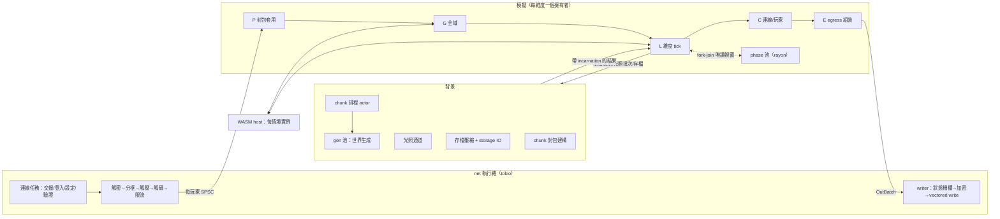

# Kiln：高效能 Minecraft Java Edition 伺服器核心設計文件（26.3／protocol 777）

## 0. 摘要

**核心架構一句話**：每個維度同一時間只有一個擁有者執行緒，依原版階段順序做決定性模擬；與順序無關的工作（網路、壓縮加密、世界生成、光照、序列化、IO、chunk 封包）全部移出 tick；tick 內可平行的部分在唯讀 fork-join 視窗執行，結果依原版順序套用。

**為什麼**：Folia 的 1000 人測試刻意分散玩家，人群集中時仍落在單一區域，所以需要區域「內」的平行化；Pumpkin 的 async→sync 重構（約 900 個檔案）證明遊戲邏輯必須同步；決定性讓我們能逐 tick 與原版差分測試，這是小團隊唯一負擔得起的正確性手段。

**最重要的設計決策**
1. 單一擁有者加型別強制的唯讀視窗；推測結果帶相依（含移動者碰撞情境）在套用時驗證；`PhaseExec` 保證內聯或平行不影響結果（§4.4）。
2. 跨維度預設依序且直接存取（精確）；平行維度 TICK-02 只在掃描證明沒有跨維度指令時自動啟用，共享狀態走 op-log 與衝突偵測，實體跨維度一律走轉移帳本（§4.6）。
3. 每個非同步結果帶 chunk incarnation，過期即丟；UUID 唯一檢查；ordered 模式 chaos harness 與重播紀錄（§4.4）。
4. encode-once arena、chunk 快取送出時驗證、以位元組為界且有狀態柵欄的 egress、一級的 proxy 模式（§7）。
5. f32 批次直譯器是世界生成的 oracle 與預設路徑；數學參考是 HotSpot `Math`（26.3 jar 沒有 StrictMath，Q8 已結案）；轉譯器只在量測證明需要時做（§8）。
6. 近似目錄：E/I/V/F 可操作定義、解析範圍、容忍度與量測方法（§10）。
7. WASM：每情境一個實例；跨情境狀態只能用情境自有命名空間、型別化原子操作或對 global 的單寫者呼叫；每玩家預算與 fail-closed（§11）。
8. 所有 ID 從官方 jar codegen、clean room、季度改版兩層政策（§2）。

**時程（老實說）**：由下而上估算，含 25% 緩衝與逐次增加的改版預算。精簡插件 host（M3b）約 2028-02；完整目錄與插件 1.0（M7）計畫值約 2030-12，合理範圍 2028-12 到 2033（§14.4）。M1 結束以實測產能重估。

**需要使用者拍板**：[§15.1](#151-待使用者拍板的決策) 的 Q1–Q18（Q8 已結案）。

---

## 1. 目標、非目標、效能目標與量測方法

### 1.1 目標與非目標
- 目標：只支援最新正式版 26.3（protocol 777、world version 5023）並跟進季度改版；`vanilla` profile 在可測範圍內與原版逐位元一致，偏差一律明列、可設定、可量測；同硬體、同版本下以里程碑比較閘門證明勝過 Paper；WASM 插件；Windows 開發、Linux 部署。
- 非目標：多版本（交給 ViaVersion/ViaProxy）、Bedrock、DataFixerUpper（舊世界先用原版 `--forceUpgrade`）、Bukkit API、mod、v1 的 anti-xray（Q14）與 signed chat（Q4）。

### 1.2 效能目標
全部是**未量測估計**，由 M1 校準（§1.4）與 M6 取代。

| # | 情境 | 目標 | 機制 |
|---|---|---|---|
| T1 | 閒置、載入出生點 | RSS ≤ 300 MB | 位元組對齊 palette、無 GC、mimalloc |
| T2 | S1 300 bots，vanilla | p99 ≤ 15 ms；CPU 秒/tick ≤ 0.5× Paper vanilla-like | encode-once、增量 tracker、平行組裝、壓縮加密移出 tick |
| T3 | S2，vanilla profile | 玩家數 ≥ 1.5× Paper vanilla-like（p99 ≤ 50 ms） | EX-01…07、ENT-01（皆 E）、無 GC 停頓、光照與 IO 移出 |
| T3b | S2，balanced／performance | ≥ 1.3× kiln-vanilla／≥ 3× Paper 預設 | §10 的 I/V/F 項目 |
| T4 | 世界生成，同種子同執行緒 | ≥ 3× Paper（硬閘門 ≥ 1×） | f32 批次直譯器（SIMD 通道加倍）、DAG 平行 |
| T5 | S4a，vanilla-exact | MSPT ≤ 0.5× Paper vanilla-like；≤ 1/3 Paper 預設 | 保序休眠、狀態表 |
| T6 | 加入時 chunk 已快取 | sim 成本 ≤ 5 ms | 快取封包 N 次 `Bytes` clone |
| T7 | S1 每玩家 egress | vanilla ≤ Paper；balanced ≤ 0.6× Paper | TR-01、快取 chunk 高壓縮等級 |
| T8 | 10 秒 200 人加入 | 無 tick 超過 50 ms | 每 tick 加入限量、登入在 net 執行緒 |

**同版本規則**：比較數字兩邊同一 MC 版本、同一批 bot、同一世界，報告印出兩邊版本。主線換版而 Paper 未跟上時，改用與 Paper 最新版相符的 Kiln pinned tag；kiln-bot 保留前一版 codegen（ID 全由 codegen 產生，成本低）。Paper 為 alpha 時照量並標示。

### 1.3 量測方法
- **拓撲**（Q17 決定前暫定）：伺服器在雙開 Linux 的 5700X3D；bots 與 Velocity 在另一台機器、有線網路；proxy 模式。同機時以 `taskset` 隔離 CPU 並標註；WSL2 不作正式數字。
- **基準**：原版 26.3 jar；Paper 預設、tuned、vanilla-like（關閉 activation range 與 hopper cooldown）。kiln-vanilla 對 Paper vanilla-like 與預設；balanced/performance 對 tuned。
- **指標**：MSPT（平均、p50、p99、最大）、CPU 秒/tick、RSS、每玩家 egress、chunks/s 與每 CPU 秒 chunks、加入到 441 chunk 延遲；5 次中位數 ± IQR。
- **情境**：S1 64×64 格內 N 人；S2 夜晚分散生存（相距 1,500 格、上限滿）；S3 探索未生成地形；S4a 無生物農場（1,000 漏斗、分類器、紅石計算機）；S4b 含鐵、金農場；S5 TNT；S6 多小時 S2+S3 浸泡。
- **統計容忍度**：以 95% CI 表示 Kiln/原版速率比；兩個 Poisson 速率比的半寬約 1.96·√(1/N₁+1/N₂)，±2% 需每邊約 19,200 個事件，所以固定 tick 數，原版用 `/tick sprint`。

### 1.4 校準與容量模型
M1 校準：在原版與 Paper 26.3 上以 JFR/spark 剖析 S2 類負載，得到每玩家、每 mob（GoalSelector 與 Brain 分開）、每 ticked chunk、每個醒著方塊實體的成本，作為容量模型與合成 mob 的來源。

序列 tick ≈ Σ玩家·c_p + Σmob·c_m + Σchunk·c_c + Σ方塊實體·c_b + 階段開銷，預算 40 ms。起始估計（未量測）：c_p 約 15 µs；c_m 在 vanilla 約 4 µs、balanced 約 3–3.5 µs（S2 多為 GoalSelector mob，只有 AI-02 覆蓋的路徑移出）、performance 約 0.8 µs（AI-04/05）；c_c 在 vanilla 約 0.3 µs、RT-01 後約 0.1 µs。推得 S2 約 vanilla 85 人、balanced 100–120 人（地獄/終界有負載時 TICK-02 再加）、performance 350 人。Q1、Q9、Q10 的預設以 M6 實測為條件。

---

## 2. 版本與資料策略

### 2.1 版本
26.3、protocol 777、world version 5023、原版 jar 需要 Java 25。版本常數集中在 `kiln-version`。只接受 DataVersion 5023 的世界，其他版本提示先用原版 `--forceUpgrade`。

### 2.2 資料擷取與 codegen
`xtask data fetch <ver>`：
1. 依 Mojang manifest 下載 `server.jar` 並驗證 SHA-1。
2. 執行 `-DbundlerMainClass=net.minecraft.data.Main --reports --server`（約 15 秒）：packets.json、blocks.json（1,286 個方塊、35,723 個狀態）、registries、物品預設元件、datapack JSON、指令樹、JSON-RPC 管理 schema。
3. `kiln-extractor`（fork 自 CC0 的 SteelExtractor 或 MIT 的 Pumpkin Extractor）：碰撞形狀（標記依賴 `CollisionContext` 者）、實體 metadata、追蹤範圍、chunk pyramid 半徑、multi-noise RTree、density function 向量、`Mth.SIN`／`ASIN_TAB` 等初始化表、修補過的參考 chunk dump。

codegen 是 xtask（`kiln-data-gen`），產物提交進版本庫，不用沉重的 build.rs。封包以名稱解析 ID，被移除或改名的封包會造成編譯錯誤。

### 2.3 資料分級與 clean room
- **Tier F（提交：互通所需事實）**：ID、名稱、狀態屬性、形狀、封包 ID 的精簡 JSON 與生成的 Rust。
- **Tier A（永不提交或散布：Mojang 資產）**：datapack JSON、結構模板、jar。開發者與 CI 自行下載；發行版在首次啟動、同意 EULA 後下載官方 jar 到雜湊驗證的快取。轉譯後的世界生成只含拓撲。
- **Clean room**：反組譯碼只用來寫 spec note（`docs/spec/…`，以自己的話描述行為、順序與事實常數）；程式碼依 spec note 與測試另行撰寫；不做逐行移植；版本庫、issue、prompt 不含反組譯碼與 GPL/AGPL 程式碼；每個 PR 列出參考來源。

### 2.4 季度改版
改版節奏約 12–13 週（26.1 3 月、26.2 6 月、26.3 9 月；之後日期為推估）。26.4-snapshot-1 已經改了 `steep` material 條件、移除 noise settings 的 `default_block`、改 lush/dripstone 洞穴生成與 `cuboid` 語意、biome 改成 16³、chunk NBT 的 `Status` 改名 `status`。研究結論是每次改版應預留「一次完整的世界生成 schema 遷移」。

**兩層政策**
- **(a) 協定與資料 parity、可加入**：正式版釋出後 10 個工作天內完成。codegen 重跑、goldens 與參考 dump 由新 jar 重新產生、新封包欄位與元件手寫。
- **(b) 新內容與變動的世界生成 parity**：在下一個里程碑內完成；在此之前由偏差清單標示「未實作／未驗證」。

**預算隨已實作的範圍成長**：D1 2 週、D2 2 週、D3–D4 3 週、D5–D6 4 週、D7 起 5 週（§14 的日曆已計入）。

**持續進行**：`next` 分支從 M0 起每晚抓最新 snapshot，產出差異報告（封包、registry、狀態數與 bpe、狀態 DAG 與 density op、chunk 格式、交握）。每次演練包含**世界升級程序**（原版 `--forceUpgrade` → Kiln 驗證 DataVersion → round trip 通過），寫進維運文件。

### 2.5 數值參考（Q8 已結案）
對 26.3 jar 的檢查：7,744 個 `net/minecraft` 類別中，引用 `java/lang/StrictMath` 的有 0 個，引用 `java/lang/Math` 的有 492 個。`UnaryFunction$LogSampler` 呼叫 `Math.log(D)D`，`PowFunction` 的三個 sampler 呼叫 `Math.pow(DD)D`；feature（OreFeature、IcebergFeature、FancyTrunkPlacer、SpeleothemUtils）以 double 直接呼叫 `Math.sin/cos/pow/log`；`Mth.SIN` 與 `ASIN_TAB` 在類別初始化時由 `Math.sin/cos` 建表。

因此：
- 參考實作是 **JDK 25 HotSpot x86-64 的 `Math`**（intrinsic 源自 Intel LIBM，不是 fdlibm）。
- 類別初始化表由 extractor dump，不自行重算。
- 每個逐次呼叫的超越函數選一種實作（correctly rounded 或 fdlibm），以約 10⁸ 個 extractor 向量量測與 jar 的翻轉率，選翻轉率最低者；已知翻轉列入偏差清單。
- 這個例外涵蓋 density op **與** feature 中的 double 呼叫。

---

## 3. 整體架構



**Workspace（相依只往下）**
```
kiln-server          協調者、執行緒池、設定與 profile、維運協定
├─ kiln-plugin-host  wasmtime host、capability、限制（kiln-plugin-wit／sdk 另行發佈）
├─ kiln-net          連線任務、登入/設定狀態機、驗證、proxy、egress、限流
│  └─ kiln-proto     codec、分框、壓縮/加密 trait、封包（kiln-proto-derive）
├─ kiln-sim          階段、方塊行為、紅石、方塊實體、生怪、tracker、物品欄、指令執行、目錄、帳本
│  ├─ kiln-entity    SoA 儲存、空間索引、物理、AI、尋路
│  ├─ kiln-light     光照引擎
│  └─ kiln-world     container、chunk、cell、ticket、狀態 DAG、tick 佇列、POI
├─ kiln-chunkgen     排程 actor、ProtoChunk      └─ kiln-worldgen 直譯器、noise、feature、structure
├─ kiln-storage      Anvil、level/player 資料、StorageService
├─ kiln-command      Brigadier 相容樹、57 種 parser、selector、NBT path
├─ kiln-data／kiln-version／kiln-nbt／kiln-util
└─ kiln-javamath     Java RNG、Math 參考實作、HashSet 與 PriorityQueue 順序模擬
工具：kiln-harness、kiln-bot、kiln-capture、kiln-probe（Java agent）、kiln-extractor、xtask；fuzz/（nightly）
```
規則：sim、world、entity、worldgen 不相依 tokio 與 `kiln-net`（xtask 檢查）；主 workspace 用 stable Rust；mimalloc 為全域配置器。

---

## 4. 執行緒與 tick 模型

### 4.1 擁有權
```rust
struct Server { worlds: Vec<World>, global: Global, ledger: TransferLedger, mode: DimMode }
struct Global { players: PlayerList, scoreboard: Scoreboard, storage: CommandStorage, bossbars: Bossbars,
                gamerules: GameRules, schedule: FunctionSchedule, ids: IdAllocators, registries: Registries }
enum DimMode { Sequential, Parallel }           // TICK-02 的實際狀態（§4.6）
enum CrossDim<'a> {                             // 維度 tick 內對其他維度的存取
    Direct   { others: &'a mut [World], global: &'a mut Global },   // 依序模式：精確
    Deferred { outbox: &'a mut Outbox, global: GlobalView<'a> },    // 平行模式
}
```
- `World` 以 `Box<Chunk>` 擁有 chunk；其他執行緒只持有 `ChunkPos` 或帶世代檢查的 handle；沒有 `Arc<Mutex<World>>`。
- 離開 sim 的只有不可變的 section 資料（`Arc<BlockContainer>`、`Arc<[u8; 2048]>` 光照，CoW）；快照不保留 chunk，不可能阻擋卸載（Pumpkin #2040 在結構上不會發生）。
- sim 不 await、不相依 tokio。

### 4.2 執行緒清單與預設數量（8C/16T）

| 池 | 預設 | 優先權 | 工作 |
|---|---|---|---|
| sim | 依序模式 1（協調者）；平行模式每維度 1 | 正常 | 權威 tick |
| phase（rayon） | 6（實體核心 −2） | 正常 | tick 內 fork-join 視窗 |
| 必要背景 | 2 | 正常 | 存檔壓縮、卸載、ticking chunk 光照、排隊檢視者的 chunk 封包 |
| gen（rayon） | 4（邏輯核心/4） | 低 | 推測性世界生成、非 ticking 區光照 |
| chunk-scheduler | 1 | 正常 | 擁有所有 ProtoChunk 的 actor |
| net（tokio） | 2（直連約每 250 連線 1 條，≤ 8） | 正常 | socket、加解密、登入、驗證 |
| storage IO | 2 | 正常 | 定位式 region IO |
| plugin-async／watchdog | 1／1 | 正常 | WASI 0.3 工作／epoch 與停滯偵測 |

- 釋放資源的工作與推測性生成分開，CPU 飽和時不會被餓死。
- 待存檔位元組上限（預設 256 MiB）：超過時 sim 停止接受新的生成 ticket，並在 L11 內聯壓縮存檔，直到回到上限以下。
- rayon 自旋縮短並可調；所有池大小可設定。

### 4.3 tick 階段順序
原版在 tick 之間處理封包，tick 內依序是 functions、各維度、connection（玩家 tick）、送 chunk。P/G/L/C/E 對應這個順序；`kiln-sim/src/order.rs` 是從 26.3 bytecode 寫成的 spec note，有測試斷言，每次改版重新比對。

```
P   封包套用    玩家依加入順序，各自的封包依到達順序（原版的全域到達序取決於網路，本來就不可重現）
G0  intake      console/RCON/JSON-RPC、跨維度訊息（排序）、插件完成事件
G1  全域        #minecraft:tick functions、/schedule（實際位置寫進 order.rs）
G2  時間步      overworld 的 world border、天氣、睡眠、tickTime（原版中這些先於其他維度且不讀其他維度）
—— 依序模式：各維度依原版順序在協調者上執行（CrossDim::Direct）；平行模式：fork（CrossDim::Deferred）
L0  inbox       chunk 升級、光照發佈、路徑結果、抵達者（依鍵排序，丟棄過期 incarnation）
L1 ∥ 預檢       移動封包的無情境碰撞預算
L2  scheduled block/fluid tick（觸發時間、優先權、sub-tick）
L3  raid        L4 chunk tick：ticket、生怪（原版洗牌列表、level RNG）、隨機 tick、降水
L5 ∥ tracker    可見性差異與 delta 編碼
L6  block event
L7 ∥ AI 預處理  Brain sensor（profile 控制）、POI 候選、goal 起始條件的推測路徑求解
L8  實體 tick   EntityTickList 插入順序、乘客
L9  方塊實體 tick（有序列表 + 醒著的 bitset）
L10 實體管理    加入、移除（空間成員資格在移動當下已更新）
L11 ∥ 尾端視窗  AI-02 路徑求解、autosave NBT 編碼（有預算）
L12 交接        光照批次、存檔、生成請求（皆帶 incarnation）
—— join ——
C   連線        玩家 doTick、keepalive（平行模式在各自維度執行緒）
E   egress      每玩家訊框依 (phase, seq) 合併、壓縮；chunk sender；交給 net
B   barrier     依維度順序重播全域 op-log、衝突偵測、ID 租約、metrics、超時政策
```

### 4.4 平行化與決定性

**型別規則**
1. 視窗只拿 `&World`；RNG 要 `&mut` 才能抽，所以原版的每次抽取都在序列套用中。
2. 結果以輸入順序回傳（indexed `collect`），依原版順序套用；禁止平行浮點歸約（lint），只允許 indexed collect 後序列 fold。
3. 會被序列階段改變的結果帶相依、套用時驗證：

```rust
struct Spec<R> { deps: SmallVec<[Dep; 8]>, val: R }
enum Dep { Section(SectionKey, u32), BlockEntity(ChunkPos, u32), Light(SectionKey, u32),
           Mover(EntityKey, u64 /* 移動者情境雜湊 */), Border(u32) }
impl<R> Spec<R> { fn take(self, w: &World, recompute: impl FnOnce() -> R) -> R {
    if self.deps.iter().all(|d| w.dep_current(d)) { self.val } else { recompute() } } }
```
- **移動者情境**：鷹架、細雪、移動中的活塞等形狀依賴 `CollisionContext`。codegen 依 extractor 標記這些方塊；預檢只算與情境無關的部分，情境相依者在套用時計算。`Dep::Mover` 涵蓋輸入旗標、姿勢、腳部物品、落下距離區間、載具、遊戲模式與能力、移動前位置；同 tick 中該玩家任何改變情境的封包都使它失效。通過驗證的結果與內聯計算逐位元相同，所以 EX-02、EX-04 是 E 類。

**`PhaseExec` 契約：策略不得改變結果**
```rust
trait PhaseWindow: Sync { type In: Sync; type Out: Send;
    fn run(&self, snap: &World, item: &Self::In) -> Self::Out; }      // 純函數
enum Strategy { Inline, Parallel }    // 依大小與命中率選；strict 模式凍結門檻
```
內聯與平行呼叫同一個 `run`、讀同一個快照、在同一個階段點；延後的結果一律在固定偏移送達。CI 對每個視窗跑強制內聯、強制平行、隨機混合，每 tick hash 必須相同。

**模式**：`ordered`（預設）tick 內完全決定，非同步結果在到達的 tick 依鍵排序套用；`strict`（測試與重播）非同步結果在固定偏移套用、sim 等待、插件用 fuel，同種子加同輸入在任何執行緒數下每 tick hash 相同。

**incarnation**：每個 `ChunkPos` 有 `incarnation: u32`，每次載入加一；所有請求（chunk、實體、POI、光照、封包建構）帶 `(ChunkPos, incarnation)`，L0 丟棄過期結果。實體加入時檢查維度內 UUID 唯一，重複即拒絕並記錄（與原版相同）。

**重播與 chaos**：重播紀錄記下每個非同步結果的套用 tick，production 事故可在 strict 模式重現。ordered 模式 chaos harness 隨機延遲與重排 IO、生成、光照完成，搭配快速 ticket 翻轉，斷言 UUID 唯一、卸載重載物品數守恆、沒有結果裝進非當前 incarnation、光照等於完整重算。

### 4.5 熱點與人群
每個 O(n²) 工作都在視窗內執行或化為 memcpy：可見性依原版觸發條件增量計算（§6.3）、delta 每實體編碼一次、每位檢視者的組裝是區段 memcpy、壓縮加密在 tick 外或 proxy。序列成本維持 O(玩家 + 實體 + 封包)；生怪上限以可生怪 chunk 的聯集計算。M1 以校準的 mob 成本量測人群序列比例，超過 60% 時把數據與選項交給使用者（R1）。

### 4.6 跨邊界互動

**依序模式**（vanilla profile 與 TICK-02 未啟用時）：各維度依原版順序在協調者上執行，`CrossDim::Direct` 以 `split_at_mut` 取得其他維度的 `&mut`。非世界限定 selector、`execute in`、跨維度 `tp`、珍珠、傳送門都當場生效，與原版一致。

**TICK-02 = `auto`**
- 只在靜態掃描沒有發現跨維度存取點時平行。存取點：非世界限定的 selector（`@e/@a/@r` 且無 x/y/z/distance/dx）、`execute in`、`at` 可能在其他維度的實體、跨維度 `tp`。
- 掃描範圍：datapack functions、指令方塊（載入與每次編輯）、指令方塊礦車、進度獎勵與附魔 `run_function`、/schedule 目標。有存取點就依序執行並記錄原因。
- 執行期出現新存取點或 barrier 偵測到衝突：下一個 barrier 起切回依序，本 session 保持關閉，原因列入 `/kiln deviations`。操作者可強制 `on`，此時該世界的 TICK-02 視為 F。

**共享狀態清單（平行模式）**

| 狀態 | 規則 |
|---|---|
| 遊戲時間、日時間 | G2 在 fork 前推進，所有維度看到 T+1（與原版後執行的維度相同） |
| 實體網路 ID、map ID | 每維度在 barrier 依維度順序領取區塊租約（決定性）；數值與原版不同、map 可能跳號，I 類 |
| 實體 UUID | 每維度決定性串流；加入時檢查唯一 |
| 記分板、command storage、bossbar、隊伍、gamerule | `GlobalView` 讀快照加自身寫入；寫入記為 op（set／add），barrier 依（維度順序, seq）重播 |
| 衝突 | 維度 i 本 tick 寫入的鍵被原版順序較晚的維度 j 讀取（W_i ∩ R_j ≠ ∅, i<j）：該 tick 不精確，記錄並切回依序 |

只寫不讀的 set 與 add 依順序重播就與原版相同；唯一的差異來源正是衝突偵測的條件。strict 測試會在三個維度同 tick 生成實體並分配 map。

**轉移帳本**
```rust
struct TransferLedger { entries: BTreeMap<TransferId, Transfer> }      // 隨 level data 持久化
struct Transfer { entity: Box<EntityTransfer>, from: DimId, to: DimId, src_tick_seq: u64,
                  reason: TransferReason, state: TransferState /* InTransit | Arrived */ }
```
- 只有擁有者執行緒能標記轉移中並移除實體。非擁有者的請求（地獄的珍珠要傳送 overworld 的主人、別的維度的 `tp @e`）變成訊息，在擁有者下一個 L0 處理；對轉移中或已移除實體的請求被拒絕（同原版 `isRemoved`）。
- 玩家資料指向帳本條目；存檔、關機、崩潰都不會遺失或複製轉移中的實體。
- 同 tick 抵達者依（來源維度順序, 來源 tick_seq）排序，讓原版會選的那位建立傳送門。
- 平行模式下跨維度珍珠與傳送門晚一 tick（I）。GameTest：跨維度珍珠加同 tick 進傳送門、轉移中關機。

**SYNC-01**（非 vanilla profile）：每個原版同步載入點寫成 spec note，列出它讀取的**完整** chunk 集合與狀態；例如傳送門搜尋前往 overworld 讀半徑 128 格（17×17 = 289 chunk）的 POI、前往地獄讀 16 格。實體在轉移狀態等整個集合就緒，優先權沿相依傳遞；POI 單獨載入。每點各自分類；傳送門搜尋連結結果精確、只有抵達延遲（I）。

**vanilla profile 的阻塞載入（Q7）**：預設有上限的模擬。阻塞請求把整個相依閉包（含半徑 8 的 STRUCTURE_STARTS）提升到最高優先權；生成絕不等待 sim（結構起點與參照在不可變側表）；等待迴圈只抽取排程器與 IO 完成事件；超過期限（預設 500 ms）記錄並退回 SYNC-01。測試：S3 負載下走傳送門進入未生成地形。

### 4.7 超時策略
- 預設不做追趕 tick（TICK-01）；vanilla profile 保留原版追趕。
- 以 MSPT EMA 加遲滯驅動的卸載階梯，只用 profile 允許的階並記錄：R1（>40 ms）chunk 傳送與生成速率、autosave 預算減半；R2（>45 ms）tracker 降頻、路徑預算收緊；R3（>50 ms 持續 5 秒）縮小 AI-04 起始距離、新 ticket SD −2；R4（>100 ms 持續）拒絕加入。
- Watchdog：停滯 5 秒 dump stack，60 秒中止；`/kiln tick` 顯示每階段 p50/p95/p99，另有 tracing span 與 Prometheus。

---

## 5. 世界與區塊

### 5.1 Section 佈局
```rust
enum BlockContainer {                                  // 放在 Arc 中以便 CoW 快照
    Single(StateId),                                   // wire bpe 0
    Nibble { pal: Palette<16>,  idx: [u8; 2048] },     // wire bpe 4，byteswap 即可送出
    Byte   { pal: Palette<256>, idx: [u8; 4096] },     // wire bpe 8（用戶端接受 5–8）
    Direct(Box<[u16; 4096]>),                          // wire bpe 16 = ceil(log2 35,723)
}
struct SectionMeta { non_air: u16, fluid: u16, version: u32, random_ticking: SmallVec<[u16; 8]>, light_dirty: bool }
```
- O(1) 讀寫，送出只做 SIMD byteswap 加 palette 標頭；記憶體在 ≤ 16 種狀態時約等於原版、17–256 種最多 1.6 倍（M2 以真實世界量測）。
- biome 為 `Single | Byte([u8; 64])`，大小依版本參數化（26.4 改為 16³）。送出時重新打包成 wire 格式：biome 的間接 palette 只接受 1–3 bits，超過就改用 direct 全域 biome ID（64 個項目，成本可忽略），不能像方塊那樣直接 byteswap。
- 每 chunk：4 個 heightmap、光照 `[Option<Arc<[u8; 2048]>>; n+2]` ×2、方塊實體、`be_version`、`light_version`、狀態、髒旗標、`CachedChunkPacket`。
- 以 `StateId: u16` 索引的生成表：不透明度、發光、形狀、是否情境相依、隨機 tick、PathType。

### 5.2 Chunk 地圖
cell = 8×8 chunk：`HashMap<CellPos, Box<Cell>>`，每個 cell `[Option<Box<Chunk>>; 64]`，加最後使用 cell 快取。v1 只保留便宜的可分區不變量：cell 索引佈局、tick 列表的 `tick_seq`、沒有跨 chunk 裸指標（一律經 `WorldView`）；split/absorb 屬於 M9。

### 5.3 Ticket 與生命週期
- 原版等級（FULL 33、block-ticking 32、entity-ticking 31），ticket 類型由資料生成；等級傳播是 sim 上的增量 BFS（O(r)），便宜且決定性，因此 v1 不照搬 Moonrise 的離線傳播器。
- 兩階段卸載：等級越過門檻、無鄰居生成參照、無進行中光照工作觸及它與光照鄰居後，sim 把 `Box<Chunk>` 與實體移進 `SaveJob::Unload`；storage 放入待寫入表，重載直接由此提供。
- chunk、實體、POI 分開載入（26.x 佈局），皆帶 incarnation。

### 5.4 26.3 生成狀態 DAG
`EMPTY → STRUCTURE_STARTS → STRUCTURE_REFERENCES → BIOMES → TERRAIN → FEATURES → INITIALIZE_LIGHT → LIGHT → SPAWN → FULL`
- 鄰居半徑擷取自 26.3 chunk pyramid（FEATURES 寫入 1、LIGHT 2）。EMPTY 到 TERRAIN 與 INITIALIZE_LIGHT 完全平行；FEATURES、LIGHT、SPAWN 需要區域獨佔。
- `chunk-scheduler` actor 擁有所有 ProtoChunk；區域工作把鄰域以 `Vec<Box<ProtoChunk>>` 移出、完成移回，擁有權就是鎖。
- 優先權為到玩家 ticket 的最小距離；阻塞請求提升整個相依閉包。結構起點與參照存於不可變側表，生成永不需要向 sim 要資料。

### 5.5 非同步結果套用
SPAWN 後送出 `ChunkReady { pos, incarnation, chunk }`；L0 驗證 incarnation、安裝方塊實體與實體（檢查 UUID）、推導狀態、排入傳送。磁碟載入：IO → 必要背景池解壓與 NBT 解析 → `ChunkLoaded`；部分生成的 chunk 送回排程器。

### 5.6 Scheduled tick 與 POI
每 chunk 的 scheduled tick 以 `kiln-javamath` 模擬 `java.util.PriorityQueue` 的 siftUp/siftDown 陣列佈局，存檔依堆陣列順序寫出、載入依該順序分配 sub-tick 序號，重載後同 (tick, priority) 平手順序與原版一致。POI 以 section 為單位帶版本，供 L7 驗證。

---

## 6. 實體與方塊實體

### 6.1 儲存
不押注第三方 ECS（Hyperion 換了三次，bevy 每 3–4 個月破壞一次）。每維度一個自有 SoA store：
```rust
struct EntityStore {
    ids: SlotMap<EntityKey, u32>,
    pos: Vec<DVec3>, old_pos: Vec<DVec3>, vel: Vec<DVec3>, aabb: Vec<Aabb>, rot: Vec<[f32; 2]>,
    flags: Vec<EFlags>, kind: Vec<EntityTypeId>, section: Vec<SectionKey>,
    net_id: Vec<i32>, uuid: Vec<Uuid>, tick_seq: Vec<u64>,
    living: SparseCol<LivingData>, mob: SparseCol<MobData>, data: Vec<KindData>,
}
```
封閉 enum 加生成表 `match` 分派，熱路徑無 trait object。`EntityTickList` 是插入順序列表加墓碑與保序壓縮，等同原版順序。

### 6.2 空間索引
- 每個 16³ section 的桶 `{all, by_class[items, living, projectiles, containers, hard_colliders]}` **保持插入順序**（墓碑加保序壓縮，不用 swap_remove）；**成員資格在移動當下更新**（同原版 `setPos`），同 tick 稍後的漏斗看得到剛進入的物品。
- 查詢依 section 鍵順序、再依插入順序回傳（影響漏斗取物與合併）。
- 每 chunk 的 `NearbyPlayers`（視距、模擬距離、8、3、10 chunk）。
- 每 section 的睡眠漏斗監聽表（吸取區與目標區 AABB），物品或容器實體移動、數量變化時測試並喚醒。

### 6.3 Tracker
觸發條件照搬原版：實體 SectionPos 改變（含 Y）時重新評估；玩家換 section 時以空間索引找出範圍內實體、用精確距離重查。結果與原版相同（E），只是檢查集合較小。L5 以 `par_map` 產生 `(added, removed)` 差異依序套用；delta 封包一次編碼進 arena。追蹤與廣播以「已送出」為準（§7.4）。

### 6.4 AI 與尋路
- GoalSelector（`canUse` 隔 tick）與 Brain（TTL 記憶、原版週期 sensor、活動）都是資料加封閉 enum，在 L8 依序執行。A* 用每執行緒 arena、PathType 表、section 全開/全實心摘要。
- **EX-04**：鍵為（起點、目標、評估器、大小），以 section 版本驗證。
- **起始條件需要路徑者**（AvoidEntityGoal 的 `canUse`、MoveToTargetSink）：在 L7 推測求解並驗證，精確；失敗則 L8 同步求解。
- **AI-02** 只用於 `start()` 之後的 moveTo（例如追擊中的重算），L11 求解、下個 L0 依請求順序送達；涵蓋的呼叫點列在目錄。
- 村民 POI 候選在 L7 計算、以 POI 版本驗證，認領依序套用。

### 6.5 方塊實體與休眠
- 每 chunk 一個有序列表；醒著的 bitset 以 ctz 掃描，醒來的漏斗剛好在原版位置 tick。
- **喚醒來源**由 spec note 列舉漏斗與各方塊實體 tick 路徑的每個讀取而來：
  - 物品欄修改計數器（自身與快取鄰居）——**遞增是唯一物品欄修改 API 的一部分**，`/item`、`/data modify block`、戰利品寫入、WASM `inventory` 都無法繞過；
  - 物品與容器實體（含漏斗/儲物箱礦車）的移動與數量變化，經監聽表測試後喚醒，section 內移動也算；
  - 冷卻到期（含 7gt/8gt）、附著面方塊更新、堆肥桶等級、目標旁雙箱子形成。
- 已知失敗的轉移略過並重播比較器副作用（Lithium 技術，重新實作）；熔爐、釀造台等同理（EX-07）；不用 Paper 的 cooldown-when-full。
- **verify-memo**：測試時重算每個略過的 tick；production 抽樣 1%，不符即記錄並喚醒。

### 6.6 靜止休眠（ENT-01）
只略過可證明靜止實體（在地面、速度零、不在流體、無推擠來源、支撐 section 版本未變）的移動積分與碰撞；`checkDespawn`、年齡、`noActionTime`、合併節奏、`(tickCount + id) % 4` 相位與所有 RNG 抽取仍每 tick 執行；流體、鄰居更新、section 變化會喚醒。如此為 E，由 verify-memo 覆蓋。整 tick 略過的版本會改變 AFK 刷怪塔與物品消失，不提供。

---

## 7. 網路管線

### 7.1 IO runtime 與入站
- tokio 多執行緒（IOCP／epoll），每連線一個 reader 與 writer；連線任務處理交握、status、登入、設定、非同步 `hasJoined`（逾時；端點由 discovery 解析並依 TTL 快取）、proxy forwarding。sim 只看到進入 Play 的玩家。io_uring 延後，放在 transport trait 後。
- 入站：64 KiB 緩衝 → 批次 CFB8 解密（約 6 倍）→ VarInt 分框（≤ 2,097,151）→ libdeflate 解壓到宣告大小（拒絕 > 8 MiB、< 門檻、> 壓縮長度 1032 倍）→ 解碼成擁有資料的型別化封包 → 限流 → 每玩家有界 SPSC，P 階段取出。

### 7.2 Encode-once 與 egress
```rust
trait Packet: Encode + Decode { const ID: PacketId; const STATE: ProtoState; const DIR: Dir; }
#[derive(Encode, Decode)] #[packet(Play, Clientbound, "minecraft:level_chunk_with_light")]
struct LevelChunkWithLight { /* 欄位依 spec note 手寫，以 golden bytes 鎖定 */ }
struct TickArena { buf: BytesMut, spans: Vec<Range<u32>> }                      // 最終訊框，只編碼一次
struct PlayerOut { own: SmallVec<[Frame; 16]>, refs: Vec<(OrderKey, SpanId)> }  // OrderKey = (phase, seq)
```
- 廣播封包只分框、壓縮一次；E 階段平行地依 `(phase, seq)` 把每位玩家的訊框與引用合併成連續緩衝，保留原版 tick 內順序；每連線只剩加密。
- **Lane**：高優先 lane 只放順序無關的 keepalive 與 disconnect，由 writer 依連線**目前狀態**編碼（Configuration 與 Play 的 ID 不同）；teleport 走一般 lane，保持與 Respawn 的順序。
- **狀態柵欄**：StartConfiguration 等狀態切換先 flush 並封住一般 lane，再丟棄或重新編碼佇列中的 Play 訊框。
- **Bundle** 內永不分割、丟棄或插入高優先訊框；≤ 4,096 個封包。
- **背壓**：待送位元組計數加 `Notify`；軟上限 2 MiB 暫停 chunk、移動合併為定期完整同步；硬上限 32 MiB 或 30 秒未確認即斷線；≤ 64 KiB 切片加密、vectored write。strict 模式對每位玩家加密前的串流做 hash。

### 7.3 壓縮與加密位置
libdeflater（MSVC 以 `cc` 建置）、zlib-rs 備援、不用 miniz；輸出到精確大小 slice，避開 flate2 清零。直連時加密在 writer（CFB8 每核心約 50 MB/s），多緩衝 VAES 延後（Q6）。

### 7.4 Chunk 封包快取與傳送
- `CachedChunkPacket { deps: ChunkDeps, frame: Bytes }`，deps 含所有 section 版本、`be_version`、`light_version`；在必要背景池以 Arc 快照建構，壓縮等級 6（位元組是頻寬槓桿），每 tick 流量用 1–4。
- **送出當下驗證**：訊框從檢視者佇列取出時比對 deps，過期就重建或附上變更紀錄。
- **廣播以已送出為準**：chunk 對某玩家仍待送時不列入廣播與追蹤（原版 `isChunkTracked` 檢查 `!isPending`），所以送出的封包必定反映送出當下的狀態。
- 原版 batch/ack（最多 10 個未確認批次）、螺旋順序；balanced 加 CH-01。

### 7.5 Proxy 模式
`[proxy] mode = "velocity"`：強制 offline 與壓縮門檻 −1；modern forwarding v1–v4、常數時間 HMAC；可選 IP 白名單；arena 訊框不壓縮，egress 為純 memcpy。也支援 BungeeGuard/legacy（host ≤ 32,767），parser 已接受 26.4 的 `host?k=v`。proxy 模式是建議部署與基準預設。

### 7.6 Codegen 與協定完整性
- 封包 ID 由 packets.json 生成並以名稱解析；欄位手寫，以 `kiln-capture`（真實用戶端與原版間的 MITM）錄的 golden bytes 鎖定。registry 同步的 known packs 與完整 NBT 兩條路徑都預先編碼；自訂 datapack registry 走完整 NBT。
- **協定完整性清單**由 packets.json 生成：每個封包必須是已實作、明確忽略（附測試）或延後（列入偏差清單）；改版新增未分類封包時 CI 失敗。涵蓋 resource pack（設定與遊戲狀態）、dialog 與 custom_click_action、code_of_conduct、server_links、transfer、cookie、custom_report_details、post_effects、waypoint、disguised_chat、plugin channel、從 Play 重新進入設定。
- **聊天 v1**：玩家訊息用 `disguised_chat`（保留 chat_type 格式），伺服器訊息用 `system_chat`；接受並忽略 `chat_session_update`、`chat_command_signed`、`chat_ack`。

---

## 8. 世界生成與光照

### 8.1 26.3 f32 語意
26.3 的 density function 與 noise 在所有中間步驟使用 f32，並重構了 noise settings（`material_rule`、`aquifers`/`ore_veins` 物件、不再有隱含的 beardifier、約 15 個新 op）。TERRAIN 合併了 NOISE、SURFACE、CARVERS。實作規則：嚴格 IEEE f32、禁止 FMA 收縮、`(float)` 轉型只出現在 Java 有的地方、`kiln-javamath` 播種（LCG、Xoroshiro128++、MD5 位置種子）、extractor 內嵌的 multi-noise RTree、數學參考見 §2.5。SteelMC 的 26.2 parity 是 f64，不適用。

### 8.2 直譯器與轉譯器
- **批次直譯器（oracle 與預設路徑）**：把 density function 圖攤平成拓撲排序的 `Vec<Node>` 加暫存槽；每個節點一次處理一批位置（一個 cell 柱）的 f32 陣列，自動向量化或以 `std::arch` AVX2（執行期偵測）；f32 的 SIMD 通道數是 f64 的兩倍。同一個直譯器也執行 datapack 的自訂世界生成。
- **轉譯器（條件式）**：只特化拓撲（CSE、依界限消除分支、f32×8 SIMD），常數在執行期載入，生成的程式碼不含 Mojang 資料。**不在關鍵路徑上**：M5 只要求直譯器 parity 與量測吞吐；若直譯器低於 T4 目標，轉譯器才排進 M8。Q3（是否嵌入常數）隨之延後。

### 8.3 平行化與參考比對
平行性來自 gen 池上的狀態 DAG。原版跨邊界的 feature 順序本來就依排程而定（MC-55596），所以比對用的測試區域以正規的單執行緒順序生成，對照依 SteelMC 方法修補過的參考（固定 feature 順序、每 chunk 重設 biome 快取、有序集合）。

### 8.4 f32 spike（M2，2 週）
- **目標版本**：D1 之後的主線（26.4）。它驗證的是 f32 數值語意，在版本間可轉移；M5 開始時以當時主線重新產生向量。
- **範圍**：density function 的值 parity——overworld router 的每個輸出在 cell 角點上 f32 逐位元相同，≥ 10⁶ 個位置，使用 extractor dump 的向量；排除 beardifier。
- **go/no-go**：2 週後仍有無法解釋的不符，就把 R2 升級給使用者（在此之前只支援預生成世界的政策）。

### 8.5 光照
Starlight 式引擎，依公開演算法 clean-room 實作：FIFO BFS、增加與減少分開的佇列、方向性傳播、生成表中的每狀態不透明度與條件式面遮蔽、以 heightmap 初始化天空光、每 section 透明度 bitset。生成期間負責 INITIALIZE_LIGHT/LIGHT。

**執行期光照管線**
1. sim 在 tick 中累積與光照有關的變更，L12 依光照 cluster（彼此相距 > 2 chunk）分組。
2. **每個 cluster 最多一個進行中的工作**；之後的變更排隊，並以前一個工作**發佈後的結果**為輸入串接，不會兩個工作從同一份舊快照出發互相覆蓋。
3. ticking chunk 的光照走必要背景池（高於世界生成）；結果帶 incarnation 與版本，在 L0 發佈（strict 模式等待）。
4. **陳舊上限一 tick**：ticking chunk 的工作若在下一個 L0 仍未完成，sim 等待它或內聯執行該批次。
5. 存檔與卸載會等待（或納入）觸及該 chunk 及其光照鄰居的進行中工作，不會寫出 `isLightOn=true` 的陳舊光照。
6. 光照 chaos 模式隨機延遲工作，並與完整重算比較。

原版光照本來就與遊戲非同步，發佈晚至多一 tick 為 I 類；光照抑制（light suppression）是已記錄的差異（GAP-01）。

---

## 9. 持久化

### 9.1 Anvil 相容
自行依格式規格實作（唯一完整的 Rust 實作是 GPL）：4 KiB sector、位置與時間戳標頭、壓縮類型 1/2/3/4 加 +128 外部 `.mcc`；26.1+ 佈局 `dimensions/minecraft/<dim>/{region,entities,poi}`、`players/{data,advancements,stats}`、`data/minecraft/*.dat`、`level.dat`。轉移帳本存在 level data 旁的 `kiln/transfers.dat`；尚未跑 SPAWN 的 chunk 記在 `kiln/pending_spawn.bin`（sidecar，不寫進 chunk NBT，不影響原版）。

### 9.2 IO 管線
`StorageService` actor 加 2 條阻塞執行緒：定位式 IO（`read_at`／`seek_read`）、256 個 region handle 的 LRU、每 region 的 sector bitmap、寫入合併、由待寫入表提供讀取。deflate 與 LZ4 在必要背景池執行。autosave 是增量的：每 tick 最多約 1 ms 或 24 個 chunk；實體與方塊實體 NBT 在 L11 從 `&World` 編碼，section 以 Arc 快照傳遞。fsync：`per-write`（原版 `sync-chunk-writes`）、`periodic`（≤ 5 秒，balanced 預設）、`none`。

### 9.3 Round-trip 驗證
兩邊伺服器都以 `/tick freeze`，或以 gamerule 關閉隨機 tick、火焰蔓延、生怪（名稱依 26.3 codegen）且無玩家的情況下執行 N tick。比較**正規化 NBT**：方塊狀態、biome、方塊實體、實體、heightmap、光照、tick 列表（有序）、level.dat、playerdata；排除 `LastUpdate`、`InhabitedTime`、時間戳與 sector 佈局。

### 9.4 可選原生格式（M8）
放在 `trait ChunkStorage` 後面：log-structured region store（附加寫入加索引、背景壓實）、直接存我們的 container 格式（載入不需重新索引）、zstd 等級 3 加每維度字典，消除 Anvil 實測 27% 的 sector 填充；`kiln world convert` 雙向轉換。Anvil 維持預設，round-trip 閘門只涵蓋 Anvil。

---

## 10. 近似與最佳化目錄

### 10.1 類別（可操作的定義）
- **E**：逐位元與原版相同。證明方式：DT1 追蹤一致（§13）。
- **I**：內部時序或 RNG 串流不同，但一般遊戲觀察不到。操作定義：DT2 GameTest 結果全部一致，且農場套件的速率比 95% CI 落在該項目的容忍度內（DT1 追蹤可以不同）。
- **V**：看得出差異，但農場仍可運作；有宣告的容忍度。
- **F**：可能讓某些農場或裝置失效。

### 10.2 Profile 與覆寫
- `vanilla`：只有 E，加上無法避免且已記錄的差異。`balanced`：E、I，加少量 V。`performance`：全部。
- 覆寫：`[gameplay.overrides]`，例如 `AI-04 = { enabled = true, start_distance = 24 }`，也可以每世界設定。
- **KnobDef 與解析範圍**：
```rust
struct KnobDef { id: &'static str, class: Parity, scope: Scope, zonable: bool, tolerance: Option<Tolerance> }
enum Scope { Global, PerDimension, PerNetwork /* 紅石網路：碰到 vanilla zone 就取最精確 */,
             PerEntityAtTickStart /* 每 tick 開始依實體位置決定一次 */, PerChunk }
```
- **Zone**：以 cell 對齊的區域覆寫 profile；清單標明哪些項目可分區。跨 zone 的紅石網路適用「最精確者勝」，實體項目在 tick 開始時依位置決定一次，生怪項目以維度為單位。
- 啟動時印出偏差清單，也可經 `/kiln deviations` 與 metrics 查詢。

### 10.3 目錄

效益欄皆為未量測估計。

| ID | 機制 | 預期效益 | 原版差異 | van/bal/perf |
|---|---|---|---|---|
| EX-01 | 漏斗休眠，保留列表位置（§6.5） | 漏斗多的基地 5–20× | E | on/on/on |
| EX-02 | 推測預算（移動、碰撞候選、POI），情境相依形狀套用時算 | 物理 20–40% 移出 sim | E | on/on/on |
| EX-03 | 增量平行 tracker（原版觸發）、encode-once、chunk 快取 | tracker 約 O(變化量) | E | on/on/on |
| EX-04 | 精確路徑快取，含起始條件的推測求解 | A* 少 20–50% | E | on/on/on |
| EX-05 | 隨機 tick 用原版 LCG 加狀態表，保持抽取次數 | 隨機 tick 較便宜 | E | on/on/on |
| EX-06 | 物品/XP 合併候選用空間索引，保持順序 | 物品農場 | E | on/on/on |
| EX-07 | 其他方塊實體休眠 | 基地 | E | on/on/on |
| ENT-01 | 靜止休眠，只略過移動與碰撞（§6.6） | 大量靜止實體 | E | on/on/on |
| RT-01 | 從每 section 列表抽樣隨機 tick、較快 RNG | 隨機 tick 2–5× | I（RNG 操控裝置不同） | off/on/on |
| TICK-02 | 平行維度，`auto`（§4.6） | 地獄/終界有負載時 +2 核心 | I；強制開啟且有跨維度指令時 F | off/auto/auto |
| SYNC-01 | 依呼叫點完整讀取集合在轉移狀態等待 | 無同步載入尖峰 | 逐點分類（傳送門搜尋 I） | off/on/on |
| AI-01 | Brain sensor 從快照平行計算 | 只對 Brain mob | I | off/on/on |
| AI-02 | 延後尋路，只限 `start()` 之後的 moveTo | 無路徑尖峰 | V（慢 50 ms） | off/on/on |
| AI-03 | 每 tick A* 節點預算 | 限制追擊尖峰 | V | off/安全網/on |
| AI-04 | 12 格外 AI 降頻，物理每 tick，村民等豁免 | mob AI 2–4× | V（部分刷怪塔） | off/off/on |
| AI-05 | activation range 加豁免 | 遠方 mob 5–10× | F（鐵/刷怪塔） | off/off/on |
| TR-01 | 遠距移動更新半頻/四分之一，保留完整同步 | 實體封包少 30–60% | V | off/輕度/on |
| TR-02 | 每位檢視者只追蹤最近 N 個 | 極端人群 | V | off/off/on |
| CROWD-01 | 高密度時玩家推擠與附近掃描隔 tick | 人群序列成本 | F（推擠裝置） | off/off/off（R1 觸發時交使用者） |
| CH-01 | chunk 傳送節流 | 平滑加入尖峰 | I/V | off/on/on |
| SP-01 | 上限近滿時抽樣 chunk、怪物週期隔 tick | 生怪 30–60% | V | off/off/on |
| RS-01 | 依流向的紅石線引擎 | 紅石線最多 20× | F | off/off/on |
| COL-01 | 每實體每 tick 最多 8 次碰撞 | 擠壓成本 | V/F | off/off/on |
| ITEM-01 | 較大合併半徑、每 4 tick | 物品農場 2–5× | V | off/off/on |
| TICK-01 | 不做追趕 tick | 避免死亡螺旋 | V | off/on/on |
| SAVE-01 | 週期性 fsync | IO 大減 | I（≤ 5 秒崩潰窗口） | off/on/on |
| LOAD-01 | 卸載階梯 R2–R4 | 過載維持 20 TPS | V | 只有 R1/on/on |
| GAP-01 | 光照晚至多一 tick；無光照抑制 | 光照完全移出 tick | I／F（抑制技術） | on/on/on（無法避免） |

漏洞修正（dupe、headless piston）不是效能項目，所有 profile 預設關閉，以 `fixes.*` 選擇性開啟（Q13）。

### 10.4 量測效果與偏差
- 每個項目有開與關的測試：E 類以 DT1 追蹤證明；I 類依 §10.1 的操作定義；V/F 類量測偏差大小。
- 統計項目的容忍度寫在 KnobDef 中，以 Kiln/原版速率比的 95% CI 表示，固定 tick 數，原版以 `/tick sprint` 執行（§1.3）。
- 效益以開關兩種設定在 S1–S4 的 CPU 秒/tick 差量測，M7 前全部完成。

---

## 11. WASM 插件架構

### 11.1 Runtime 與 WIT 版本化
- wasmtime 49.x component model、WIT 套件 `kiln:api`、guest 為 wasm32-wasip2/p3。熱路徑同步、關閉 `concurrency_support`（約 187 ns／次，開啟約 684 ns）；WASI 0.3 async 只在獨立的 `async-tasks` world（HTTP、計時器、DB），只以訊息接觸遊戲；pooling allocator、快取 `.cwasm`。
- **0.x**（M3b 起）允許破壞性變更並附遷移說明；**1.0 於 M7 凍結**，前提是 §11.3 與 §11.4 的測試通過；之後 semver，major 需兩次改版的淘汰期。WIT 與 SDK 以寬鬆授權另行發佈。原生層只有第一方 Rust crate（cargo feature），不支援 Rust-ABI dylib。

### 11.2 執行緒契約
每個插件在每個執行情境各實例化一次：一個 `global` 情境（G 階段，協調者），每個維度一個情境（該維度的 sim 執行緒，由 `World` 擁有）；v2 分區時「情境」變成「區域」，API 不變（Folia 的教訓）。實例不共享記憶體，handle 只在情境內有效。

### 11.3 跨情境狀態（取代可合併的 KV）
共享 KV 的 get/put 在平行情境下沒有 read-modify-write 語意（A 付給 B、C 付給 A 同 tick 發生時會遺失或複製金額），所以不提供。改為三種機制：
```wit
interface state {
  // 1. 情境自有命名空間：只有擁有情境能讀寫；玩家範圍的資料屬於玩家所在情境，隨轉移帳本原子地搬移
  get: func(ns: owned-ns, key: string) -> option<list<u8>>;
  put: func(ns: owned-ns, key: string, val: list<u8>);
  // 2. 型別化原子操作：任何情境可提交，barrier 依（情境順序, seq）套用，結果下一 tick 送回
  submit: func(op: atomic-op) -> ticket;          // add / compare-and-set / append
  // 3. 對 global 實例的單寫者非同步呼叫
  call-global: func(method: string, args: list<u8>) -> ticket;
}
```
可取消事件中的同步決策只能讀情境自有資料（文件化並由 host 檢查）。Property test：三個情境隨機並行轉帳，總額必須恆定。

### 11.4 事件、預算與失敗政策
- 不提供每次方塊更新與每次實體 tick 的 hook。
- **可取消事件**（破壞、放置、互動、聊天、指令、玩家傷害、加入/離開）在原版的時點同步呼叫；manifest 可宣告 host 端過濾（方塊 tag、範圍、權限、實體類型），多數事件不跨邊界。
- **觀察事件**（死亡、生成、依 tag 的方塊變化、物品欄變化）每個插件每個階段邊界批次送出 `list<event>`，攤提約 50–100 ns/事件。
- **每次呼叫的新鮮額度**：每次可取消事件呼叫有自己的 epoch 期限（預設 500 µs），不受其他玩家事件消耗的影響。
- **每位玩家／來源的預算與速率限制**：host 在呼叫插件之前先套用每位玩家的事件速率限制與每 tick 額度；超出只影響該玩家後續事件，並依該訂閱的失敗政策處理。
- **失敗政策**由 manifest 的每個訂閱宣告：`fail-closed`（保護類：trap 或超額即拒絕）或 `fail-open`。
- **Strike** 只在單次呼叫超過自己的新鮮額度時計算，耗盡總預算不算。3 次 strike／60 秒降為只觀察；有 fail-closed 訂閱的插件降級後**繼續拒絕**，絕不靜默放行。
- **寫入緩衝**：可取消處理器中的 host 寫入先緩衝，正常返回才提交；trap 不留下部分修改（epoch 時序不具決定性）。
- **插件引發的可取消事件**（插件 A 傷害玩家）同步派送給其他插件的 Store；只拒絕重新進入已在呼叫堆疊上的 Store（避免 Pumpkin #2056/#3593 的重入問題），不延後，否則會變成不可取消而繞過保護。

```rust
struct PluginInstance { store: wasmtime::Store<HostState>, generation: u32, ctx: ContextId }
struct HostState { limits: StoreLimits, caps: CapSet, write_buf: Vec<HostWrite>, on_stack: bool,
                   per_player: HashMap<PlayerKey, TokenBucket> }
trait PluginHost {
    fn dispatch_cancellable(&mut self, ev: &Event, src: Source) -> Verdict;   // 新鮮額度、失敗政策
    fn dispatch_batch(&mut self, phase: PhaseId, evs: &[Event]);
}
```

### 11.5 Capability 與資源限制
- manifest 宣告：`world.read`/`write`、`entity.control`、`player.message`、`inventory`（經唯一物品欄 API，會遞增修改計數器）、`command.register`、`scheduler`、`http:<host>`、`fs.data`；`packet.observe` 需要操作者明確授權。只連結已授權的介面。WASI 只預開插件資料目錄，無環境變數，除授權的 HTTP 外無 socket。
- `StoreLimits` 64 MiB、實例與表上限；1 ms epoch ticker；strict 模式改用 fuel，加上 host 提供的種子 RNG 與時鐘，重播精確。
- 不讓數字 ID 跨越邊界：registry 鍵解析成每次執行的 handle，狀態以屬性 map 表示，插件可跨季度改版不需修改。
- 批次 API：`get-blocks(box)`、`set-blocks(list, flags)`（依原版更新旗標依序套用；在可取消處理器中則先緩衝）。

### 11.6 熱重載
在 barrier：離線編譯新元件 → `on-disable() -> option<list<u8>>` 取得狀態 blob → 原子地替換訂閱與指令、每情境實例化 → `on-enable(blob)`。每個工作、非同步完成與 handle 都帶實例 `generation`；重載時排空或取消它們並送出取消通知，只有狀態 blob 跨版本。測試：帶有跨情境工作與進行中 HTTP 完成的重載。

---

## 12. 安全與維運

- **封包驗證**：訊框 ≤ 2,097,151 B；串流解壓 ≤ 8 MiB，不依宣告大小預先配置；拒絕宣告低於門檻的壓縮訊框；每欄位上限；NBT 深度 512、2 MiB。
- **限流**：token bucket（500 封包／7 秒）加每類型限制（tab-complete、配方書、書本編輯）；登入與交握逾時；每 tick 加入人數上限；非同步 `hasJoined` 帶逾時；Velocity forwarding 以常數時間 HMAC 驗證。插件事件另有每玩家速率限制（§11.4）。
- **維運協定**：status ping、favicon、legacy 0xFE ping；RCON 預設關閉或只綁 localhost；Query；原版 JSON-RPC 管理協定 3.1.0（TLS 預設開啟）；transfer 與 cookie。
- **設定檔**：TOML，含對應 server.properties 的鍵、`[proxy]`、`[threads]`、`[gameplay] profile` 與覆寫、zone、`fixes.*`；ops.json 等級 0–4 加節點權限。
- **可觀測性**：每階段 tracing span（Tracy）、samply 用的 `profiling` profile、Prometheus（TPS、MSPT、送出位元組、佇列深度、待存檔位元組、壓縮加密時間）。
- **改版維運**：世界升級程序（§2.4）寫進維運文件。

---

## 13. 驗證策略

### 13.1 原版差異測試（DT1–DT3）
- **DT1 逐 tick 追蹤**：`kiln-probe` 是掛在原版 26.3 上的 Java agent，記錄每 tick 的區域方塊 hash、實體狀態、level RNG 狀態 hash 與隨機 tick LCG 值。它把原版以時間或執行緒播種的 RNG（`Level.random`、每個實體的 RandomSource 與由它抽出的 UUID、Sensor 的靜態 RANDOM）替換成決定性推導的種子（種子紀錄加每維度的建立序號）；Kiln 在測試模式用同一套推導。抽取次數不同會在第一個分歧的 tick 顯現。
- **DT2 GameTest**：26.3 的 GameTest 是 BlockBasedTestInstance（test_block、test_instance_block、結構模板）。Kiln 在 M2 實作 GameTest runtime 與結構模板載入器（含方塊實體與實體）、測試方塊語意與 `/test`；通過／失敗必須一致。
- **DT3 統計與行為**：農場套件（含 AFK 刷怪塔、物品消失、村民床與工作站取得、苦力怕躲貓、鐵與金農場），依 §1.3 的 CI 方法。
- **語料必須涵蓋**：物品流越過 cell 邊界進入分類器、漏斗吸取區的 section 內物品滑動、漏斗礦車、指令寫入物品欄、堆肥桶與雙箱子、存檔重載跨越的同 tick 中繼器平手、跨維度 function、鷹架與細雪的同 tick 輸入變化、128 格內未載入 chunk 中的既有傳送門。
- **世界生成**：每維度 2,500 chunk、多個種子，逐方塊（加 biome 與 heightmap）對照修補過的參考；閘門是 0 不符，依狀態逐步加入。
- **協定 goldens** 來自 `kiln-capture`；**Anvil round trip** 依 §9.3。

### 13.2 決定性測試
- strict 模式在 phase=1/gen=1 與 phase=16/gen=8 下每 tick hash 相同（每個 PR）。
- `PhaseExec` 強制內聯、強制平行、隨機混合三種 hash 相同（§4.4）。
- ordered 模式 chaos harness 與重播（§4.4）；光照 chaos（§8.5）。
- strict 模式下每位玩家 egress 串流 hash 相同。
- loom 涵蓋 egress 佇列與排程器協定；Miri 涵蓋 byteswap 的 unsafe 程式碼。

### 13.3 Fuzz
每個解碼器、壓縮訊框、NBT、region 與 chunk NBT 的 cargo-fuzz 目標；登入與設定的有狀態序列 fuzz；CI 短跑、每晚長跑。

### 13.4 沒有 26.3 bot 時的壓測
- `kiln-bot` 以 `kiln-proto` 撰寫，26.3 支援不需另外做，並保留前一版 codegen；每個 process 數千個 bot，腳本行為：跟隨人群、分散行走、20 格/秒飛行探索、建造破壞、聊天、挖礦。
- **影子世界 oracle**：bot 把收到的所有封包解碼成用戶端側世界，在靜止時與伺服器比對（同時進行編輯、加入與傳送翻轉），用來抓 chunk 快取陳舊與廣播遺漏。
- 對稱 codec 錯誤以 goldens、ViaProxy + azalea 交叉檢查、真實用戶端冒煙測試抓出。

### 13.5 CI
- 每個 PR：Windows 與 Linux 建置、單元測試、goldens、strict 決定性、短 fuzz、DT2 子集、協定完整性清單。
- 每晚：完整 DT1/DT2、世界生成閘門、chaos harness、長 fuzz、`next` 分支的 snapshot 差異報告。
- 每週：S1–S5 基準（固定拓撲）；每個里程碑前：S6 多小時浸泡（RSS 與待存檔深度有閘門）。

---

## 14. 里程碑

### 14.1 估算依據
由下而上依子系統行數估算，先驗取自研究：世界生成 SteelMC 約 66k 行、Pumpkin 約 59k；Pumpkin entity 約 82k；ItemStack 元件（26.3 有 122 種）加實體 metadata 約 15–20k。其餘為我們的估計。**產能假設**（M0–M1 實測後取代）：機械式程式碼（codec、以 golden 驗證）6k 行/週；行為移植（以差分測試驗證）3k 行/週；新型基礎設施（排程、並行、儲存）2k 行/週。每個里程碑加 25% 緩衝；改版預算依 §2.4 另計。

| 里程碑 | 估計行數（機械／行為／基礎設施） | 基礎週數 | 計畫週數（含 25%） |
|---|---|---|---|
| M0 | 5k／—／3k | 2.3 | 4（含環境建置） |
| M1 | 14k／6k／12k | 10.3 | 13 |
| M2 | 15k／8k／20k，加 spike 2 週 | 17.2 | 21 |
| M3 | 4k／26k／— | 9.4 | 12 |
| M3b | —／2k／10k | 5.7 | 8 |
| M4 | —／67k／7k | 25.8 | 32 |
| M5 | —／55k／5k | 20.8 | 26 |
| M6 | —／60k（排名前 30 種 mob）／— | 20.0 | 25 |
| M7 | —／3k／12k | 7.0 | 10 |

### 14.2 里程碑（垂直切片，先打掉最大未知數）

W1 = 2026-10-05。改版日期為推估（約每 13 週一次），已插入日曆。比較閘門一律遵守同版本規則（§1.2）；**未達比較閘門時重新規劃，並把 profile 或架構的選擇交給使用者**。

| 里程碑 | 時程 | 範圍（依優先序；cut line 由使用者事先核准） | 完成標準（客觀） | 打掉的未知數 |
|---|---|---|---|---|
| **M0 管線與 codec 骨架** | 4 週（W1–W4，→ 2026-10-30） | `xtask data fetch`、Tier F codegen、`kiln-capture`、`next` 分支每晚 snapshot 報告、產能量測開始 | fetch 在 Windows 與 Linux CI 可重現；交握、status、登入、設定的 goldens 逐位元組一致；真實用戶端可 ping；26.4 snapshot 報告每晚產出 | 資料管線、產能 |
| **M1 人群大廳**（含 **D1：26.4**，約 2026-12-15，2 週） | 13 + 2 週（W5–W19，→ 2027-02-12） | offline 與 Velocity 登入；完整設定狀態與 registry 同步；實體 metadata（codegen 加玩家）；無情境移動預檢；原版觸發條件的 tracker；system chat 與 disguised_chat；指令樹與基本指令；P/G/L/C/E 骨架、`PhaseExec`、`TickArena`、egress lane 與狀態柵欄；ordered/strict、重播紀錄、incarnation；跨維度帳本骨架與三維度 strict 測試；kiln-bot（先驗證能加入原版 26.3，保留 N−1 codegen）；**校準工作**（§1.4）；Windows 與 Linux 的 fork-join 開銷；協定完整性清單產生 | 固定拓撲上 S1 300 bots p99 ≤ 15 ms、1,000 bots 分 20 群 p99 ≤ 20 ms；**比較閘門**：S1 300 bots 的 CPU 秒/tick ≤ 0.5× 同版本 Paper vanilla-like；strict 模式 1 與 16 條 phase 執行緒、強制內聯/平行/混合 6,000 tick hash 相同；三維度同 tick 生成實體與分配 map 的 hash 相同；序列比例以校準的 mob 成本量測，>60% 時提交使用者；**重估**：以實測產能重算 §14.1 | 沒有 26.3 bot、egress、階段開銷、人群序列比例、產能 |
| **M2 可編輯的原版世界 + 物品**（含 **D2：27.1** 2 週、**D3：27.2** 3 週） | 21 + 5 週（W20–W45，→ 2027-08-13） | Anvil 讀寫（3 維度、實體、POI）、level.dat、playerdata、stats；online 驗證；cell chunk 地圖；ticket；chunk 快取與 sender（送出時驗證）；執行期光照（§8.5）；放置破壞、更新與形狀；ItemStack codec（全部元件含預設、hashed slot）與玩家物品欄；autosave 與優先權分級；GameTest runtime 與結構模板載入器；**f32 spike 2 週**（§8.4） | §9.3 的正規化 NBT round trip 雙向為零差異（含 level.dat、playerdata）；方塊更新 GameTest 一致；S1 在真實地形通過；T8；影子世界 oracle 在編輯與加入翻轉下無差異；spike：10⁶ 個位置零不符，或在 2 週期限內把 R2 升級給使用者；chaos harness 綠；cell 佈局開銷以實體跨 cell 的 S2 類微基準對照樹內的 flat-map 基準量測 | palette 記憶體成本、cell 開銷、f32 語意、加入風暴、快取陳舊 |
| **M3 大廳工具組**（含 **D4：27.3**，3 週） | 12 + 3 週（W46–W60，→ 2027-11-26） | Brigadier 執行、selector、NBT path、`/execute`；依使用頻率排序的核心指令（tp、give、data、item、fill、setblock、scoreboard、team、bossbar、title、gamerule、tick…）；記分板、隊伍、bossbar、title；datapack functions 與 `/reload`（functions、tags、loot、recipes）；TICK-02 靜態掃描器；resource pack、transfer、cookie、dialog、server links、code of conduct；協定完整性 100% 分類 | 指令 DT2 案例與原版一致（含跨維度 function 在 TICK-02 開關兩種下）；協定清單無未分類封包；範例大廳（resource pack、記分板、bossbar、transfer）以真實用戶端走完 | 指令語意廣度、TICK-02 掃描可行性 |
| **M3b 精簡插件 host**（Q11 建議；含 **D5：27.4**，4 週） | 8 + 4 週（W61–W72，→ 2028-02-18） | WIT 0.x：global 與維度情境、§11.3 狀態模型、§11.4 事件與預算、capability、熱重載；範例：fail-closed 保護插件、聊天格式、記分板 HUD | 三情境轉帳 property test 總額恆定；突發互動無法讓其他玩家的保護事件放行或被拒；trap 不留下部分修改；熱重載帶進行中跨情境工作不出錯 | 插件契約在實際使用下是否成立 |
| **M4 無生物的生存 + 紅石**（含 D6–D9） | 32 + 18 週（W73–W123，→ 2029-02-09） | 依真實世界出現頻率排序的方塊行為（cut line 預設：覆蓋樣本世界 99% 放置量）加**全部**紅石元件；流體、scheduled 與隨機 tick（EX-05）；方塊實體與休眠（EX-01/07）；選單、合成、配方、戰利品；傷害、效果、屬性、飢餓、附魔；基礎實體物理與非 mob 實體（item、xp_orb、falling_block、tnt、礦車、item_frame）；傳送門與跨維度（帳本）；DT1 probe agent | DT1 語料 ≥ 60 個結構 2,000 tick 追蹤一致（含隨機性結構）；≥ 300 個 DT2 案例一致；verify-memo 在語料上全綠；**比較閘門**：S4a MSPT ≤ 0.5× 同版本 Paper vanilla-like | 紅石與漏斗精確度、休眠喚醒完整性 |
| **M5 地形與世界生成 parity**（含 D10–D12） | 26 + 15 週（W124–W164，→ 2029-11-23） | 先 overworld TERRAIN，再逐類型加入 FEATURES 與 structure（依出現頻率排序，cut line 事先核准），再 nether 與 end；帶優先權等級的狀態排程器；只做直譯器 | 已納入的狀態與類型每維度 2,500 chunk 零不符；**比較閘門**：chunks/s ≥ 1× 同版本、同執行緒數的 Paper（T4 目標 3×，未達則轉譯器排進 M8）；合成負載 1,000 chunks/s 時排程 actor 使用率 < 50% | 世界生成吞吐、排程 actor 瓶頸 |
| **M6 活的世界**（含 D13–D15） | 25 + 15 週（W165–W204，→ 2030-08-30） | 投射物、戰鬥；先 GoalSelector 再 Brain（排名前 30 種 mob）；生怪（分層環境屬性）；尋路與 EX-04；村民與 POI；SPAWN 狀態與 `pending_spawn` 的補跑（只補 InhabitedTime 低於門檻的 chunk）；農場套件 | **比較閘門**：vanilla profile 的 S2 玩家數 ≥ 1.5× 同版本 Paper vanilla-like；農場套件決定性部分完全一致、統計部分在各項目 CI 容忍度內；≥ 30 個 DT3 行為情境通過；容量模型預測與實測誤差 ≤ ±20% | 實體 AI 成本、容量模型 |
| **M7 完整目錄 + 插件 1.0**（含 D16） | 10 + 5 週（W205–W219，→ 2030-12-13） | 完整目錄（KnobDef、zone、偏差清單、每項量測）；WIT 1.0 凍結；維度情境以外的插件 API 補齊 | 每個項目的類別依 §10.1 的操作定義有測試；balanced 統計農場在各項目容忍度內、紅石與漏斗完全一致；strict 模式下插件 hash 相同；**比較閘門**：T3b（balanced ≥ 1.3× kiln-vanilla、performance ≥ 3× Paper 預設） | 近似治理 |
| **M8 硬化與廣度** | 持續 | 明確清單：進度、raid、終界戰、其餘 mob、signed chat（若 Q4 同意）、完整 JSON-RPC 管理、可選原生格式、轉譯器（若 M5 觸發） | 清單中每項有 DT2 或 DT3 案例；原生格式載入 ≥ 3× Anvil | — |
| **M9 v2 空間分片** | 以量測為閘門（Q5） | EDF 排程器；分片為索引集合；每個 store 的 split/absorb | **進入條件**：S2 證明單一維度是瓶頸；split/absorb 的 10k 隨機腳本 property test（含迭代中的移動與移除，對照原版順序的參考模型）。**完成**：分片模式的 parity 類別明確定義（跨邊界互動為非同步）；分片之間保留寬度 ≥ 最大讀寫半徑的非 ticking 間隔；debug 建置與 loom/chaos 下每次跨 cell 存取都做擁有權檢查；跨邊界 DT1 案例必須一致或列為已知偏差 | 分散型伺服器的天花板 |

### 14.3 何時開始可用
- **M1 之後**：人群大廳技術展示（平坦世界，無遊戲邏輯）。
- **M2 之後**：可編輯的預生成世界，有物品欄、放置破壞；適合靜態展示或無遊戲邏輯的大廳。
- **M3 之後**：大廳工具組——記分板、隊伍、bossbar、title、resource pack、transfer、datapack functions；小遊戲邏輯可用 datapack 寫。
- **M3b 之後**：可用插件寫小遊戲。
- **M4 之後**：創造模式與紅石（預生成世界）。
- **M5 之後**：可以探索未生成地形；M6 前生成的 chunk 記入 `pending_spawn`，M6 補跑 SPAWN。
- **M6 之後**：生存模式。

### 14.4 時程要老實說
- 計畫值：M3b（插件可用）約 2028-02；M7（完整目錄與插件 1.0）約 2030-12，約 219 週，其中改版約 68 週。這是先前 74 週計畫的 3 倍左右；先前的計畫沒有估算依據，也沒有隨範圍成長的改版預算。
- 範圍：產能比假設高 50% 時 M7 約 2029-06；低 30% 時約 2033-01；把 M4–M6 的範圍依 cut line 縮小 25% 時約 2030-05；兩者都有利時約 2028-12。
- 改版稅在成熟期約占每季 5 週（約 38% 產能），是「只支援最新版」加上小團隊的結構性成本（Q18）。
- 每個里程碑結束時以實測產能重估；任何里程碑落後超過 30% 時，依事先核准的 cut line 縮減（R3）。

---

## 15. 風險與待決策事項

### 15.1 待使用者拍板的決策

**Q1 預設 profile**（vanilla／balanced／performance）
- 取捨：vanilla 最安全，但放棄 RT-01、CH-01、TR-01 等項目與平行維度；performance 的 AI-04/AI-05 與生怪抽樣會改變部分農場速率。balanced 在 S2 的收益是**未量測估計**（約多 20–40%），因為 S2 的 mob 多半走 GoalSelector，AI-01 幾乎用不上。
- **建議：暫定 balanced，以 M6 實測為條件**：S2 收益 ≥ 20% 且每個項目的農場容忍度成立，否則預設改為 vanilla。

**Q2 專案授權與版本庫公開時機**（MIT OR Apache-2.0／Apache-2.0／GPL-3.0）
- 法律事實：GPL-3.0 在法律上允許併入 GPL-3.0 程式碼，§13 也允許與 AGPL 結合；但**專案政策**本來就禁止複製 Pumpkin 與 SteelMC，所以這不是差異點。MIT/Apache crate 在兩種選擇下都能用。真正的軸線是下游：寬鬆授權允許閉源分支，GPL 強制分支開源。WIT 與 SDK 在兩種選擇下都用寬鬆授權（Pumpkin 就是 GPL 核心配 MIT/Apache 插件 API）。
- 版本庫若從第一天公開，提交 Tier F 資料即構成發佈，法律審查必須在公開前完成。
- **建議：MIT OR Apache-2.0；版本庫先私有，公開前做法律審查。** 若更重視防止閉源分支，選 GPL-3.0。

**Q3 編譯版世界生成是否嵌入常數**：隨轉譯器延後，只有 M5 觸發轉譯器時才決定；發行版永遠只含拓撲。

**Q4 Signed chat**：v1 玩家訊息用 `disguised_chat`、伺服器訊息用 `system_chat`、`enforcesSecureChat=false`；完整簽章鏈工作量大且與插件改寫聊天衝突。用戶端實際顯示的警示以真實 26.3 用戶端確認後補上。**建議：v1 用 disguised_chat，完整實作列入 M8 清單。**

**Q5 是否投入 v2 空間分片**：分片能突破單一維度上限，代價是跨分區檢查表與長期 bug 尾巴（Canvas 為 Folia 修了 80 多個）。**建議：v1 不做 split/absorb，等 S2 證明單一維度是瓶頸再進 M9；替代方案是 Velocity 加多台後端。**

**Q6 部署模式與加密投資**：直連 CFB8 每核心約 50 MB/s，大型人群需要 2–3 個核心。**建議：以 proxy 為優先**，直連規模變大時再做多緩衝 CFB8。

**Q7 vanilla profile 是否模擬阻塞載入**（完全模擬／有上限的模擬／永不同步）
- 取捨：完全模擬最精確，但一次同步生成要數十 ms（原版約 42 chunks/s），也違背 Moonrise「絕不在 tick 執行緒同步載入」的教訓。有上限的模擬在已生成地形上精確，極端情況以記錄的偏差換 p99。T3 在預生成世界量測，不受此決策影響。
- **建議：有上限的模擬（預設 500 ms，§4.6）。**

**Q8 世界生成數學參考（已結案，僅供知悉）**：26.3 jar 沒有 StrictMath；參考是 JDK 25 HotSpot x86-64 的 `Math`（§2.5）。

**Q9 balanced 是否包含 TICK-02**：以 `auto` 實作後，有跨維度指令的世界自動依序、精確不受影響；純生存世界的代價是跨維度珍珠與傳送門晚一 tick（I）；收益只在地獄或終界有負載時出現。**建議：balanced 用 auto，收益以 M6 量測為條件。**

**Q10 balanced 是否包含 AI-01 與 AI-02**：AI-01 只對 Brain mob 有效；AI-02 限於 `start()` 之後的 moveTo，起始條件需要路徑處走精確的推測求解。**建議：包含，以農場套件（含村民床/工作站、苦力怕躲貓）為閘門，並以 M6 實測 mob 成本降幅 ≥ 10% 為條件。**

**Q11 時程與範圍**
- A：插件只在 M7（約 2030-12）。B：M3 之後做精簡插件 host（M3b，約 2028-02），其後里程碑晚約 12 週。C：依 cut line 縮小 M4–M6（方塊覆蓋率、mob 數、先只做 overworld）。
- **建議：B，並事先核准 C 的 cut line。** 3–4 年的時程下，最後才有插件太晚；M3b 也能在安裝基數還小時驗證 WIT 契約。1.0 仍在 M7 凍結。

**Q12 儲存格式**：**建議 Anvil 為預設**，原生格式列入 M8 且保持可選（省約 27% 填充；載入加速未量測）。

**Q13 漏洞修正**：**建議所有 profile 預設關閉**，以 `fixes.*` 選擇性開啟。

**Q14 Anti-xray**：會繞過共用 chunk 快取。**建議 v1 不做**，之後評估在快取緩衝區上做每位玩家修補。

**Q15 壓測工具**：**建議以 kiln-bot 為主**，azalea 經 ViaProxy 只做交叉檢查。

**Q16 比較基準的時機**：**建議遵守同版本規則（§1.2）**：現在用 Paper 26.3 alpha 並標示；主線換版後以 Kiln pinned tag 對 Paper 最新版，Paper 跟上後重建基準。

**Q17 基準硬體與拓撲**（專用 Linux 主機或雙開；bot 與 proxy 位置；是否接受 WSL2）
- 取捨：同機跑 1,000 bots 會扭曲 p99；Velocity 重新壓縮會吃 CPU。
- **建議：5700X3D 雙開 Linux 作伺服器，bots 與 Velocity 在第二台機器；同機時隔離 CPU 並標註；WSL2 不作正式數字。**

**Q18 改版稅政策**：成熟期每季約 5 週用於改版（§14.4）。
- A：第 (b) 層在下一個里程碑內完成。B：第 (b) 層依使用率排序，新內容可在偏差清單標示「未實作」最多兩次改版。C：每年只跟兩次改版，中間靠 ViaVersion（違反「只支援最新版」）。
- **建議：B**，保留「最新版可加入」，把產能留給核心效能與 parity。

### 15.2 主要風險

| 風險 | 可能性／影響 | 緩解 | 觸發條件與應對 |
|---|---|---|---|
| R1 人群序列比例吃掉平行化收益 | 中／高 | M1 以真實骨架與校準的 mob 成本量測；ENT-01、方塊實體休眠 | 序列 > 60%：把數據與選項（CROWD-01、切分 connection tick）交使用者 |
| R2 f32 世界生成做不到零不符 | 中／高 | spike（值 parity、10⁶ 位置）；Math 參考已定 | 2 週後仍有無法解釋的不符：交使用者決定「只支援預生成世界」 |
| R3 相容性廣度相對小團隊太大 | 高／高 | 由下而上估算、25% 緩衝、事先核准的 cut line；DT1/DT2 為可執行規格；AI 產出一律差分驗證 | 落後 > 30%：依 cut line 縮減 |
| R4 季度改版吃掉產能 | 高／高 | 名稱解析 ID、M0 起的 snapshot 分支、逐次增加的預算、世界升級程序 | 第 (a) 層 > 10 個工作天：檢討自動化；超出預算：依 Q18 |
| R5 EULA 與版權 | 中／高 | Tier F/A、執行期下載 jar、spec note clean room、PR 列出參考、公開前法律審查 | 收到權利主張：暫停散布並審查 |
| R6 推測相依或 Java 集合順序遺漏 | 中／中 | `Spec` 含移動者情境與 BE/光照版本；PriorityQueue 與 HashSet 模擬；verify-memo 抽樣 | DT1 差異：寫 spec note 補相依或模擬 |
| R7 bot 與伺服器對稱的 codec bug | 中／中 | golden bytes、影子世界 oracle、真實用戶端、ViaProxy + azalea | — |
| R8 Windows 與 Linux 效能差異 | 中／低 | 正式數字只取 Linux（Q17）；兩邊都量 fork-join | — |
| R9 階段開銷抵銷收益 | 中／中 | `PhaseExec` 依大小與命中率選策略且不影響結果 | 視窗得不償失：固定內聯 |
| R10 跨維度共享狀態遺漏 | 中／中 | §4.6 清單以 spec note 維護、每次改版重審；barrier 衝突偵測 | 發現未列入的共享狀態：TICK-02 預設關閉直到補上 |
| R11 WIT 演進破壞插件 | 中／中 | 0.x 明說不穩定；情境契約從第一天就有；1.0 於 M7 凍結 | — |
| R12 非同步結果與生命週期競爭 | 中／高 | incarnation、UUID 唯一、光照串接、送出時驗證、chaos harness、套用時點重播紀錄 | 不變量違反：以重播紀錄在 strict 模式重現 |
| R13 產能假設錯誤 | 高／高 | M0–M1 實測，每個里程碑重估 | 實測 < 假設的 70%：與使用者重談 Q11、Q18 |

---

## 附錄：參考專案、授權注意事項與關鍵事實出處

### A. 參考專案與授權
- **只作設計參考、政策上不複製程式碼**：Pumpkin（GPL-3.0；async→sync 教訓、WASM 插件、#2040、#2056/#3593）、SteelMC（AGPL-3.0；去除非決定性的參考 dump、轉譯器思路；26.2 parity 是 f64）。
- **可 fork**：Pumpkin Extractor（MIT）、SteelExtractor（CC0）。
- **思路參考**：FerrumC v2（MIT，AI 驅動、未發佈，權重低）、Hyperion（Apache-2.0，2024 舊數字）、Valence（MIT，只剩維護）、MCHPRS（MIT，部分元件）、azalea/simdnbt（MIT，需 nightly）。
- **Java 專案**（Paper、Folia、Moonrise、Lithium、C2ME、Leaf）與演算法（Starlight、Alternate Current、FerriteCore）：只讀設計與公開說明，clean-room 實作。
- **可重用 crate**：tokio、bytes、libdeflater、zlib-rs、lz4_flex、zstd、RustCrypto、mimalloc、rayon、smallvec、bumpalo、glam、slotmap、wasmtime、tracing、metrics；不用 miniz_oxide。

### B. 關鍵事實出處

| 事實 | 出處 |
|---|---|
| 26.3 = protocol 777、world version 5023、2026-09-15、Java 25 | piston-meta version_manifest_v2.json；minecraft.wiki/w/Java_Edition_26.3 |
| 26.2→26.3：104 個 Play ID 移動、狀態 32,366→35,723、registry 29→32、元件 111→122、方塊 1196→1286；封包數設定 21/10、Play 144/69 | 對官方 jar 執行資料產生器比對（r_protocol-data）；26.3 packets.json |
| 26.3 jar 0/7,744 類別引用 StrictMath，492 個引用 Math | 審查期間對 server-26.3.jar 的常數池檢查 |
| 26.4-snapshot-1 的世界生成、biome 16³、`status`、host 變更 | minecraft.wiki/w/Java_Edition_26.4_Snapshot_1 |
| 26.3 全面 f32；每次改版約一次世界生成 schema 遷移 | minecraft.wiki/w/Density_function、Noise_router；r_parity-extensibility |
| Velocity 重新壓縮；modern forwarding v1–v4 | github.com/PaperMC/Velocity（PlayerDataForwarding.java） |
| Folia 約 630 人（玩家刻意分散）；Paper 約 100 人是估計；Servo 量到原版約 110／90 人 | cubxity.dev/blog/folia-test-june-2023；Servo ICDCS 2023（r_java-perf-lessons） |
| Moonrise 狀態 DAG 與半徑；Folia 48 chunk 間隔；Canvas 80+ 修正 | github.com/Tuinity/Moonrise；github.com/PaperMC/Folia；github.com/CraftCanvasMC/Canvas |
| 世界生成吞吐 42／142／458 chunks/s（不可外推）；MC-55596 | github.com/RelativityMC/C2ME-fabric |
| Starlight 演算法；Lithium 漏斗休眠；Paper #13018 | PaperMC/Starlight TECHNICAL_DETAILS.md；CaffeineMC/lithium；PaperMC/Paper#13018 |
| 實體封包占訊息 86–97%、位元組 1–17% | arxiv.org/html/2112.06963v2 |
| Pumpkin async→sync、6,000 不符容忍、entity 約 82k 行；SteelMC 7,500 chunk parity、世界生成約 66k 行 | Pumpkin commit 8ee11b06c；steelmc.dev；r_rust-landscape |
| 紅石線 HashSet 順序；scheduled tick 平手依 PriorityQueue 內部 | r_parity-extensibility |
| 壓縮、加密、mimalloc、Anvil 27% 填充的本機實測 | r_rust-techniques（5700X3D、Windows 11） |
| wasmtime 187／684 ns；WASI 0.3；epoch 不具決定性、fuel 具決定性 | Bamberghh/wasm-bench-test；bytecodealliance.org；docs.wasmtime.dev |
| 管理協定 JSON-RPC 3.1.0；GameTest 可無頭執行；Brigadier 57 種 parser | minecraft.wiki 相應頁面 |
| 沒有 bot 原生支援 26.3；ViaVersion 5.12.0 支援 | r_rust-landscape；ViaVersion 5.12.0 release |
| 反混淆後 EULA 不變 | minecraft.net removing-obfuscation 公告 |

**待對 26.3 bytecode 確認的原版行為**（來自審查意見，實作前寫成 spec note）：`/schedule` 佇列在 tick 中的位置、ItemEntity 的 `(tickCount + id) % 4` 相位、傳送門搜尋的 POI 半徑（128／16 格）、`checkDespawn` 的 1/800 與 `noActionTime` 門檻、`isChunkTracked` 的待送檢查、scheduled tick 存檔順序。
